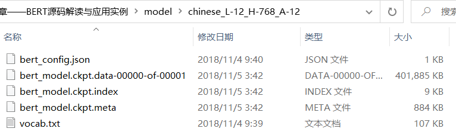
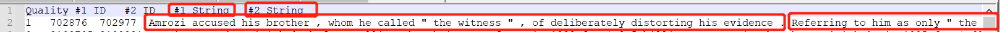
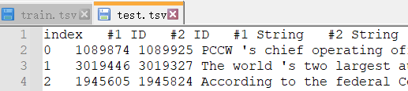
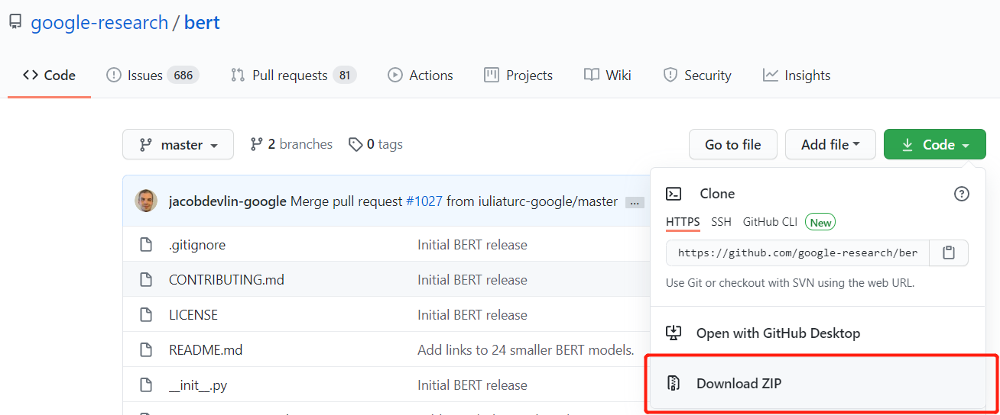

# README

[BERT开源框架地址](<https://github.com/google-research/bert>)，最好读下README，以下是预训练好的BERT模型，这里用到两个

> 点击即可下载，里面内容如下

> json：相关的参数
>
> vocab：语料库
>
> 其它：使用时的是加载文件，如训练好的权重等

> 下载一个数据集，使用脚本命令下载，可能需要翻墙，可以访问我的百度云盘进行下载。这里只用到MRPC

#### MRPC

内容如下：

train.csv：

> 二分类任务：判断两句话是否说的是同一意思
>
> Quality：是否相同，相同为1

test.csv

> 没有了Quality，需要进行预测

#### download BERT

把bert的code全部下载下来，并解压到指定目录

推荐的pip方式是：pip --default-timeout=100 install 库名字 -i http://pypi.douban.com/simple/ --trusted-host pypi.douban.com

