### 第一章——NLP通用框架BERT原理解读

#### 传统解决方案遇到的问题

传统的RNN网络

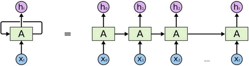

- 训练速度：无法加速训练，并行等
- Self-Attention机制（注意力），一段话中，不是每个词都重要，我们只需要关注重要的部分。如：下班后我们一起去吃饭吧，我听说有家面馆挺好吃的，我请客。是不是对于听的人来说主要是“我请客”。

- word2vec：训练好词向量就永久不变了，不同的语境相同的词相同的向量，但这合理吗？就想我们在生气的时候说傻子，很开心的时候说傻子，意思是完全不一样的，

#### Transformer整体架构如下

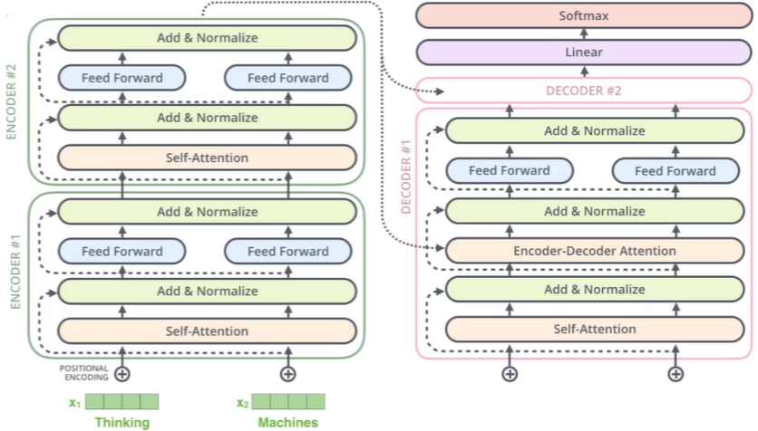

#### 注意力机制的作用

- 对于输入的数据，我们的关注点是什么？
- 如何才能让计算机关注到这些有价值的信息？

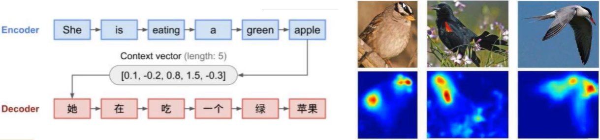

> 如上，传入一段文本，如果我们没有强调注意什么，那么词向量结果可能是平行的，如果我们强调“eating”，那么“eating”这个词的词向量就会有所不同。

如果是人为的加权，告诉计算机哪个重要，这显然是不合实际的，应该让计算机自己发现哪些重要。

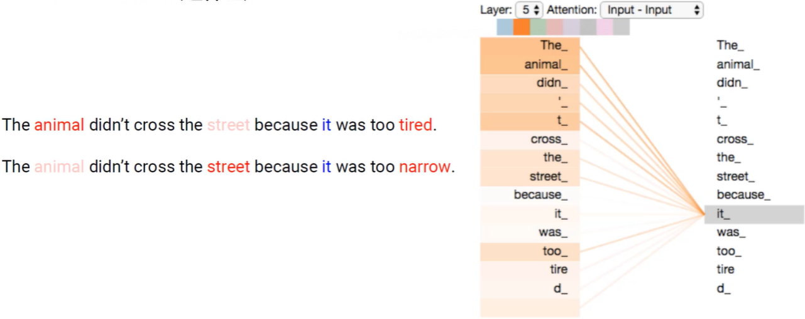

> “it”在第一句中是指代“animal”，表示它太累了没有过去。
>
> “it”在第二句中指代“street”，表示路太窄了没有过去。
>
> 这里关注的是“animal”，我们希望即使是第二句，“animal”对结果的影响越大。

#### Self-Attention计算

- 输入经过编码后得到的向量。
- 得到当前词语上下文的关系，可以当做是加权。
- 构建三个矩阵分别查询当前词跟其它词的关系，以及特征向量的表达。

如下图：

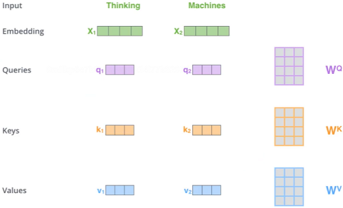

> 先转换成向量，构建三个矩阵Q、K、V，求出来第一个词编码的时候怎么找到上下文。右边的W就是权重。

这三个矩阵具体做什么：

- Q: query，要去查询的
- K: key，等着被查的
- V: value，实际的特征信息

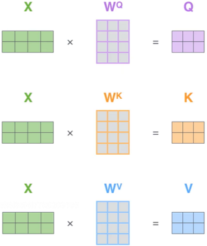

> X是输入内容，结果W后，形成Q、K、V不同矩阵的特征向量。

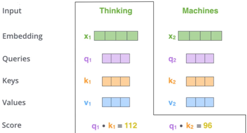

> q与k的内积表示有多匹配，如果Xa与Xb之间无关的时候，那么其在坐标系上的表示是垂直的；如果有关系，则非垂直，则有夹角有内积，相关性越大，则夹角越小，内积越大。

#### 特征分配与softmax机制

- 最终的的得分值经过softmax就是最终上下文结果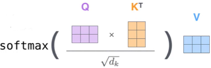

  > 加上dk是因为计算内积会因为向量维度越长，向量维度越大，越大影响就越大，影响不应该根据维度的长宽改变，所以应该除掉向量维度的影响。softemax的计算不理解的可以跳转到[深度学习入门第一章](https://github.com/ben1234560/AiLearning-Theory-Applying/blob/master/%E6%B7%B1%E5%BA%A6%E5%AD%A6%E4%B9%A0%E5%85%A5%E9%97%A8/%E7%AC%AC%E4%B8%80%E7%AB%A0%E2%80%94%E2%80%94%E6%B7%B1%E5%BA%A6%E5%AD%A6%E4%B9%A0%E5%BF%85%E5%A4%87%E7%9F%A5%E8%AF%86%E7%82%B9.md#softmax%E5%88%86%E7%B1%BB%E5%99%A8%E5%88%86%E7%B1%BB%E4%BB%BB%E5%8A%A1)

- Scaled Dot-Product Attention 不能让分值随着向量维度的增大而增加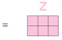

这样就能计算出来了结果，这个就是Self-Attention机制，内积大的就重要，小的就不重要。

每个词的Q会跟整个序列中每个K计算得分，然后基于得分再分配特征

> 这样就解决了word2vec训练完后词向量不变的问题，每次都跟其它组合项进行计算，从而改变权重和词向量。

**再看一遍整体流程**

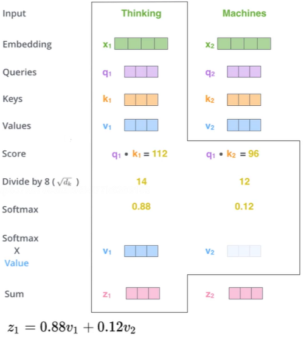

- input~Score：每个词的Q会跟每个K计算得分。
- Divide by dk：除掉维度的影响。
- Softmax：得到最大的概率值。
- Softmax × Value：求得词向量的编码。

这样第一个词就编码完成，后面的第二、第N个词也是如此操作。

总结：Attention依靠内积来求得每个词和每个K的得分，且并行求。

#### Multi/head的作用

之前卷积中，我们利用fillter（w）来将X映射成更多的特征表达，再取最大的进行降维，在这里也是同样道理。

- 通过不同的head得到多个特征表达
- 将所有特征拼接在一起
- 可以通过再一层全连接来降维

Multi-Head架构图如下

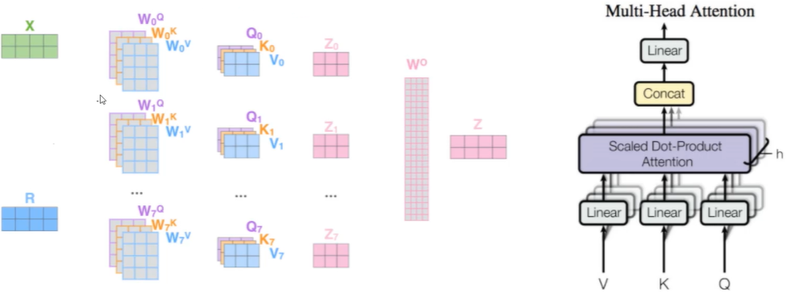

> 不同的注意力结果，得到的特征向量表达也是不同的。

堆叠多层：

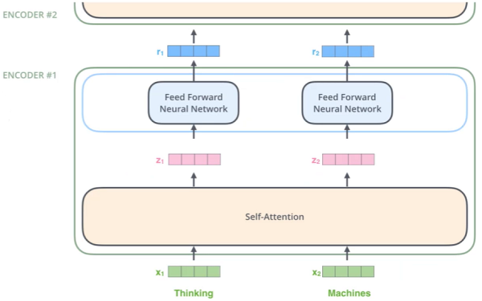

> 由于输入输出都是向量，也就是可以堆叠更多层，计算方法都是相同的，只是增加了多层。

#### 位置编码与多层堆叠

> 位置信息：在self-attention中，每个词都会考虑整个序列的加权，所以其出现位置并不会对结果产生什么影响，相当于放哪都无所谓，但是这跟实际就有些不符合了，我们希望模型能对位置有额外的认识。

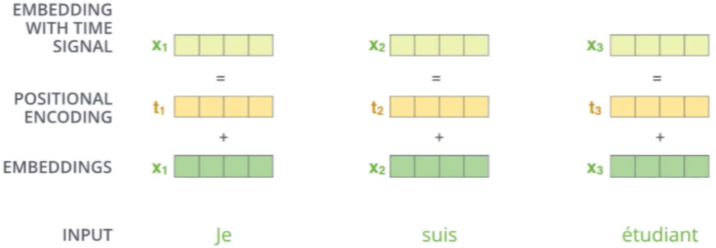

> POSITIONAL ENCODING：将余弦和正弦的周期表达信号，当作位置信息。

**Add与Normalize**

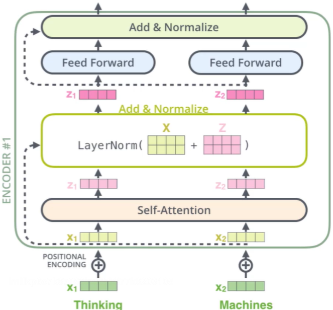

- 归一化：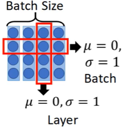

  > Batch Size：将其一行，让其均值为0，标准差为1
  >
  > Layer：让其一列，变成均值为0，标准差为1

- 连接：基本的残差连接方式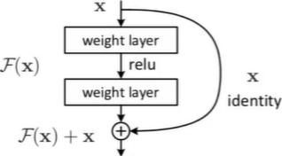

  > 残差连接：X如果处理完残差变小，则使用该X，如果残差反而大了，则使用原有的X。也就是堆叠的层数中，我们保证了堆叠的过程中，结果一定不会比原来差。

#### Decoder

- Attention计算不同：只需要用Q去查encode的K,V即可
- 加入MASK机制：遮挡部分值，不使用它，比如内积会将每个相乘相加，而在计算内积的过程不能让它知道全部信息，比如下面的I am a student，遮挡掉student，否则相当于透题。

最终输出结果

- 得到最终预测结果
- 损失函数cross-entropy即可

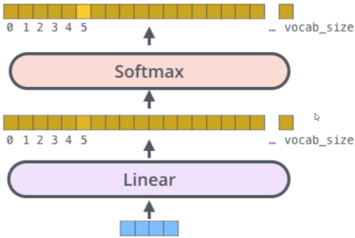

#### Transformer整体架构

- Self-Attention
- Multi-Head
- 多层堆叠，位置编码
- 并行加速训练

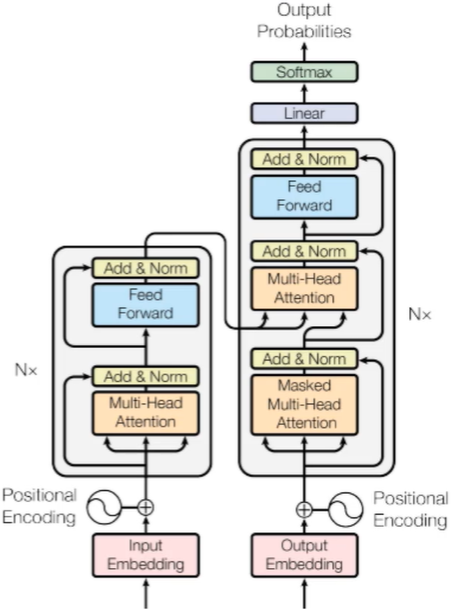

**Encode端**

- input：输入X1、X2、...、Xn；
- 初始化：初始化词编码，先随机出词的编码再进行调整，但现在一般使用预训练好的模型，也就是没有了这个步骤；
- Positional Encoding：加入位置编码；
- Nx：N层堆叠Self-Attention；
- Multi-Head：多头Self-Attention；
- 残差连接：随着堆叠层数，可能结果会变差，残差连接则能保证学习至少不比原来差；

**Decode端**

- MASK机制：遮挡掉部分，不使用后面的结果；
- 获取K,V的结果；
- Nx：N层堆叠；
- Linear：得到所有的编码，Linear成向量；
- Softmax：将向量进行分类；

这就是Transformer的整体结构。

