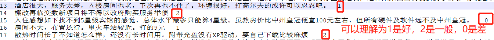

### 第三章——基于BERT的中文情感分析实战

#### 任务介绍

对中文进行分类demo，分成0/1/2

我们使用的是Google官方开源的中文BERT预训练模型

> vocab.txt里把常用的中文基本覆盖了

#### 读取处理自己的数据集

~~~python
class DataProcessor(object):
  """Base class for data converters for sequence classification data sets."""

  def get_train_examples(self, data_dir):
    """Gets a collection of `InputExample`s for the train set."""
    raise NotImplementedError()

  def get_dev_examples(self, data_dir):
    """Gets a collection of `InputExample`s for the dev set."""
    raise NotImplementedError()

  def get_test_examples(self, data_dir):
    """Gets a collection of `InputExample`s for prediction."""
    raise NotImplementedError()

  def get_labels(self):
    """Gets the list of labels for this data set."""
    raise NotImplementedError()
~~~

