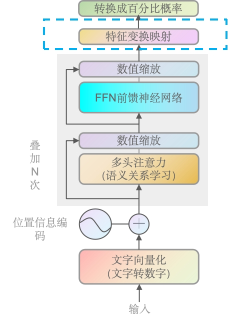
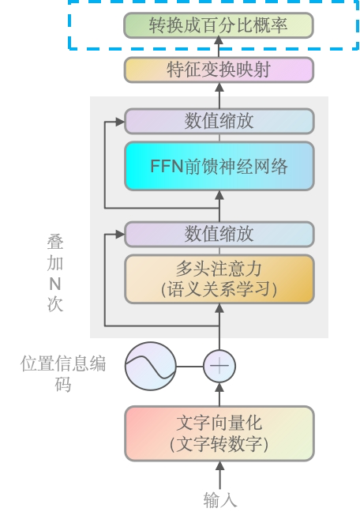

# 第一章——Transformer网络架构

### 总体架构图

> 这个阶段主要是有个大概认识，你可能会觉得模糊或不能理解的，后面会对每个模块进行详解，也欢迎给我留issue探讨。
>
> [论文地址](https://arxiv.org/pdf/1706.03762)
>
> [官方代码](https://www.tensorflow.org/tutorials/text/transformer?hl=zh-cn)


> WHAT：自注意力机制模型，顾名思义，它能够自己找到不同位置的依赖关系。如在序列的任何位置直接计算出 与 其他位置的依赖关系，从而有效捕捉长距离依赖。以及位置编码等关键组成。
>
> WHY：相比前一代主流的RNN/LSTM，它可以并行化（意味着它能够提供非常好的用户体验，逐渐能够走向大众视野）。能较好处理长距离依赖。效果上也是当时多个任务上的最佳性能。

左半边是编码器（Encoder），右半边是解码器（Decoder）。


### 左右如何配合运作

训练阶段：

- 编码器处理输入的序列（如源语音文本），并将其转化成一系列上下文相关的表示（**机器可读的表示形式**），用于捕获输入序列中的信息。
- 解码器使用编码器的输出以及目标序列的前缀（通过教师强制技术），来预测目标序列的下一个词或标记。在训练过程中，**解码器学习**如何根据编码器的输出和已知的目标序列前缀来生成正确的输出序列。

推理阶段（解码/生成阶段）：

- 编码器同样处理输入序列并产生上下文相关的表示（**机器可读的表示形式**）。
- 解码器则逐步生成输出序列。在每一步，它使用编码器的输出和到目前为止自己生成的序列来预测下一个词或标记。在推理时，解码器不再有访问真实目标序列的前缀，而是依赖于自己之前的预测来继续生成序列。


### 一定同时需要编码器和解码器吗？

根据我们上面了解到的，不同的部分其实可以针对不同的任务。

- BERT（Bidirectional Encoder Representations from Transformers）是只使用了编码器（Encoder）的模型，一般用于抽样式问答 或者 做命名实体识别，如从给定的文本段落中找到并提取出回答问题的文本片段。目标是识别或检索信息，而不是生成新的文本序列。
- GPT（Generative Pretrained Transformer）是只使用了解码器的模型，被设计用于生成文本。但是里面的Mask改成了因果masking（causal masking），即不像原始那样隐藏一句话中的某个词，而是它只能看到前面的词，而不能看到后面的。[GPT-2源码地址](https://github.com/openai/gpt-2)
- 机器翻译，则需要编码器处理源语言文本，解码器生成目标语言文本。即整个Transofmer。

当你更加深入理解模型，你也能创造出更多的可能性。


### 解码器（Decoder）概述

> WHY：由于现在GPT是最主流的方向，所以后续主要讲decoder，encoder的架构也跟decoder差不多，理解了decoder也就理解了encoder。


通过上面的英文转中文，大家应该也能理解大致意思，也就是文字会向量化 加上 位置信息编码，输入到多头注意力机制里，去学习语义关系，通过数值缩放再到神经网络层。数值缩放后被线性映射，最后输出成百分比概率，概率越大的就越可能是最终预测输出的文字。

其中左侧的线（非主线），则是残差连接（借鉴Resnet）。残差连接用以解决梯度消失/爆炸，和保留原始信息；

下面我们以简单讲述，来走一遍全部流程，后续章节再进行更深入的讲解。


### 文字向量化 & 位置编码

> Embedding & Positional Encoding
>
> WHY：机器无法理解文字，机器底层只能识别数值，所以文字需要转换成数值。而由于自注意力机制不具有处理序列顺序的能力，位置编码被用来保留单词的顺序信息。
>
> HOW：文字的向量化有很多种方法，我们后面再详解。


> 这里用英文的输入，引文英文输入使用代码更容易理解

如样本“LLM with me”（大模型和我），通过GPT2Tokenizer转换成索引[3069, 44, 351, 502]，转成向量后再结合位置信息编码，如[1,2,3]。继续向上传递。

> 你可能好奇，为什么LLM with me明明是3个词会有4个索引，后面会详细解答，并提供代码。另外位置编码不会向1,2,3这么简单的叠加，后面也会详解。
>
> 768是嵌入向量的维度，这是GPT-2模型（其中一个版本）的一个特定参数。每个嵌入向量的维度是模型设计时确定的，并且在整个模型中保持一致。


### 语义关系学习（多头注意力）

> Multi-Head Self-Attention
>
> WHY：捕捉多种语义关系，提高模型的表达能力。如LLM是大模型的缩写，同时也是法学硕士的缩写。亦或者冬天里的能穿多少穿多少，跟夏天里的能穿多少穿多少。


向量传入后，通过语义关系学习（一系列计算，点积/内积的方法），得出一个矩阵，维度是4 × 4的矩阵。矩阵里的每个值都是数字，数字代表了文字对应其它文字的关注程度，越高表示与其它文字的关注度越高，反正则越小。

> 为什么数字越大表示关系越近，现在可以简单理解，就是每个词的查询向量（Q）会与序列中所有单词的键（K）向量进行点积运算，得到一个分数，这个分数经过softmax函数处理后，就变成了注意力权重。即每个词都有跟全部词的向量结果，越大表示语义关系越紧密，权重越低则表示关系越疏远。
>
> 另外，实际上是通过三个不同的线性变换生产Q、K和V向量（实际是3条线，为了简化前面用1条线表达），每一份对应一个头，如GPT是12头，则是向量 × 4 × 3 × 12 份数据。另外需要注意的是，每个子模块都会叠加N次，如GPT-3就据说叠加了175层。即最终是向量 × 4 × 3 × 12 × 175。当然我们这里只用向量 × 4 × 1 × 1 × 1 即 向量 × 4 × 3 1头1个子模块，以方便大家理解。


### 数值缩放

> Addition and Layer Normalization
>
> WHY：前面我们讲到，矩阵里的数字越大，表示跟其它词的语义关系越紧密，如果两个大值相加，很可能就造成大的值特别大，小的值特别小。所以要统一到一个维度，特别是深度学习场景里，由于深度学习是矩阵乘法， 所以大值或者小值都会被无限放大，导致模型不稳定。

将语义关系学习里输出的矩阵，加上残差（输入语义关系学习）前的向量，再进行值的统一缩放，使得它们的均值为0，方差为1。大部分情况下是缩放到[-1,1]区间。


Add & Norm的过程可以理解为相同位置元素相加，再做层归一化（Layer Normalization），即如果残差连接的A矩阵是3维的，多头注意力输出的B矩阵也会是3维的，而且两者一定是同Size，即A矩阵是(None, 4, 768)，B矩阵肯定也是(None, 4, 768)，两者同位置的如`A[i][j][k]=0.1`，`B[i][j][k]=0.2`，则相加是0.3，再去进行归一化。层归一化后面我们会详解。


### 前馈神经网络

> Feed Forward Neural Network
>
> WHAT：数学上，对于每个位置的输入向量`x`，FFNN可以表示为：
>
> ~~~
> FFNN(x) = max(0, xW1 + b1)W2 + b2
> ~~~
>
> 其中`W1`和`W2`是权重矩阵，`b1`和`b2`是偏置项，`max(0,·)`是ReLU激活函数。
>
> WHY：多头注意力层（语义关系学习）是线性的，这意味着它们可能不足以捕捉复杂的数据模式。前馈神经网络通过引入非线性激活函数，增强了模型的能力，使其能够学习更加复杂的函数映射等。且最重要的是每个神经元的输出仅依赖于当前层的输入，这使得计算可以并行化，从而提高了模型的训练和推理效率。
>
> 感兴趣的同学，可以去这个网址玩玩[A Neural Network Playground](https://playground.tensorflow.org/#activation=tanh&batchSize=10&dataset=circle&regDataset=reg-plane&learningRate=0.03&regularizationRate=0&noise=0&networkShape=4,2&seed=0.53882&showTestData=false&discretize=false&percTrainData=50&x=true&y=true&xTimesY=false&xSquared=false&ySquared=false&cosX=false&sinX=false&cosY=false&sinY=false&collectStats=false&problem=classification&initZero=false&hideText=false)


当数据输入到神经网络后，经过一系列运算（点积），输出的数据一般是非线形的。而且维度输出的维度与输入的维度是不变的。这种设计允许FFN在不改变输入和输出维度的情况下，增加网络的非线性和复杂性，从而使模型能够学习更加复杂的特征表示。


### 最后一个数据缩放

同样，当数据进行点积后，大值会越来越大，小值也会越来越小，所以再做一次数值缩放。另外整个子模块会进行多次叠加，即前面说到的如GPT叠加了175层。


### 特征变换映射（全数字列表）

> Linear



前面数据经过最后一次缩放后，线形变换用于前者的输出，映射到一个词汇表大小的向量上，并选举出最大可能性的词或句子作为最终输出

> 机器人对话场景（如GPT）

如果训练阶段我们的总文本词汇是3个，最终会得到一个有3个分数的词汇表。预测阶段输入"LLM with me"，那么对于"LLM with me"中的每个标记，线性层将输出一个长度为3的向量。如果训练阶段的总文本词汇是10,000个，最终会训练成10,000个词的向量队列，那么输出的则是10,000的向量（可以理解为概率）。预测下一个字，就是找出向量矩阵中概率最高的对应的文字。如"LLM with me"的下一个词的概率，一般展示如下：

```
{
    "is": 0.10,
    "the": -0.05,
    "a": 2.03,
    ...
    "learning": -0.07,
    ...
}
```

但上面输出的是文字的值，如果我们以最高值作为下个词的输出，还需要将它们统一到一个数值区间。


### 转换成百分比概率

> WHY：转化到0-1区间，便于比较（同维度）和处理。将注意力分数转换为概率分布。



可以简单理解为，将前面线形层输出的值，转化成0-1区间的概率分布，进行输出。


### 合并成一个句子

上面将的都是输出一个词，如果是预测下一个句子，通常会采用一种称为“自回归语言生成”的方法，在这种方法中，模型会一次生成一个词，然后将生成的词作为下一个预测的上下文的一部分。这个过程会重复进行，直到生成一个终止符号（如句号或特殊的结束标记），或者达到预设的最大长度限制。中间阶段的展示一般如下：

~~~
[
    {"sequence": "The cat is", "probability": 0.09, "next_words": {"sitting": 0.5, "sleeping": 0.3, ...}},
    {"sequence": "She went to", "probability": 0.07, "next_words": {"the store": 0.4, "school": 0.2, ...}},
    ...
]
~~~

> 当然，模型一般会采用某种策略（如贪婪搜索、束搜索（beam search）或采样）来逐步构建句子，而不是会生成这么庞大的组合，因为一个句子可能有几千甚至几万个词。

每个条目包含了当前的候选序列（"sequence"），该序列的累积概率（"probability"），以及下一个可能的词及其概率（"next_words"）。模型会在每一步更新这些候选序列，直到生成完整的句子。

~~~
[
    {"sequence": "The cat is sitting by the window.", "probability": 0.08},
    {"sequence": "She went to the store to buy some groceries.", "probability": 0.06},
    ...
]
~~~


至此，你已经对整个Transformer有的整体了解，我们已经是熟悉transformer的人了🎉🎉🎉
