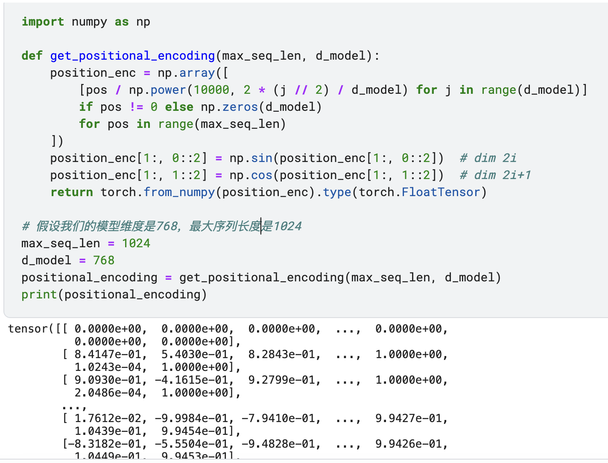
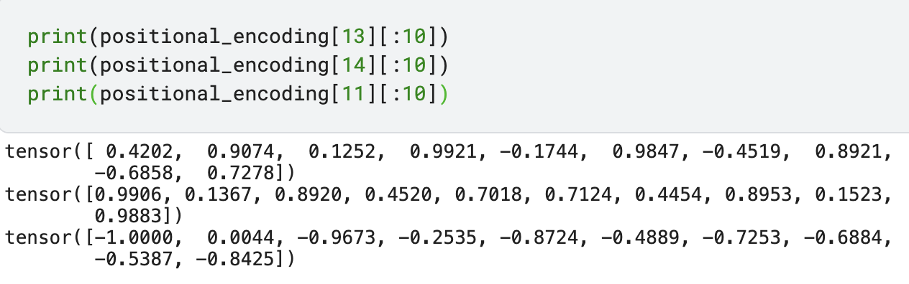
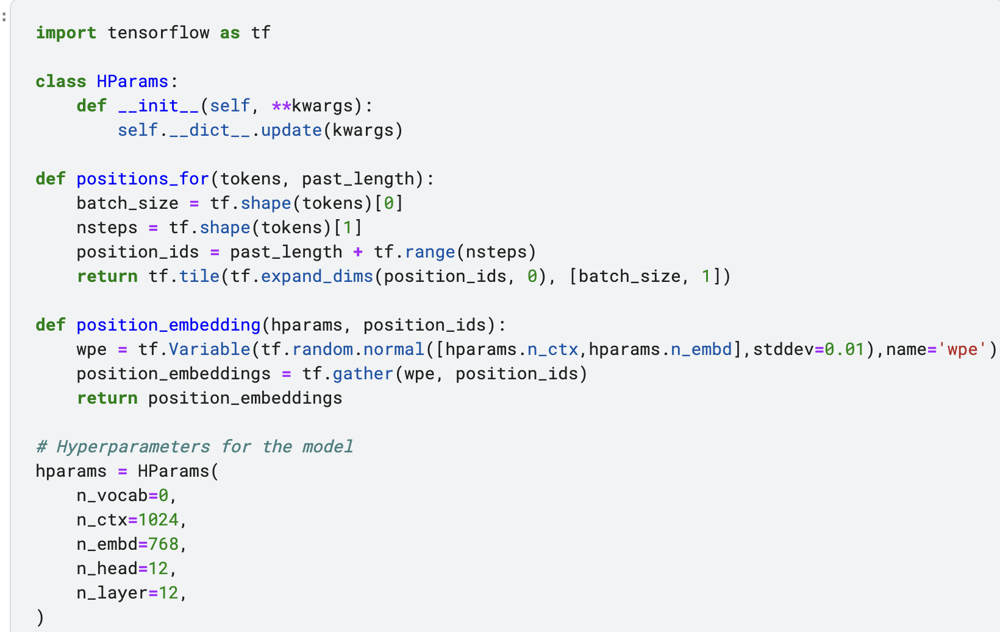
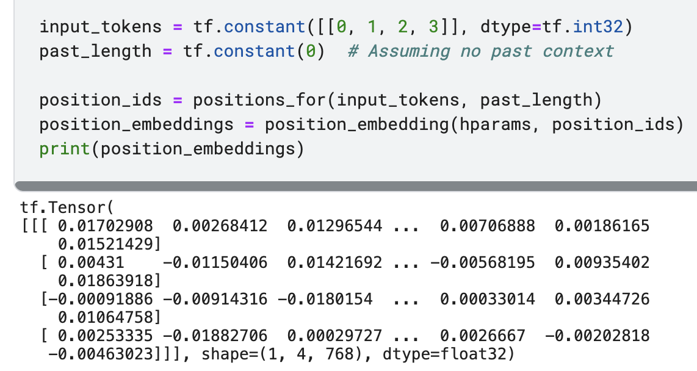
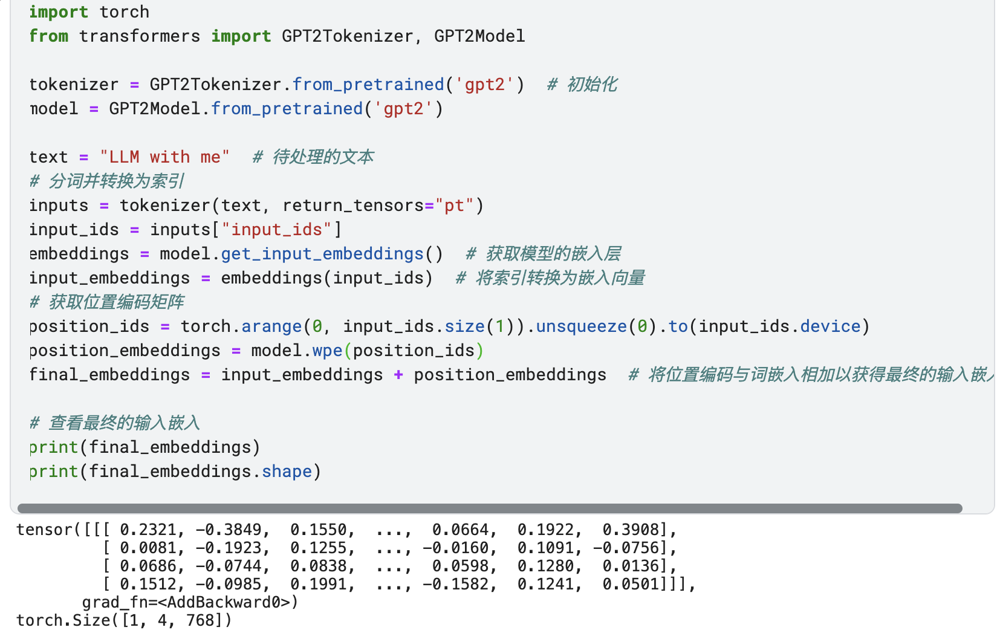
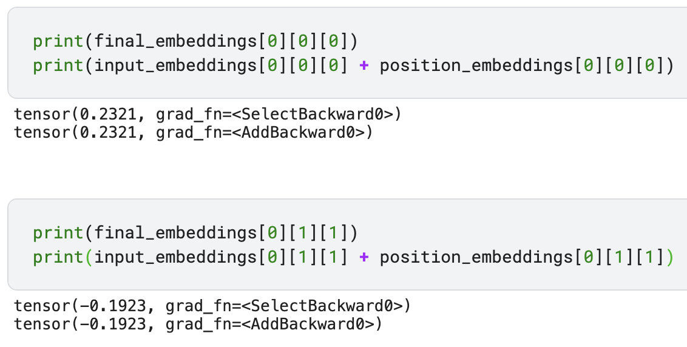

# 第三章——位置编码

### 前言

第二章我们讲了文字向量化，而在向量化传到多头注意力之前，还有一个位置信息编码。

WHY：在自然语言处理中，单词的顺序对于理解文本的含义至关重要。例如，"狗咬人"和"人咬狗"词汇相同但意义不同。然而，Transformer模型的核心机制——自注意力（self-attention）本身并不具备捕捉序列顺序的能力。它允许模型在处理一个单词时考虑到句子中的所有其他单词，但它不会区分这些单词的位置关系。这就是为什么位置编码至关重要的原因：它们为模型提供了单词在句子中的位置信息，使得模型能够理解词序和语法结构。

WHAT：位置编码是一种向模型输入的每个单词嵌入向量中添加信息的技术，以便模型能够识别单词的位置。

### 位置编码是怎么算的？

在《Attention is all you need》中，位置编码是有正弦和余弦函数计算出来的，且是固定的。

优点：

- 由于是固定公式，不需要通过训练来学习，可以直接计算出任意位置的编码。
- 具有可能的泛化能力，理论上可以处理比训练时见过的序列更长的序列。
- 由于正弦和余弦函数是周期性的，这种编码方式可能帮助模型捕捉到某种周期性的模式。

GPT-2的位置编码是可学习的参数。这意味着模型在训练过程中会调整位置编码，以便更好地适应特定任务的需求。

优点：

- 由于是通过训练学习的，模型可以自适应地为特定任务找到最佳的位置编码。
- 可以捕捉到数据中的特定模式，可能比固定公式更适合某些任务。
- 由于是模型的一部分，位置编码可以与其他模型参数一起进行端到端的优化。

### Transformer里的位置编码方法（原文）

~~~python
import numpy as np

def get_positional_encoding(max_seq_len, d_model):
    position_enc = np.array([
        [pos / np.power(10000, 2 * (j // 2) / d_model) for j in range(d_model)]
        if pos != 0 else np.zeros(d_model)
        for pos in range(max_seq_len)
    ])
    position_enc[1:, 0::2] = np.sin(position_enc[1:, 0::2])  # dim 2i
    position_enc[1:, 1::2] = np.cos(position_enc[1:, 1::2])  # dim 2i+1
    return torch.from_numpy(position_enc).type(torch.FloatTensor)

# 假设我们的模型维度是768，最大序列长度是1024
max_seq_len = 1024
d_model = 768
positional_encoding = get_positional_encoding(max_seq_len, d_model)
print(positional_encoding)
"""out:
tensor([[ 0.0000e+00,  0.0000e+00,  0.0000e+00,  ...,  0.0000e+00,
          0.0000e+00,  0.0000e+00],
        [ 8.4147e-01,  5.4030e-01,  8.2843e-01,  ...,  1.0000e+00,
          1.0243e-04,  1.0000e+00],
        [ 9.0930e-01, -4.1615e-01,  9.2799e-01,  ...,  1.0000e+00,
          2.0486e-04,  1.0000e+00],
        ...
"""
~~~

> 我们上面参数也参考GPT-2的，比如max_seq_len=1024、d_model=768

你也可以根据第二章的"LLM with me"的索引，去获取对应的位置编码。

~~~python
print(positional_encoding[13][:10])
print(positional_encoding[14][:10])
print(positional_encoding[11][:10])
"""out:
tensor([ 0.4202,  0.9074,  0.1252,  0.9921, -0.1744,  0.9847, -0.4519,  0.8921,
        -0.6858,  0.7278])
tensor([0.9906, 0.1367, 0.8920, 0.4520, 0.7018, 0.7124, 0.4454, 0.8953, 0.1523,
        0.9883])
tensor([-1.0000,  0.0044, -0.9673, -0.2535, -0.8724, -0.4889, -0.7253, -0.6884,
        -0.5387, -0.8425])
"""
~~~

为什么是用正弦和余弦函数，对于正弦函（sin）：最大值是 1，最小值是 -1。对于余弦函数（cos）：最大值是 1，最小值是 -1。也就是它们可以保证值是比较小的，而且也是符合深度学习模型可学习的参数。

其中最重要的是允许模型学习相对位置：由于正弦和余弦函数的周期性，对于任意固定偏移量 `k`，`PE(pos+k)`可以表示为 `PE(pos)` 的线性函数。这意味着模型可以很容易地通过学习注意力权重来关注相对位置，因为相对位置的编码可以通过简单的线性变换来获得。

~~~markdown
原文：
We chose this function because we hypothesized it would allow the model to easily learn to attend by relative positions, since for any fixed offset k, PE(pos+k) can be represented as a linear function of PE(pos).
~~~

我们用更简单的语言来解释这个概念：

~~~markdown
想象一下，你有一串彩色的灯泡，每个灯泡都有不同的颜色。这些颜色按照一定的模式重复，比如红、绿、蓝、红、绿、蓝，依此类推。如果你知道了这个模式，即使你被蒙上眼睛，只要告诉你起点的颜色，你也能猜出后面第几个灯泡是什么颜色。
在Transformer模型中，我们想要模型能够理解单词在句子中的位置。为此，我们给每个位置分配了一个特殊的标记，就像给每个灯泡分配了一种颜色。正弦和余弦函数就像是这些颜色的模式，它们以一种规律的方式重复。
现在，当模型看到一个单词和它的位置标记时，它可以通过这个位置标记（就像颜色模式）来理解这个单词与句子中其他单词的相对位置。因为正弦和余弦函数是周期性的，所以模型可以通过简单的数学运算（线性变换）来预测单词之间的相对位置，就像你可以通过颜色模式来预测下一个灯泡的颜色一样。
这种方法的好处是，模型不仅知道每个单词的绝对位置（就像知道每个灯泡的编号），而且还能理解单词之间的相对位置（就像知道一个灯泡与另一个灯泡之间有几个灯泡）。这对于理解和生成语言非常重要，因为在语言中，单词的意义往往取决于它们在句子中的位置和它们与其他单词的关系。
~~~

关键词：编号和可预测的颜色顺序

### GPT-2的位置编码方法

~~~python
import tensorflow as tf

class HParams:
    def __init__(self, **kwargs):
        self.__dict__.update(kwargs)

def positions_for(tokens, past_length):
    batch_size = tf.shape(tokens)[0]
    nsteps = tf.shape(tokens)[1]
    position_ids = past_length + tf.range(nsteps)
    return tf.tile(tf.expand_dims(position_ids, 0), [batch_size, 1])

def position_embedding(hparams, position_ids):
    wpe = tf.Variable(tf.random.normal([hparams.n_ctx, hparams.n_embd], stddev=0.01), name='wpe')
    position_embeddings = tf.gather(wpe, position_ids)
    return position_embeddings

# Hyperparameters for the model
hparams = HParams(
    n_vocab=0,
    n_ctx=1024,
    n_embd=768,
    n_head=12,
    n_layer=12,
)

input_tokens = tf.constant([[0, 1, 2, 3]], dtype=tf.int32)
past_length = tf.constant(0)  # Assuming no past context

position_ids = positions_for(input_tokens, past_length)
position_embeddings = position_embedding(hparams, position_ids)
print(position_embeddings)
"""out:
tf.Tensor(
[[[ 0.01702908  0.00268412  0.01296544 ...  0.00706888  0.00186165
    0.01521429]
  [ 0.00431    -0.01150406  0.01421692 ... -0.00568195  0.00935402
    0.01863918]
  [-0.00091886 -0.00914316 -0.0180154  ...  0.00033014  0.00344726
    0.01064758]
  [ 0.00253335 -0.01882706  0.00029727 ...  0.0026667  -0.00202818
   -0.00463023]]], shape=(1, 4, 768), dtype=float32)
"""
~~~

可以看到GPT-2就是直接用模型训练的方法去迭代位置编码的参数。可以直接去看[源码](https://github.com/openai/gpt-2/blob/9b63575ef42771a015060c964af2c3da4cf7c8ab/src/model.py)。两者的优点前面也已经说了，这也是为什么大家都称GPT为“暴力美学”。当然不仅是这里，后面还有“暴力美学”的相关佐证。

过程可以理解为：

1. **初始化位置嵌入**：在模型初始化时，创建一个位置嵌入矩阵，这个矩阵的每一行对应于序列中的一个位置，每一行是一个向量，其长度等于模型的嵌入维度。这个矩阵是随机初始化的，就像其他神经网络权重一样。
2. **查找位置嵌入**：在模型的前向传播过程中，对于输入序列中的每个位置，模型会从位置嵌入矩阵中查找对应的嵌入向量。这通常是通过一个简单的索引操作完成的，而不是通过乘积或其他复杂的神经网络运算。
3. **结合位置嵌入和词嵌入**：得到的位置嵌入向量会与相应的词嵌入向量相加，以此来为每个词提供其在序列中位置的信息。这个相加操作是简单的向量加法。
4. **训练调整位置嵌入**：在训练过程中，模型会通过反向传播算法来调整位置嵌入矩阵中的值，以便最小化预测错误。这意味着位置嵌入会根据模型在训练数据上的表现进行优化。

### 矩阵同位置相加

不管是Transformer原文中的方法还是GPT的方法，都是通过矩阵的简单相加。这里以GPT-2为例（Hugging Face开源的GPT），具体代码如下：

~~~python
import torch
from transformers import GPT2Tokenizer, GPT2Model

tokenizer = GPT2Tokenizer.from_pretrained('gpt2')  # 初始化
model = GPT2Model.from_pretrained('gpt2')

text = "LLM with me"  # 待处理的文本
# 分词并转换为索引
inputs = tokenizer(text, return_tensors="pt")
input_ids = inputs["input_ids"]
embeddings = model.get_input_embeddings()  # 获取模型的嵌入层
input_embeddings = embeddings(input_ids)  # 将索引转换为嵌入向量
# 获取位置编码矩阵
position_ids = torch.arange(0, input_ids.size(1)).unsqueeze(0).to(input_ids.device)
position_embeddings = model.wpe(position_ids)
final_embeddings = input_embeddings + position_embeddings  # 将位置编码与词嵌入相加以获得最终的输入嵌入

# 查看最终的输入嵌入
print(final_embeddings)
print(final_embeddings.shape)
"""out:
tensor([[[ 0.2321, -0.3849,  0.1550,  ...,  0.0664,  0.1922,  0.3908],
         [ 0.0081, -0.1923,  0.1255,  ..., -0.0160,  0.1091, -0.0756],
         [ 0.0686, -0.0744,  0.0838,  ...,  0.0598,  0.1280,  0.0136],
         [ 0.1512, -0.0985,  0.1991,  ..., -0.1582,  0.1241,  0.0501]]],
       grad_fn=<AddBackward0>)
torch.Size([1, 4, 768])
"""
~~~

从代码来看，embedding跟position_embeddings就是同位置元素相加。以下面的方法来检验

~~~python
print(final_embeddings[0][0][0])
print(input_embeddings[0][0][0] + position_embeddings[0][0][0])
"""out:
tensor(0.2321, grad_fn=<SelectBackward0>)
tensor(0.2321, grad_fn=<AddBackward0>)
"""

print(final_embeddings[0][1][1])
print(input_embeddings[0][1][1] + position_embeddings[0][1][1])
"""out:
tensor(-0.1923, grad_fn=<SelectBackward0>)
tensor(-0.1923, grad_fn=<AddBackward0>)
"""
~~~

