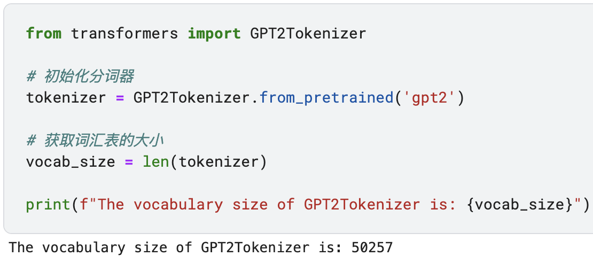

# 第二章——文字向量化

在传给Transformer前，文本会先通过tokenizer（分词器），将原始文本分割成词汇单元（tokens），这些词汇单元对应于模型词汇表中的索引。然后，这些索引会被转换成模型能够处理的输入序列。

也就是上面的"LLM with me"会转成4个索引，代码如下（下面用GPT2做示例，因为GPT2是开源的）：

~~~python
from transformers import GPT2Tokenizer, GPT2Model

# 初始化分词器和模型
tokenizer = GPT2Tokenizer.from_pretrained('gpt2')
model = GPT2Model.from_pretrained('gpt2')
# 待向量化的文本
text = "LLM with me"
# 分词并转换为索引
inputs = tokenizer(text, return_tensors="pt")
# 输出token及其对应的索引
print(inputs)
"""out: {'input_ids': tensor([[3069,   44,  351,  502]]), 'attention_mask': tensor([[1, 1, 1, 1]])}
"""
~~~

我们可以看到"LLM with me"明明是3个词，但是输出的有4个索引。我们拆开文本来看

~~~python
text = "LLM"
inputs = tokenizer(text, return_tensors="pt")
print(inputs)

# 查看索引对应的token
print(tokenizer.convert_ids_to_tokens(inputs['input_ids'][0]))

"""out: 
{'input_ids': tensor([[3069,   44]]), 'attention_mask': tensor([[1, 1]])}
['LL', 'M']
"""
~~~

通过上面的代码，我们发现"LLM"文本被分成了"LL"和"M"两个词。

为什么会被分成两个，原因是即使英文也有数十万甚至更多的词，大部分词都是通过subword（子单词）组成，也就是input可以由in和put组成。如果每个独立的词都单独做词汇会造成极大浪费，最后每次词可能要与几十万的向量去做点积。为了提高资源利用率，以及不造成数据维度爆炸，我们会现在词汇量的大小，如GPT2Tokenizer的词汇量是50257。代码如下：

