# 第二章——文字向量化

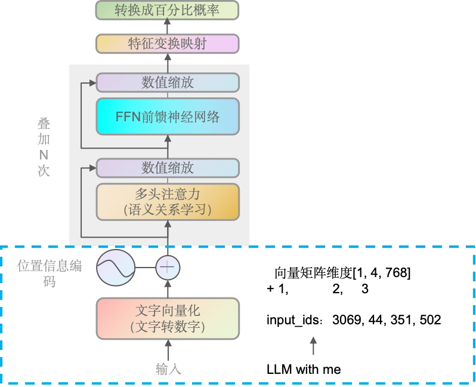

在传给Transformer前，文本会先通过tokenizer（分词器），将原始文本分割成词汇单元（tokens），这些词汇单元对应于模型词汇表中的索引。然后，这些索引会被转换成模型能够处理的输入序列。

### 文字转索引

前面的"LLM with me"会转成4个索引，代码如下（下面用GPT2做示例，因为GPT2是开源的）：

~~~python
from transformers import GPT2Tokenizer, GPT2Model

# 初始化分词器和模型
tokenizer = GPT2Tokenizer.from_pretrained('gpt2')
model = GPT2Model.from_pretrained('gpt2')
# 待向量化的文本
text = "LLM with me"
# 分词并转换为索引
inputs = tokenizer(text, return_tensors="pt")
# 输出token及其对应的索引
print(inputs)
"""out: {'input_ids': tensor([[3069,   44,  351,  502]]), 'attention_mask': tensor([[1, 1, 1, 1]])}
"""
~~~

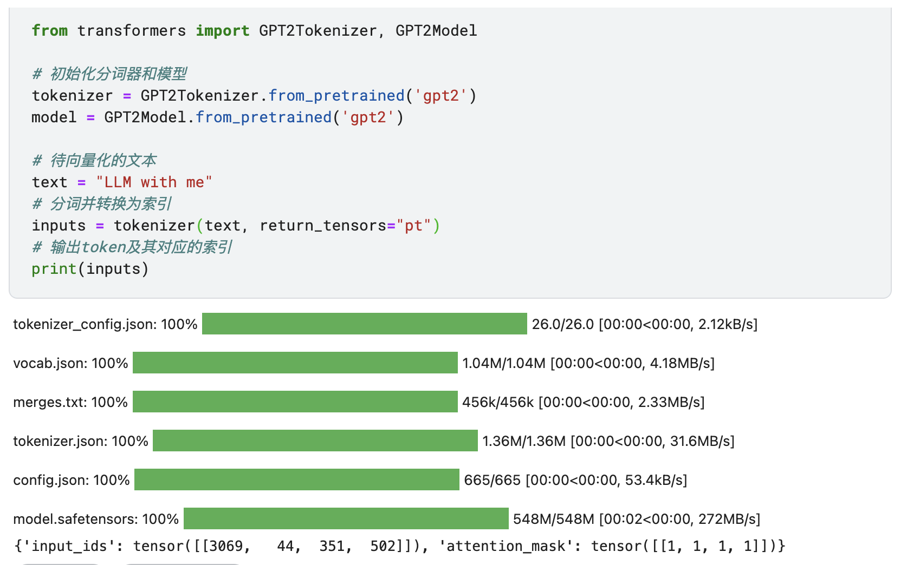

我们可以看到"LLM with me"明明是3个词，但是输出的有4个索引。我们拆开文本来看

~~~python
text = "LLM"
inputs = tokenizer(text, return_tensors="pt")
print(inputs)

# 查看索引对应的token
print(tokenizer.convert_ids_to_tokens(inputs['input_ids'][0]))

"""out: 
{'input_ids': tensor([[3069,   44]]), 'attention_mask': tensor([[1, 1]])}
['LL', 'M']
"""
~~~

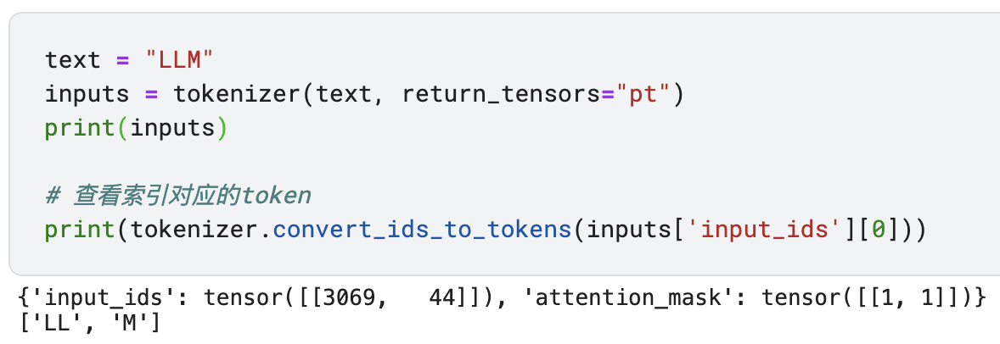

通过上面的代码，我们发现"LLM"文本被分成了"LL"和"M"两个词。

为什么会被分成两个，因为许多现代NLP模型，使用了一种称为子词分割（subword tokenization）的技术。这种技术允许模型有效地处理词汇量大和词汇外（out-of-vocabulary, OOV）单词的问题。子词分割的常见算法包括Byte-Pair Encoding (BPE)、WordPiece和SentencePiece。

分成多个索引的原因：**词汇量限制**、**处理未知单词**、**保留语义信息**、**提高模型效率**，如GPT2Tokenizer的词汇量是50257。代码如下：

~~~python
from transformers import GPT2Tokenizer

# 初始化分词器
tokenizer = GPT2Tokenizer.from_pretrained('gpt2')
# 获取词汇表的大小
vocab_size = len(tokenizer)
print(f"The vocabulary size of GPT2Tokenizer is: {vocab_size}")
"""out:
The vocabulary size of GPT2Tokenizer is: 50257
"""
~~~

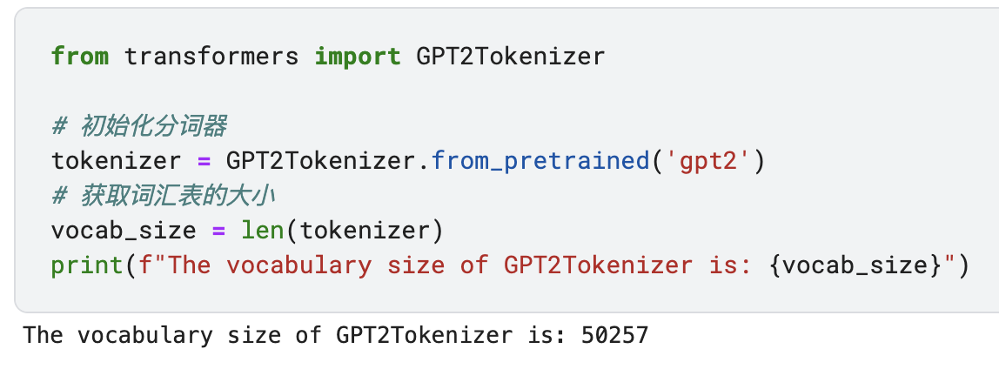

### 索引向量化

`tokenizer`将文本转换为索引（`input_ids`），然后我们通过`model.get_input_embeddings()`获取模型的嵌入层。这个嵌入层是一个预训练的层，它将索引映射到嵌入向量。我们通过调用`embeddings(input_ids)`将索引转换为嵌入向量（`input_embeddings`）。

`input_embeddings`现在包含了文本中每个token的嵌入向量，这些向量可以被送入模型的其余部分进行进一步处理。。例子如下：

~~~python
from transformers import GPT2Tokenizer, GPT2Model

# 初始化分词器和模型
tokenizer = GPT2Tokenizer.from_pretrained('gpt2')
model = GPT2Model.from_pretrained('gpt2')
# 待处理的文本
text = "LLM with me"
# 分词并转换为索引
inputs = tokenizer(text, return_tensors="pt")
input_ids = inputs["input_ids"]
# 获取模型的嵌入层
embeddings = model.get_input_embeddings()
# 将索引转换为嵌入向量
input_embeddings = embeddings(input_ids)
print(input_embeddings)
print(input_embeddings.shape)
"""out:
tensor([[[ 0.2509, -0.1875,  0.1510,  ...,  0.1094,  0.1639,  0.3363],
         [-0.0159, -0.1385,  0.2203,  ..., -0.0501,  0.0990, -0.0755],
         [ 0.0644,  0.0104,  0.0293,  ...,  0.0400,  0.1087,  0.0350],
         [ 0.1515, -0.0247,  0.0936,  ..., -0.1684,  0.1065,  0.0572]]],
       grad_fn=<EmbeddingBackward0>)
torch.Size([1, 4, 768])
"""
~~~

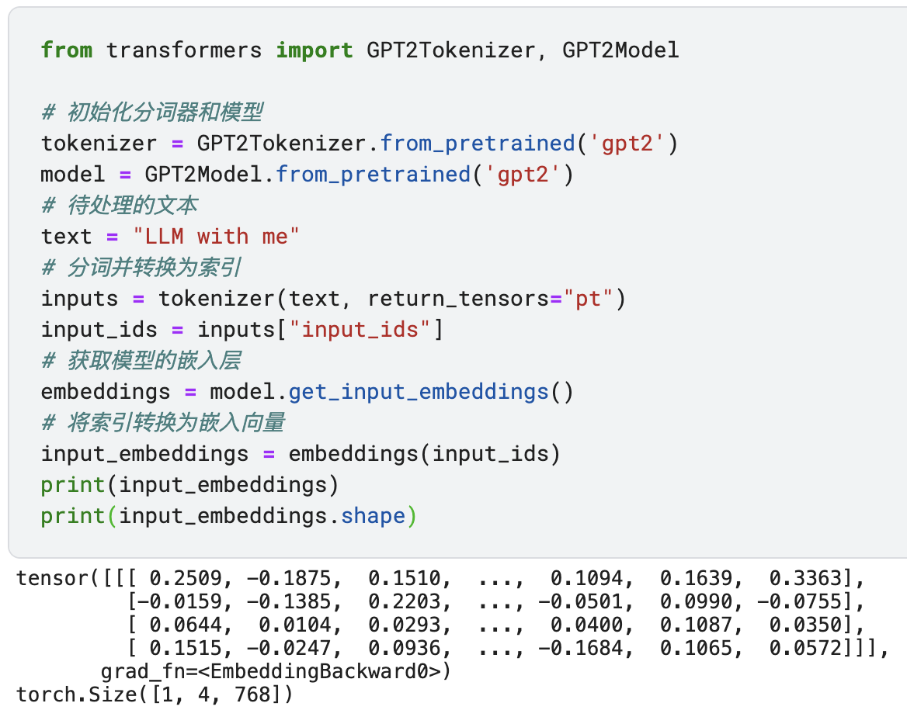

可以看到最终维度是转成了768列，4行。也就对应着4个索引，和GPT2的嵌入向量维度768。

注意，上面的模型是已经预训练好了，我们可以进行微调或从头开始训练，那应该怎么做呢？这里我们就涉及从0训练Tokenizer和从0训练Model，下面我们来演示从0开始训练。

### 从0开始Tokenizer

对于GPT或类似的模型，通常使用Byte-Pair Encoding (BPE) 或 SentencePiece 等子词分割算法。在这个例子中，我们将使用Hugging Face的`tokenizers`库来训练一个基于BPE的分词器。我们用"LLM with me"来做演示

~~~python
from tokenizers import Tokenizer
from tokenizers.models import BPE
from tokenizers.trainers import BpeTrainer
from tokenizers.pre_tokenizers import Whitespace

# 创建一个空的BPE分词器 & 使用空格进行预分词 & 创建一个分词器训练器
tokenizer = Tokenizer(BPE(unk_token="[UNK]"))
tokenizer.pre_tokenizer = Whitespace()
trainer = BpeTrainer(special_tokens=["[UNK]", "<EOS>"])  # 添加两个占位来解决不认识的词和结束语

# 准备一些训练数据，这里我们只用一句话 & 在实际应用中，你需要大量的文本数据
train_data = ["LLM with me"]
# 训练分词器
tokenizer.train_from_iterator(train_data, trainer)
# 保存分词器到文件
tokenizer.save("custom_tokenizer.json")
# 测试分词器
output = tokenizer.encode("LLM with me <EOS>")
print(output.tokens)
"""out:
['LLM', 'with', 'me', '<EOS>']
"""
~~~

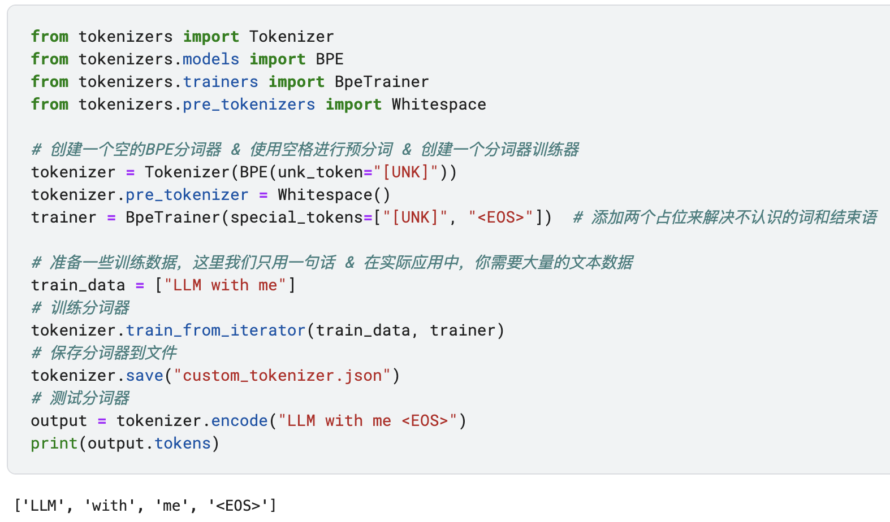

> <EOS>作为结束语，后面会用到大家先不用管。这是是比较简单的，还有开头语和换行等，我们这里只是用于演示和流程。

可以看到上面训练完的模型，如果只有几个字，解码器解码时，出来的也会只有几个字，所以一般情况下，我们需要大量的文本，然后进行保存即可后续调用。

那索引是怎样的呢？

~~~python
from transformers import PreTrainedTokenizerFast

# 获取文本的索引
input_ids = output.ids
print(input_ids)

# 加载自定义分词器 & 编码文本并返回PyTorch张量
tokenizer = PreTrainedTokenizerFast(tokenizer_file="custom_tokenizer.json")
inputs = tokenizer(text, return_tensors="pt")
input_ids = inputs["input_ids"]
print(input_ids)
"""out:
[14, 15, 12, 1]
tensor([[14, 15, 12]])
"""
~~~

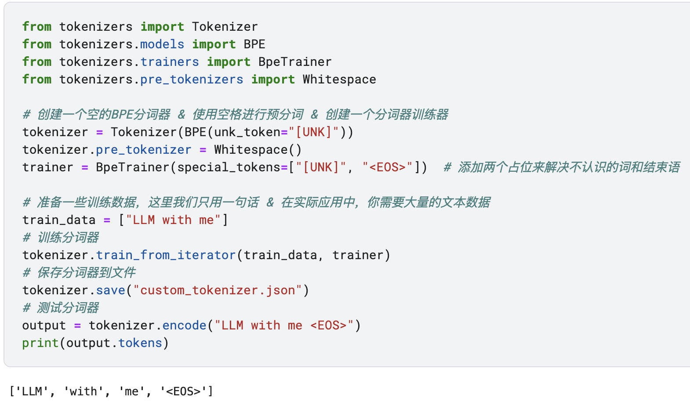

得到的索引是[14, 15, 12]，那0-11又分别是什么呢？

~~~python
# 查看分词器的词汇表
vocab = tokenizer.get_vocab()
print(vocab)
"""out:
{'e': 4, 'it': 11, 'm': 7, 'h': 5, 'w': 9, 'LLM': 14, '[UNK]': 0, 'i': 6, 'LL': 10, 'wit': 13, 'M': 3, 'with': 15, 'L': 2, 't': 8, '<EOS>': 1, 'me': 12}
"""
~~~

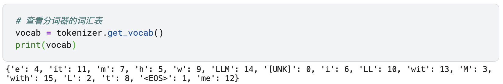

可以看到Tokenizer会讲输入的"LLM with me"进行逐个拆分，然后每个占一个索引空间。想要对BPE算法有更深入了解的，可以网上搜索下相关算法。简单来说，一种数据压缩技术，后来被应用于NLP中作为一种子词分割方法，通过迭代合并最频繁的字节对来减少词汇量，同时有效处理未知或罕见词汇。

### 从0开始Model

上面我们已经训练好Tokenizer，我们基于Tokenizer导入到已经训练好的GPT-2模型进行训练

~~~python
from transformers import PreTrainedTokenizerFast
from transformers import GPT2Config, GPT2Model

# 加载自定义分词器
tokenizer = PreTrainedTokenizerFast(tokenizer_file="custom_tokenizer.json")

# 创建模型配置 & 初始化模型
config = GPT2Config(vocab_size=tokenizer.vocab_size, n_embd=768, n_layer=12, n_head=12)
model = GPT2Model(config)

# 待处理的文本 & 分词并转换为索引
text = "LLM with me"
inputs = tokenizer(text, return_tensors="pt")
input_ids = inputs["input_ids"]

# 获取模型的嵌入层 & 将索引转换为嵌入向量
embeddings = model.get_input_embeddings()
input_embeddings = embeddings(input_ids)
print(input_embeddings)
print(input_embeddings.shape)
"""out:
tensor([[[-0.0054,  0.0349, -0.0085,  ..., -0.0360, -0.0266, -0.0049],
         [-0.0047, -0.0010,  0.0164,  ..., -0.0157, -0.0245, -0.0222],
         [-0.0183,  0.0165, -0.0246,  ..., -0.0089,  0.0305, -0.0066]]],
       grad_fn=<EmbeddingBackward0>)
torch.Size([1, 3, 768])
"""
~~~

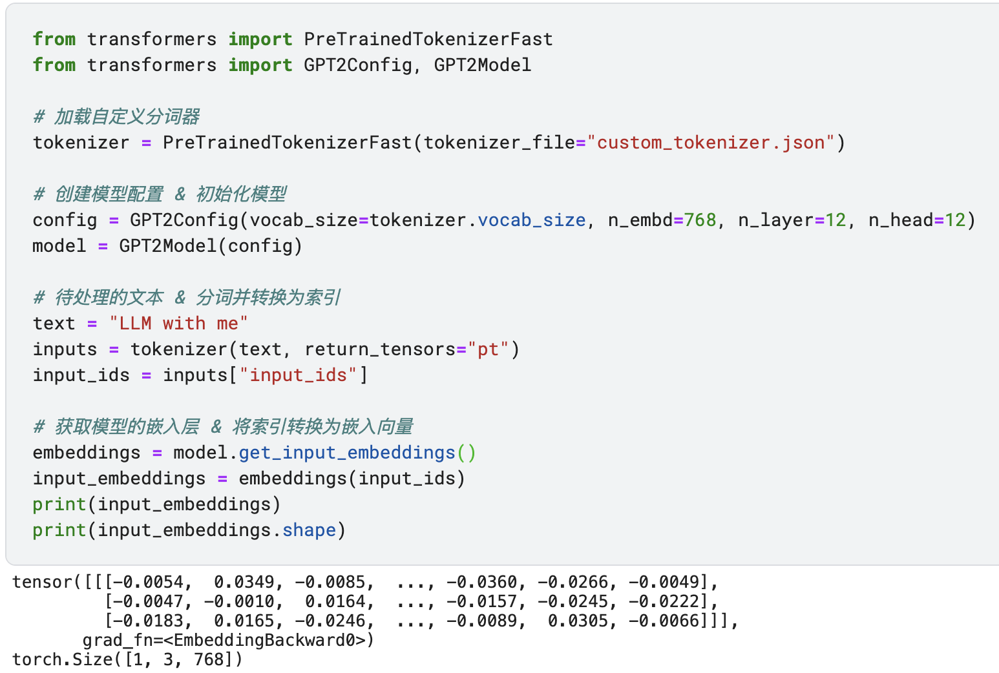

> 注意，每次embedding的值不一定是完全一样的，因为每次初始化的权重值都是不一样的，这也是深度学习的一大特点。

由于我们训练的tokenizer只有3个词，所以可以看到索引是3行，embedding的维度还是768，我们前面声明了。最终输出的是[1, 3, 768]维度的向量。

里面又是怎么加工成每个索引的字符对应768个向量呢？为了演示，我这里将对应参数改成小值`n_embd=10, n_layer=1, n_head=1`只用10维

~~~python
import torch
from transformers import PreTrainedTokenizerFast

# 加载自定义分词器
tokenizer = PreTrainedTokenizerFast(tokenizer_file="custom_tokenizer.json")
# 待处理的文本 & 分词并转换为索引
text = "LLM with me"
inputs = tokenizer(text, return_tensors="pt")
input_ids = inputs["input_ids"]

# 假设我们的自定义分词器有一个很小的词汇表
vocab_size = tokenizer.vocab_size  # 从自定义分词器获取词汇表大小
n_embd = 10  # 设置嵌入维度为10
# 创建一个随机初始化的嵌入矩阵，这里我们使用正态分布随机初始化，与实际模型初始化类似
embedding_matrix = torch.randn(vocab_size, n_embd)
token_indices = input_ids[0]  # 假设input_ids是一个包含索引的张量
token_embeddings = embedding_matrix[token_indices]
print(token_embeddings)
print(token_embeddings.shape)
"""out:
tensor([[-0.0734,  0.9592,  1.3814,  2.3693,  2.3262, -1.0959,  0.7059, -0.0506,
         -0.0729, -1.1791],
        [-0.5122,  0.6106, -0.3071,  0.4347,  0.2445,  2.0369,  0.3645, -0.4135,
         -0.5863,  1.2864],
        [-2.0330,  0.1906, -0.1990, -0.4726,  2.1953,  1.0321, -2.0593, -0.5847,
         -0.3605, -1.9308]])
torch.Size([3, 10])
"""
~~~

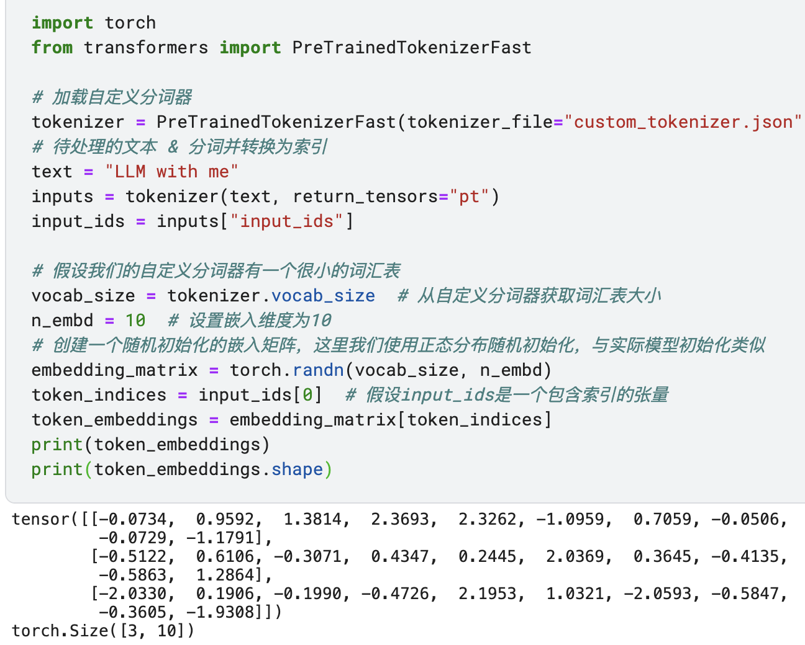

一开始，会用生成正态分布的随机值，并且是指定的维度的，如我们上面的10维。当索引进来使用的时候，就会去获取对应的向量，比如13、14、11这三个位置的

~~~python
print(embedding_matrix[13])
print(embedding_matrix[14])
print(embedding_matrix[11])
"""out:
tensor([ 0.2336,  0.0510, -0.3690,  0.1556,  0.4199, -0.0156,  0.1811,  0.0889,
        -0.2165, -0.3598])
tensor([-0.2331, -0.0356,  0.3055, -0.3690, -0.1693,  0.2621,  0.1827,  0.4458,
         0.2014, -0.2417])
tensor([-0.0288, -0.2724, -0.3007,  0.4584, -0.1438,  0.3389, -0.0454, -0.4382,
        -0.2596,  0.1011])
"""
~~~

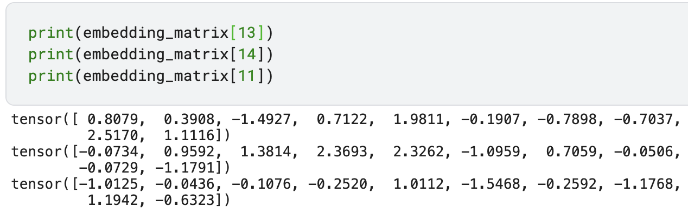

>  'LLM': 14, 'wit': 13, 'me': 12。14是对应LLM，可以看到14的值是对应上的。

Transformer模型中的embedding层虽然只有一个模块，但它是通过整个模型的训练过程中与其他层一起学习和优化的。

在GPT这样的Transformer模型中，Token Embedding并没有使用一个单独的算法来形成，而是作为模型的初始参数随机初始化，然后在整个模型的训练过程中与其他参数一起学习和调整。这个过程涉及到将输入token转换为高维向量，并通过模型的自注意力和前馈网络层来不断优化这些向量，以便它们能够更好地捕捉和表示输入数据的语义特征。

为了演示，我这里提供一个非常简化的模型过程（简化了一些位置编码等）：

~~~python
import torch
import torch.nn as nn
import torch.optim as optim

vocab_size = tokenizer.vocab_size; n_embd = 10
embedding_matrix = torch.empty(vocab_size, n_embd)
nn.init.xavier_uniform_(embedding_matrix)
# 定义一个简化版的GPT模型
class SimpleGPT(nn.Module):
    def __init__(self, vocab_size, n_embd):
        super(SimpleGPT, self).__init__()
        self.embeddings = nn.Embedding(vocab_size, n_embd)
        self.ffn = nn.Linear(n_embd, n_embd)
        self.logits = nn.Linear(n_embd, vocab_size)
        nn.init.xavier_uniform_(self.embeddings.weight)  # 使用Xavier初始化嵌入层
    
    def forward(self, input_ids):
        x = self.embeddings(input_ids)  # 嵌入层
        x = self.ffn(x)  # 前馈网络
        logits = self.logits(x)  # 输出层
        return logits

# 创建模型实例 & 定义损失函数和优化器
model = SimpleGPT(vocab_size, n_embd)
loss_fn = nn.CrossEntropyLoss()
optimizer = optim.Adam(model.parameters(), lr=0.001)

# 假设我们有一些训练数据
input_ids = torch.tensor([[1, 2, 3, 4], [2, 3, 4, 5]])  # 示例输入
labels = torch.tensor([[2, 3, 4, 5], [3, 4, 5, 6]])  # 示例目标

# 训练循环
for epoch in range(100):  # 假设训练100个epoch
    logits = model(input_ids)  # 前向传播
    loss = loss_fn(logits.view(-1, vocab_size), labels.view(-1))  # 计算损失
    # 反向传播
    optimizer.zero_grad()  
    loss.backward()
    # 梯度下降
    optimizer.step()
    # 打印损失
    if (epoch + 1) % 10 == 0:
        print(f'Epoch {epoch + 1}, Loss: {loss.item()}')

"""out:
Epoch 10, Loss: 2.7324118614196777
Epoch 20, Loss: 2.657238245010376
Epoch 30, Loss: 2.580580472946167
Epoch 40, Loss: 2.500619888305664
Epoch 50, Loss: 2.415583848953247
Epoch 60, Loss: 2.3237650394439697
Epoch 70, Loss: 2.2237038612365723
Epoch 80, Loss: 2.1143651008605957
Epoch 90, Loss: 1.9953210353851318
Epoch 100, Loss: 1.8669122457504272
"""
~~~

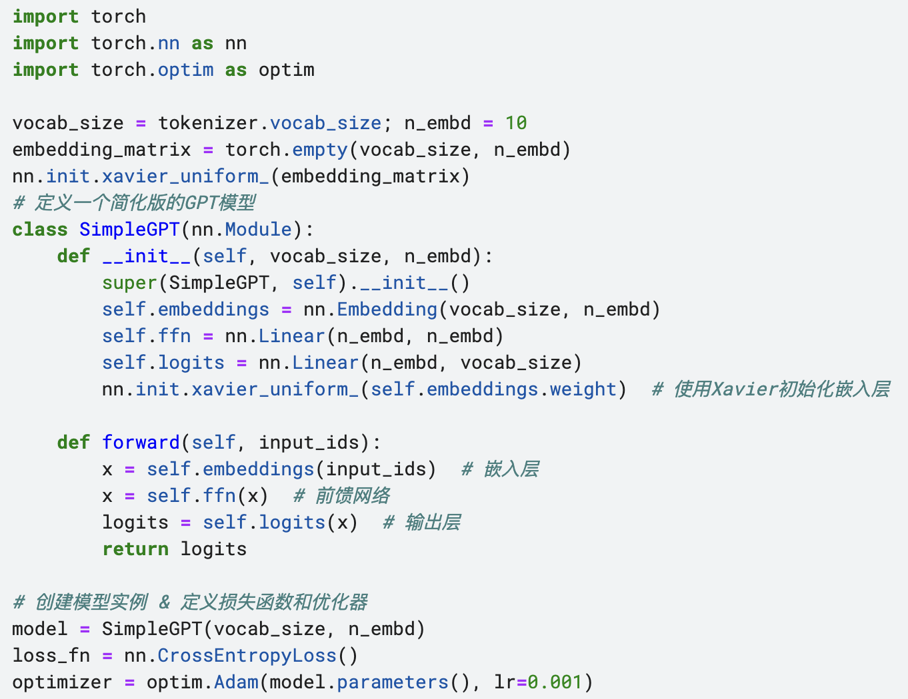

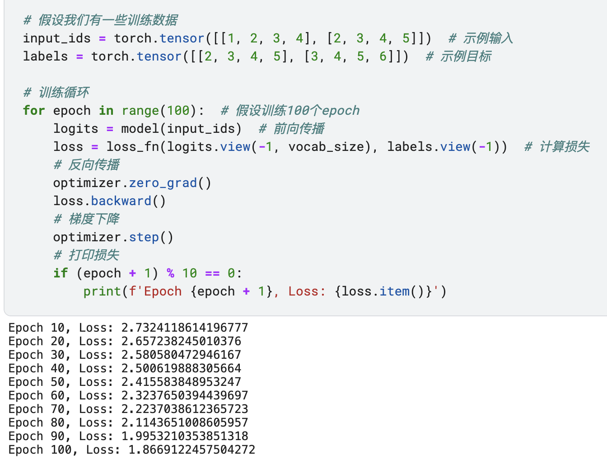

~~~python
token_indices = input_ids[0]
token_embeddings = model.embeddings(token_indices)
print(token_embeddings)
print(token_embeddings.shape)
"""out:
tensor([[ 0.3168,  0.1598, -0.2357, -0.1286,  0.4422,  0.0902, -0.2156,  0.1508,
         -0.3751, -0.4240],
        [ 0.3838, -0.2698,  0.2582, -0.1764,  0.4416, -0.0557,  0.5702,  0.3589,
         -0.0439,  0.4755],
        [ 0.0883, -0.5616, -0.4737, -0.1625,  0.4614, -0.1707, -0.3864, -0.3232,
         -0.1757,  0.2665],
        [-0.4491,  0.5912,  0.0080,  0.0760,  0.0837, -0.4634, -0.5850, -0.4476,
         -0.4615, -0.2961]], grad_fn=<EmbeddingBackward0>)
torch.Size([4, 10])
"""
~~~

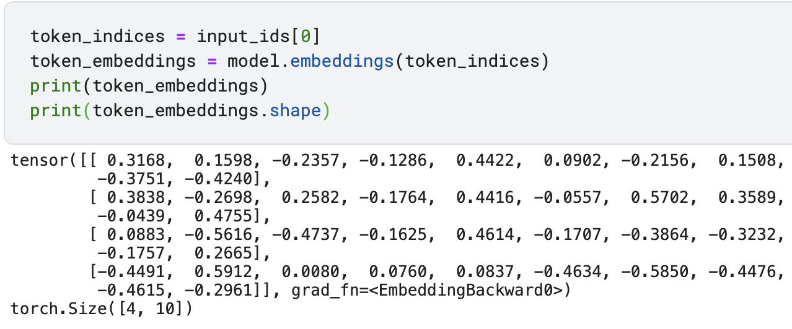

如果我们要训练一个完全自己的大模型，模型结构需要更复杂，另外最重要的就是input_ids跟labels的数据量一定要足够多。前面我们已经演示如何训练简易的GPT，并训练好了，那怎么用起来呢？

~~~python
import torch.nn.functional as F
# 假设model是训练好的模型实例 & 假设tokenizer是加载好的分词器
model.eval() # 将模型设置为评估模式
input_text = "LLM with me"  # 输入文本
input_ids = tokenizer.encode(input_text, return_tensors="pt")  # 将文本编码为token索引
temperature = 0.7  # 设置温度参数 & 一般设置为0到1之间的值
generated_text = input_text + " A:"
for _ in range(50):  # 假设我们想生成50个单词
    with torch.no_grad():  # 不需要计算梯度
        logits = model(input_ids)
        logits = logits / temperature  # 应用温度调整
        # 使用softmax函数将logits转换为概率分布 & 根据概率分布随机选择下一个单词
        probabilities = F.softmax(logits[:, -1, :], dim=-1)
        predicted_id = torch.multinomial(probabilities, num_samples=1)
        # 将预测的token添加到输入序列中 & 将预测的token解码为文本并添加到生成的文本中
        input_ids = torch.cat((input_ids, predicted_id), dim=1)
        generated_text += tokenizer.decode(predicted_id[0])

print(generated_text)
eos_token = '<EOS>'  # 在生成文本后根据<EOS>进行切割
generated_text_parts = generated_text.split(eos_token)
final_text = generated_text_parts[0] + eos_token if len(generated_text_parts) > 1 else generated_text_parts[0]
print(final_text)
"""out:
LLM with me A:[UNK]iLLwitMimeLMethihitMehw<EOS>LLMwitMmmMwitLLLLLLMLMLMiwitLLmLwithe[UNK]LLhi[UNK]witLLM
LLM with me A:[UNK]iLLwitMimeLMethihitMehw<EOS>
"""
~~~

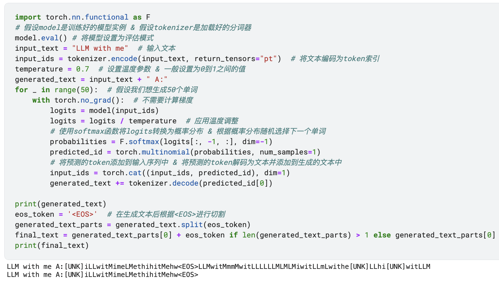

我们设置了temperature=0.7，让模型生成更开放的答案，当你改成0.1的时候你会发现每次生成的结果会变得非常确定，甚至每次生成的完全一样。

同时我们要需要限制那种最大文本词是50个，保证不会无限输出，以及判断是否遇到`'<EOS>'`结束语，遇到则截断。

最终输出的`iLLwitMimeLMethihitMehw`就是我们训练好的模型输出的下一句回答。

到这，我们已经学习了文字向量化的流程，以及如何从0开始进行文字向量化。