# 第五章——多头注意力机制——全流程

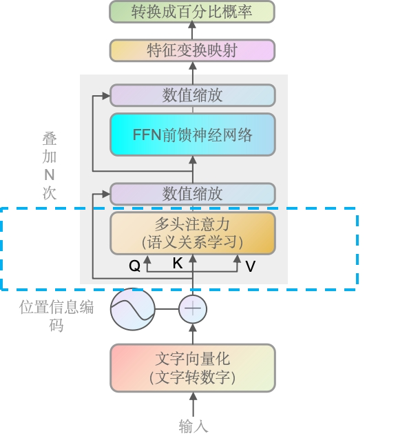

### 前言

上一章，我们已经研究了矩阵相乘以及QK相乘的过程，接下来我们完整的走一遍多头注意力机制里的流程。

### QK矩阵相乘

上面我们计算好了QK相乘后的矩阵，我们看下原文中的Attention公式
$$
\operatorname{Attention}(Q, K, V)=\operatorname{softmax}\left(\frac{Q K^{T}}{\sqrt{d_{k}}}\right) V
$$
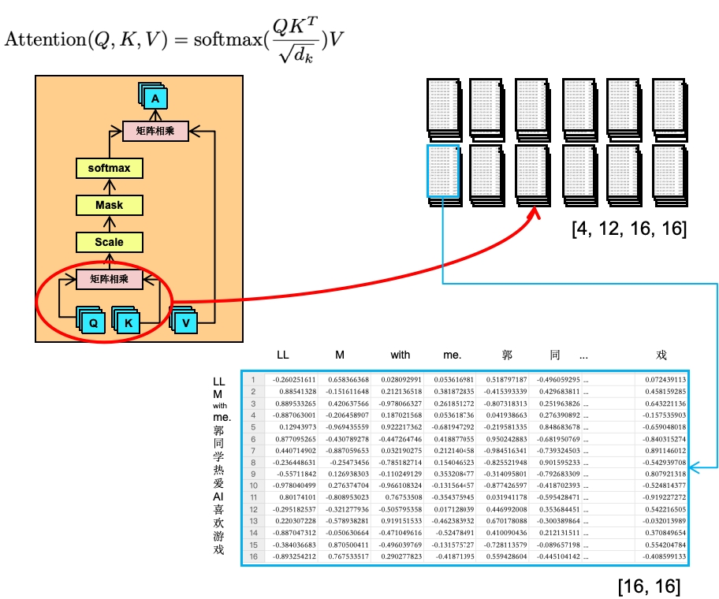

我们单独拿1个批次的第一个头出来

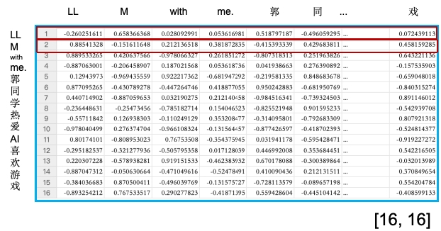

第一行的所有数据，分别上`LL`分别跟`LLM with me.郭同学热爱AI喜欢游戏`每个词的相关性。第二行则是`M`分别跟`LLM with me.郭同学热爱AI喜欢游戏`每个词的相关性。越高则代表两个字的相关性越高，越低则代表两个字的相关性越低。

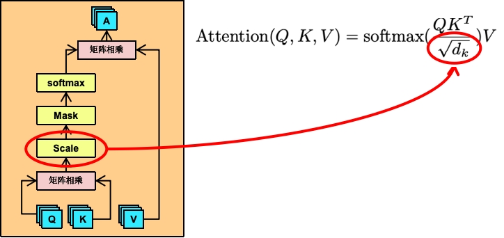

### Scale缩放

缩放层。缩放操作通常用于调整矩阵乘法的结果。在计算注意力分数之前，会将查询和键的矩阵乘法结果除以一个缩放因子，通常是键向量维度的平方根。可以看到上面的它的公式就是让QK矩阵去除以根号下的d_k，而d_k就是每个头的维度，即768除以12个头，得到64，d_k=64。

也就是下面这个表的每一个值都会除以根号下的64（即8），相当于值会进行缩小。缩放因子是键向量维度的平方根。

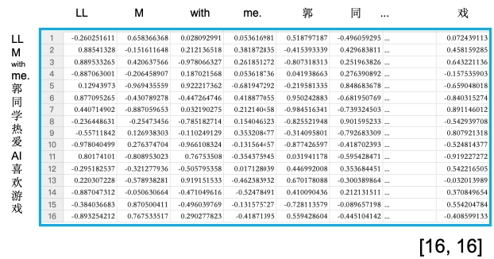

### Mask遮挡

这里讲的是生成型任务如语言模型（例如GPT），Mask遮挡的目的是为了防止模型在预测下一个词时“偷看”到未来的信息。这种技术被称为因果遮挡（Causal Masking）或自回归遮挡。在GPT这样的自回归语言模型中，模型被训练为基于之前的词来预测序列中的下一个词。因此，遮挡确保模型在生成当前词时只能使用它之前的词，而不能使用它之后的词，这符合自然语言的生成过程。

将矩阵的上三角部分（包括对角线）填充为 `-inf`。

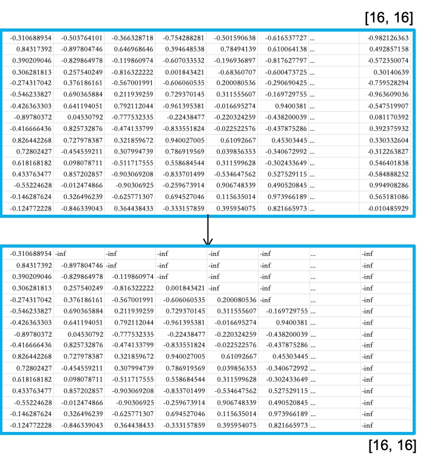

训练的过程中（语言模型场景），是从前往后训练，然后去预测后面的词（句子），所以训练过程中，我们要遮挡一部分，让模型不知道后面的信息，自动去生成然后校验生成与实际之间的差距。

### Softmax归一化

将上面的值转成0到1直接的值，即百分比的概率分布。它会放大分数较高的元素，并抑制分数较低的元素。在注意力机制中，这意味着模型可以更加集中地关注那些与当前查询（Query）最相关的键（Key），从而获取对应的值（Value）。

Softmax函数的公式如下：
$$
\text{Softmax}(z_i) = \frac{e^{z_i}}{\sum_{j=1}^{K} e^{z_j}}
$$
这里就不做详解，你就简单理解为：它可以将一批值，转换为一个概率分布，其中每个元素的值介于0和1之间，并且所有元素的和为1。

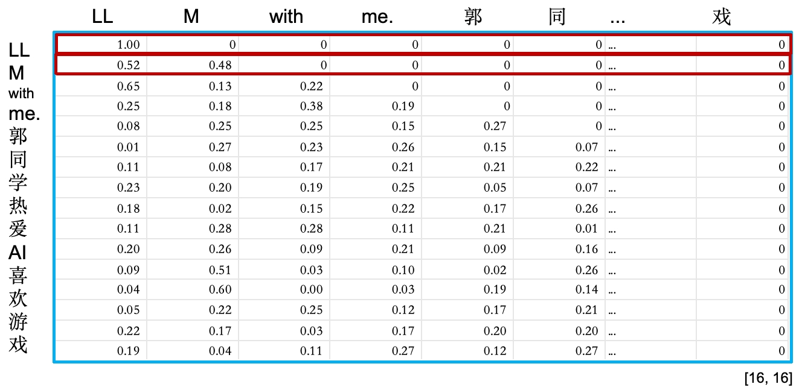

可以看到`LL`对全部文本信息（包括它本身）的概率总和是1，`M`对全部文本信息的概率总和也是1。以此类推，此时整个矩阵的形状是没有变的。

> 为什么是包括它本身？
>
> 1.**完整的上下文信息**：一个元素的含义往往不仅取决于它与其他元素的关系，也取决于它自身的特性。
>
> 2.**自引用的重要性**：在某些情况下，元素自身可能是理解其上下文中最重要的部分。即代词“它”指代前文提到的名词。
>
> 3.**灵活性和泛化能力**：自注意力机制不对元素之间的关系做任何先验假设，它允许模型在训练过程中学习到元素之间的复杂关系，包括元素与自身的关系。
>
> 4.**简化模型结构**：不做过多的代码处理，使得模型更易于实现和优化。

### QK与V矩阵相乘

前面我们QK矩阵相乘，并经过了Scale、Mask和Softmax，接下来就要跟V去做矩阵相乘

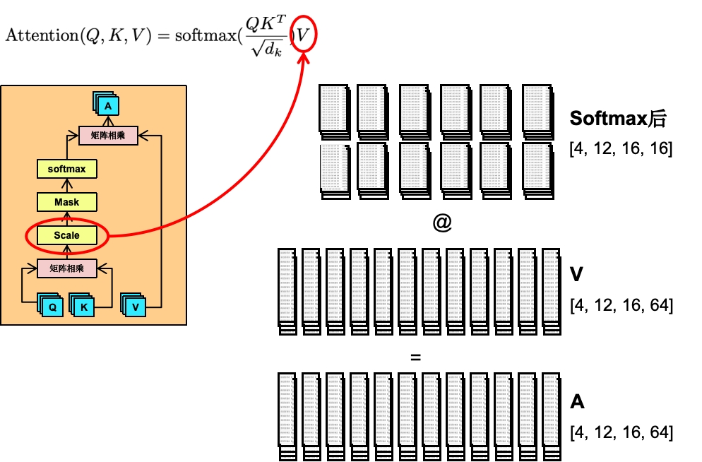

如上图所示，V跟一开始的QK一样，都是[4, 12, 16, 64]即64维，前面的矩阵相乘我们知道，只要第一个矩阵的第二个维度值 跟 第二个矩阵的第一个维度值一样（即第一个矩阵的列数与第二个矩阵的行数相同，它们就能相乘），它们就能相乘。即[16, 16]跟[16, 64]是可以矩阵相乘的，得出的矩阵A。

A就代表着我们这个Attention关注度计算。

### QKV机制的数学逻辑

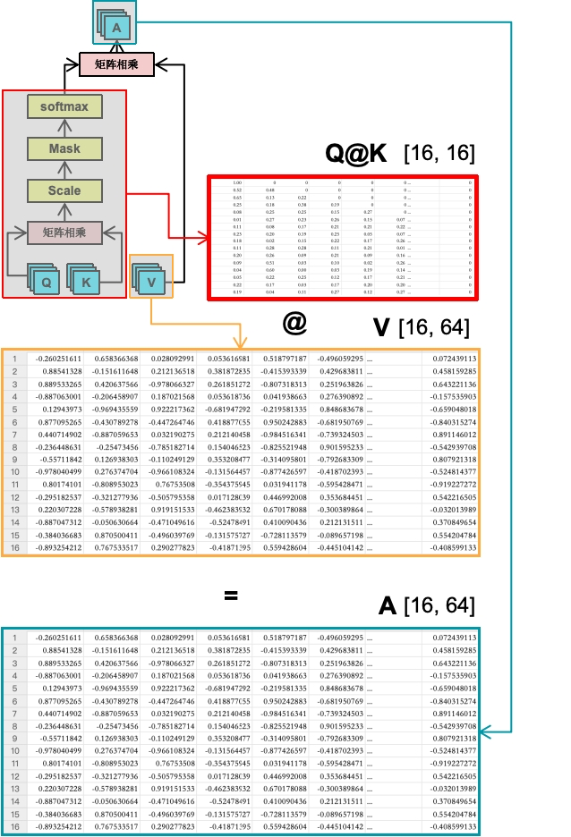

我们先看Q@K的结果，里面是每一个token（文字的信息）对应其它文字token的权重关系且是一个百分比的形式。V是原始形状[16, 64]，每行就是每个文字随机初始化的数字矩阵（如果是推理截断，这些值则是训练好的），即每个token对应的64维的向量数据，64维。两者矩阵相乘是矩阵A。

这里建议大家回到第四章，再看一遍“什么是矩阵相乘”以及“为什么是矩阵相乘-几何解释”。看完后你再确定矩阵相乘，就是第一个矩阵的第一行 跟 第二个矩阵的第一列相乘求和，以此类推。伪代码如下

~~~python
# 我随便造一点数据
import numpy as np

np.random.seed(0)
matrix_A = np.random.rand(3, 3)
matrix_B = np.random.rand(3, 6)
product_matrix = np.dot(matrix_A, matrix_B)

print("Matrix A (3x3):")
print(matrix_A)
print("\nMatrix B (3x6):")
print(matrix_B)
print("\nProduct Matrix (3x6):")
print(product_matrix)
~~~

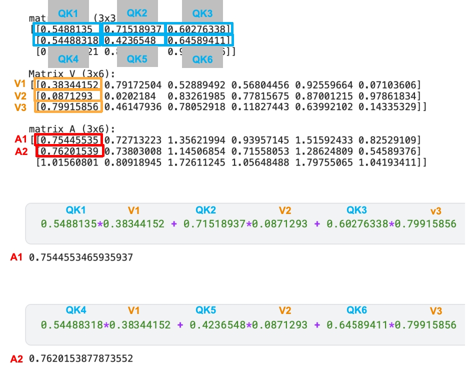

可以看到，A1的结果是QK矩阵的第一行跟V矩阵的第一列相乘的结果。而第一行是QK最终通过softmax输出的`LL`对全部文本信息的概率总和，而V矩阵的第一列，则是全部文字向量化后，在64维里的第一个维度的数值。即`LL`的概率总和（向量） 与 `LLM with me.郭同学热爱AI喜欢游戏`的一维向量 相乘。等于`LL`在这个维度里（第一维），对所有文本（包括它本身）的关注度的总权重（权重总和）。

当然，我们的V还有第二维，如下所示

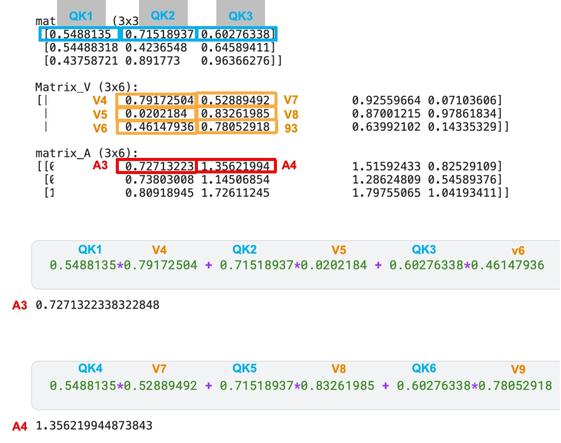

A矩阵里的第一行第二列的值，则是QK矩阵第一行跟V的第二列 相乘的结果，也就是`LL`对于在第二维，对所有文本的总权重。后续的值则以此类推。

也就是最终的矩阵A里面，就是每个文本对所有文本的关注度的总权重（权重总和），并且有64个维度（每个头和每个批次里）。在训练过程中，通过不断的训练后，推理阶段就能得出输入文字中，哪些文字的权重比较高（重要性）。

### 注意力输出结果

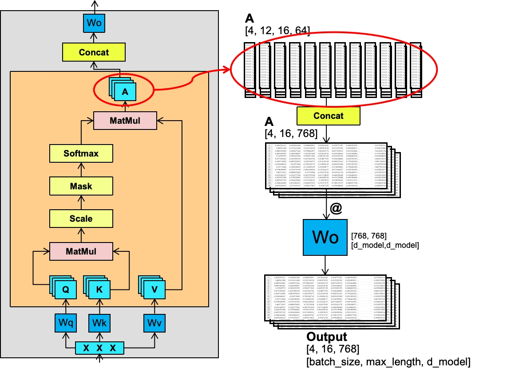

前面我们的矩阵A已经算好了，矩阵A经过Concat合并成一开始的[4, 16, 768]的形状，即12个头都合并到一起。再结果一次W的权重矩阵相乘，最终输出[4, 16, 768]维度的矩阵。

> 大家应该也注意到，除了Wo，另外3个W（qkv）都是[768, 768]维度的矩阵，并且，生成的Q、K、V、A都是统一维度的，这样最大的好处是能简化计算（包括代码）以及并行计算。

Wq、Wk、Wv、Wo这4个矩阵的值都是不一样的，每个头（以及每个Block里，即我们前面讲到的GPT-3据说有175层）里都是唯一的且只有一份。比如Wq只要是一个头里，不管跟哪个X相乘都是一样的值，除非训练的过程中自动给它调整了。

### 上亿的参数量是怎么来的

> WHAT：大家平时看到的7B、13B模型就代表着70亿、130亿的模型参数的模型。

继续上文。也就是说，每个子模块有4个W（Wq、Wk、Wv、Wo）每个768，以及一开始输入的X也会随之改变（X是词向量，前面我们GPT-2输出的是50257，维度是768），且GPT-3据说有175层（Block）。**当训练完成后，4个W权重跟向量X都会固定下来。**

公式为：
$$
((4*768)+(1*50257*768))*175 = 6,755,078,400
$$
上面单单是子模块就有67亿的参数量了，还没包括前馈神经网络的部分（后面会详解），神经网络以及LayerNorm等也有需要保存的参数。很容易就到数十亿甚至数百亿。

### 总结

多头注意力机制通过Q、K、V矩阵的转换和相互作用，实现了对输入序列的并行关注。QK矩阵相乘后，通过缩放、Mask遮挡和Softmax归一化处理，得到注意力权重。这些权重与V矩阵相乘，生成加权的输出表示。多个头的输出被合并，并通过权重矩阵Wo得到最终结果。在大型模型如GPT-3中，这个过程在多个层中重复，每层都有独特的权重矩阵，导致模型的参数量达到数十亿。这些参数在训练过程中不断调整，以优化模型的性能。**推理阶段，所有的模型参数包括这些权重都会固定住不变（冻结）。**
