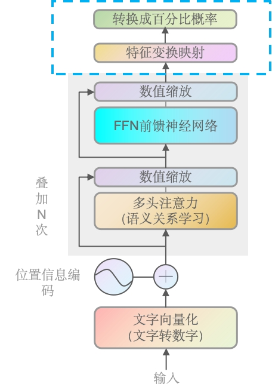
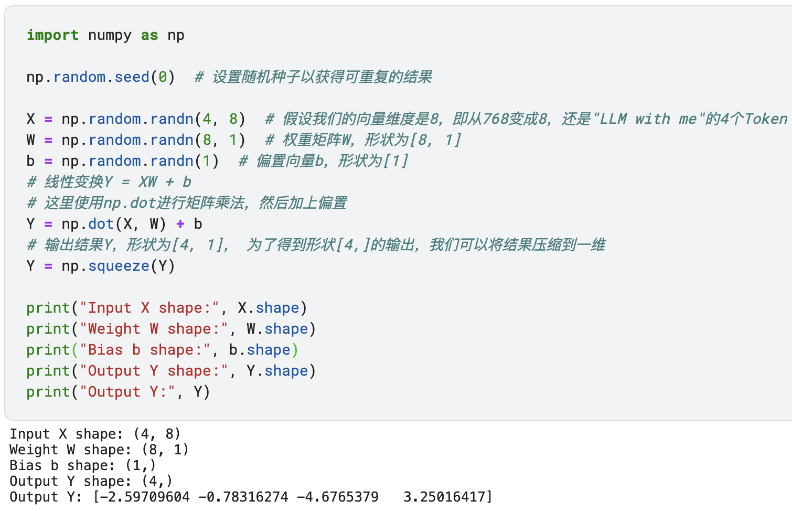

# 第八章——最后的输出

### 前言

FFNN前馈神经网络输出结果后，经过数值缩放，来到了这里。终于来到模块的最后了！Linear跟Softmax要讲的内容不多，我们放在一起，一次性过完。数值缩放由于是一样的，所以我们之间跳过了。

### Linear层

这是一个线性变换层，它将前一层（如多头注意力层或前馈神经网络层）的输出进行线性变换，以生成一个新的特征空间。在Transformer中，这通常是将维度较高的特征向量映射到一个较低维度的空间，这个空间的维度等于词汇表的大小。在GPT-2里，也就是我们前面查到的50257个词汇量。

将特征映射到词汇表空间：Transformer模型的目标是生成文本，因此需要将内部的高维特征表示映射到一个与词汇表大小相同的空间，以便能够选择最可能的下一个词。

GPT-2源代码如下：

~~~python
h_flat = tf.reshape(h, [batch*sequence, hparams.n_embd])
logits = tf.matmul(h_flat, wte, transpose_b=True)
logits = tf.reshape(logits, [batch, sequence, hparams.n_vocab])
~~~

相当于对每个时间步的特征向量应用了一个线性变换，将它们映射到了词汇表空间。这个线性变换的权重实际上是词嵌入矩阵`wte`，这是因为在GPT-2中，输出层的权重与词嵌入层的权重是共享的。

最后，`logits`被重新塑形为`[batch, sequence, hparams.n_vocab]`，这样每个序列位置都有一个与词汇表大小相对应的logits向量，这些logits可以被送入Softmax函数来生成概率分布。

### Linear的简单demo

~~~python
import numpy as np

np.random.seed(0)  # 设置随机种子以获得可重复的结果

X = np.random.randn(4, 8)  # 假设我们的向量维度是8，即从768变成8，还是"LLM with me"的4个Token
W = np.random.randn(8, 1)  # 权重矩阵W，形状为[8, 1]
b = np.random.randn(1)  # 偏置向量b，形状为[1]
# 线性变换Y = XW + b
# 这里使用np.dot进行矩阵乘法，然后加上偏置
Y = np.dot(X, W) + b
# 输出结果Y，形状为[4, 1]， 为了得到形状[4,]的输出，我们可以将结果压缩到一维
Y = np.squeeze(Y)

print("Input X shape:", X.shape)
print("Weight W shape:", W.shape)
print("Bias b shape:", b.shape)
print("Output Y shape:", Y.shape)
print("Output Y:", Y)
"""out:
Input X shape: (4, 8)
Weight W shape: (8, 1)
Bias b shape: (1,)
Output Y shape: (4,)
Output Y: [-2.59709604 -0.78316274 -4.6765379   3.25016417]
"""
~~~

可以看到线形层的目标，就是把高维降低到低维，并且跟总词汇量是一致的。同时你也会发现，输出的并不是概率（当然值也不一定有那么多大的幅度），维度不统一就无法比较，所以我们还需要用Softmax去转成概率。

### Softmax层

Softmax层是一个激活函数，它将线性层的输出转换为一个概率分布。每个元素的值介于0和1之间，并且所有元素的和为1。这使得模型能够为每个可能的输出词汇生成一个概率。

生成概率分布：为了从模型中得到一个实际的输出序列，需要将模型的输出转换为一个概率分布，这样就可以选择概率最高的词作为预测结果。
$$
\text{softmax}(z)_i = \frac{e^{z_i}}{\sum_{j=1}^{n} e^{z_j}}
\\
其中，\text{softmax}(z)_i 是向量 z中第i个元素的softmax值,\\ e是自然对数的底，n是向量z的长度，\sum_{j=1}^{n} e^{z_j}是所有元素的指数和。
$$

### 训练和推理阶段的不同

- **训练阶段**：
  - 在训练阶段，模型使用带标签的数据集进行学习。Linear层学习如何将特征映射到词汇表空间，而Softmax层将这些映射转换为概率分布。然后，模型的输出（概率分布）与真实的标签进行比较，计算损失函数（如交叉熵损失），并通过反向传播更新模型的参数。
- **推理阶段**：
  - 在推理阶段，模型不再更新参数，而是使用训练好的参数来生成预测。Linear层将输入特征映射到词汇表空间，Softmax层将这些映射转换为概率分布。根据这个分布，模型可以采用贪婪解码、束搜索（beam search）或其他策略来生成最终的文本输出。在生成每个词后，通常会将预测的词作为下一个时间步的输入，直到生成结束符号或达到最大长度限制为止。

### 总结

在Transformer模型的最后阶段，Linear层负责将前一层的输出通过线性变换映射到与词汇表大小相同的空间，为文本生成做准备。GPT中，这一层的权重与词嵌入共享。接着，Softmax层将Linear层的输出转换为概率分布，为每个词分配一个概率值，以便选择下一个最可能的词。在训练阶段，模型通过比较预测和真实标签来学习，使用损失函数进行优化。而在推理阶段，模型停止学习，使用已训练好的参数来生成文本，可以采用不同的解码策略来输出最终结果。这两个层是文本生成模型的关键组成部分，确保了输出的连贯性和准确性。