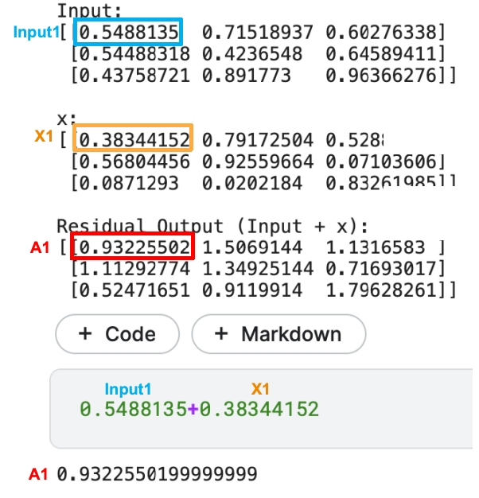

# 第六章——数值缩放

### 前言

我们的多头注意力已经输出了A矩阵，接下来需要继续矩阵相加和层归一化了。

基本公式如下
$$
\text{Output} = \text{LayerNorm}(\text{Input} + x)
$$
`x`是上一步的输入，`Input`是多头注意力里输出的结果。前面我们也看到最终输出的多头注意力的矩阵跟一开始的X的矩阵的维度是一样的。所以两者是可以同位置相加。

### 残差连接

`Input`跟`x`的相加，则是对应位置元素简单相加，可以理解为类似位置编码一样的向量加法，即`Input[i][j]`+`x[i][j]`，i、j分别表示不同维度的某个位置。

模拟代码如下：

~~~python
import numpy as np

np.random.seed(0)
Input = np.random.rand(3, 3)
x = np.random.rand(3, 3)
residual_output = Input + x

print("Input:")
print(Input)
print("\nx:")
print(x)
print("\nResidual Output (Input + x):")
print(residual_output)
~~~

可以看到结果是同个位置的元素相加。

用大白话来解释：

残差连接很像人，从心理学上讲，每个人都有对成功的路径依赖。比如说你上次是通过努力背公式，让你考试拿了高分，那你下次考试前，还会努力背公式。亦或者是你发现运动过程中，边运动边听音乐能帮忙你运动更长时间，你下次运动的时候还是会边听音乐边运动。

经过两者的相加后，大值之间相加就有可能超过1，小值相加就有可能小与-1，这时候就需要进行一次缩放。

### 层归一化

调整数据使得其均值为0，方差为1。以下是GPT-2里的源码

~~~python
def norm(x, scope, *, axis=-1, epsilon=1e-5):
    """Normalize to mean = 0, std = 1, then do a diagonal affine transform."""
    with tf.variable_scope(scope):
        n_state = x.shape[-1].value
        g = tf.get_variable('g', [n_state], initializer=tf.constant_initializer(1))  # 创建可训练的缩放因子（scale factor） g
        b = tf.get_variable('b', [n_state], initializer=tf.constant_initializer(0))  # 创建可训练的偏置项（bias term） b
        u = tf.reduce_mean(x, axis=axis, keepdims=True)  # 计算均值
        s = tf.reduce_mean(tf.square(x-u), axis=axis, keepdims=True)  # 求方差
        x = (x - u) * tf.rsqrt(s + epsilon)
        x = x*g + b
        return x
~~~

- 𝑥 是输入张量，
- 𝜇 是输入张量 𝑥*x* 沿着指定轴的均值，
- 𝜎2 是输入张量 𝑥*x* 沿着指定轴的方差，
- 𝜖 是一个小的常数，用于防止除以零，
- 𝑔 是可学习的缩放因子，
- 𝑏 是可学习的偏置项。

$$
\text{LN}(x) = g \cdot \frac{x - \mu}{\sqrt{\sigma^2 + \epsilon}} + b
$$

跟你网上查的层归一化的公式可能不一样，但两者是等价的。代码考虑了实际情况，调整成运行更优的方式。简单理解为，最终值又会进行一轮的缩放，让它们都回到一个相对统一的区间。

### 总结

多头注意力的输出A矩阵通过残差连接与原始输入x相加，得到相同位置元素的和。这个过程类似于人们对成功经验的依赖。然而，相加后的值可能超出标准范围，因此需要层归一化(LayerNorm)来调整数据分布，使其均值为0，方差为1。层归一化通过可学习参数g和b，对输入进行缩放和偏移，确保网络的稳定性。
