# 第四章——多头注意力机制——QK矩阵相乘

### 前言

前面通过向量和位置编码后，我们已经得到了一个数值矩阵，那么这个数值矩阵，怎么把数值矩阵用起来了。接下里就到了Transformer里最吸引人的一部分，注意力机制。

放大语义关系学习（注意力机制）内部

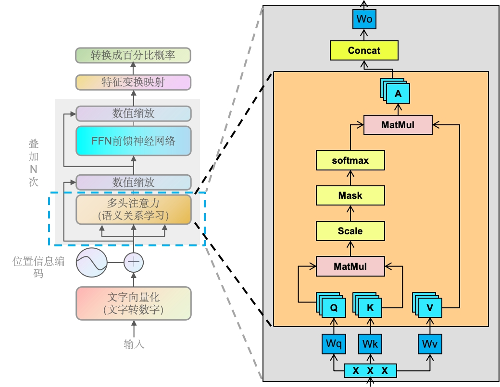

> Wq/Wk/Wv（Linear）：线性层。数学表达式是 `y = wx + b`，其中 `x` 是输入向量，`W`是权重矩阵，`b` 是偏置向量，`y` 是输出向量。
>
> MatMul: 矩阵相乘。一种线性代数运算，用于计算两个矩阵的乘积。如果有两个矩阵 A 和 B，它们的乘积 C 通过将 A 的行与 B 的列对应元素相乘然后求和来计算。
>
> Scale：缩放层。缩放操作通常用于调整矩阵乘法的结果。在计算注意力分数之前，会将查询和键的矩阵乘法结果除以一个缩放因子，通常是键向量维度的平方根。这样做是为了防止在进行softmax操作之前，注意力分数过大导致梯度消失问题。
>
> Softmax：软最大值。oftmax用于将注意力分数（经过缩放的矩阵乘法结果）转换为概率值，这些概率值表示每个头在给定输入时应该关注的程度。
>
> 另外，上面的A，有的文章会写成Z，两者是一样的。

输入矩阵X会变成3份，分别去乘以不同的权重W。变成QKV，经过各种层后，最终输出上面说的缩放好的点积注意力机制，也就是除开Scale、Maks、Softmax外，是包裹了两次的矩阵相乘。这也是最重要的部分，为什么是矩阵相乘呢？矩阵相乘能代表词之间的关注度高低吗？

### 什么是矩阵相乘

一个值是标量（Scalar），一维数组是向量（Vector），多维数组是矩阵（Matrix）

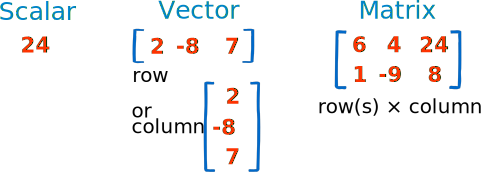

矩阵也就是多维的向量，矩阵是可以多种维度的，如3列2行（上面图的），亦或者2行3列。

矩阵相乘（又叫点积相乘）如下：

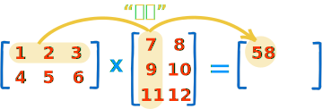

~~~markdown
"点积" 是把 对称的元素相乘，然后把结果加起来：
(1, 2, 3) • (7, 9, 11) = 1×7 + 2×9 + 3×11 = 58
~~~

要更加深入了解计算的，可以跳转到这个网址[数学乐](https://www.shuxuele.com/algebra/matrix-multiplying.html)

这里顺便补充下， 我们平时说的线形变换，其实就是一种特殊的矩阵相乘，即，矩阵乘以一个向量

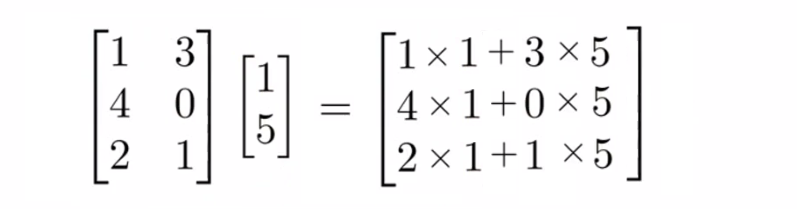

最终输出的是[3,1]的矩阵，即一个向量`[16 4 7]`。从上面我们也知道，只要[3,2]里的这个2，能够对应上另外一个矩阵的行，就能够相乘。即[3,2]对应上面的[2,1]，2跟2对应。即第一个矩阵的第二个数 能跟 第二个矩阵的第一个数对应上，就能相乘。

### 为什么是矩阵相乘-几何解释

假设我们有两个矩阵：A [1 2] 和 B [3 3]两个矩阵，画到象限表，如下图

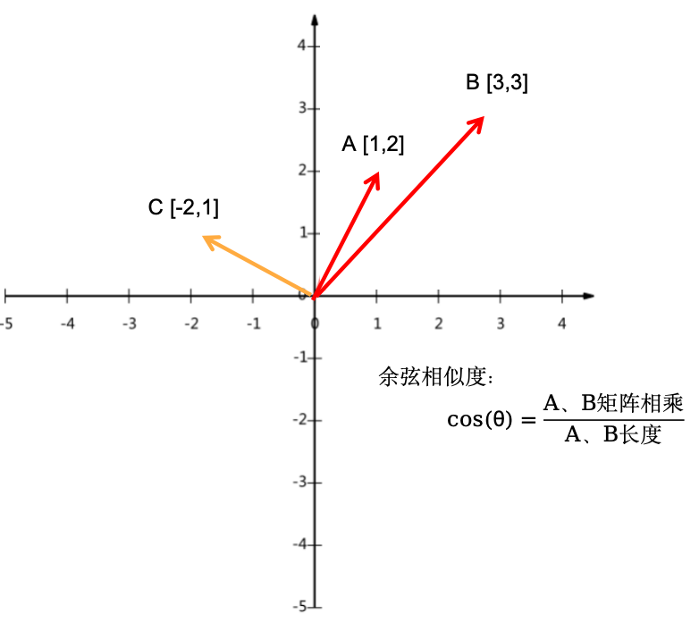

我们说A和B相似，如何判断相似，就看它们离的近不近，或者两个向量的夹角a比较小。并且我们肉眼看，A和C离的相对更远。

在线性代数中，如何判断两个顶点是否相似，可以用余弦相似度来计算（定理）。余弦相似度 = 两个矩阵相乘 除以 两条线的长度。结果越大（分子）表示相似度越高，这里我们只需要关注矩阵的值即可，因为分母（线的长度）变长，对应着矩阵的值也会增加，所以矩阵相乘的结果增幅永远大于分母的增幅。

公式变换：
$$
cos(\theta) =  \frac{A矩阵*B矩阵}{A长度*B长度}
$$
## 

$$
cos(\theta) =  \frac{A矩阵*B矩阵}{A长度*B长度}
$$

等同于
$$
A矩阵*B矩阵=B长度*A长度*cos(\theta)
$$
我们做一个浅绿色的垂线，它就变成一个直角三角形。在数学三角函数中，cos的邻边等于cos(θ)乘以斜边。也就是A的长度乘以cos(θ)，等于黑色的线（B上的黑色线）

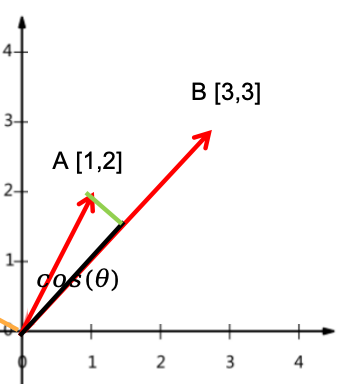

也就是公式等同于，也就是红色乘以黑色的部分
$$
A矩阵*B矩阵=B长度*(A在B上的投影)
$$
也就是寻找两个向量的相似度，也就是看其中一个向量在另一个向量上的投影长度大小，也就是A越长 等同于 投影长度越长 等同于 两者越靠近（越相似），B是不变的。

如果是C做垂线B，可能就是负数了。如果是三维平面或者四维屏幕，则是如下增加多条线

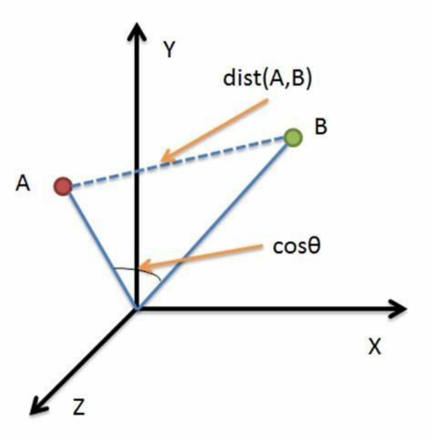

现在我们知道矩阵相乘能代表相似度的高低，回到实际中，过程图如下

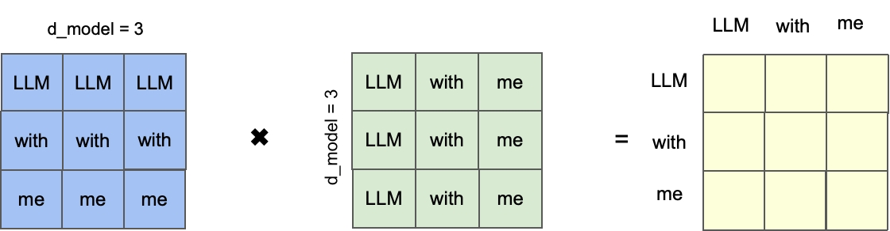

上面我放的文字，实际传给机器的时候是数值。

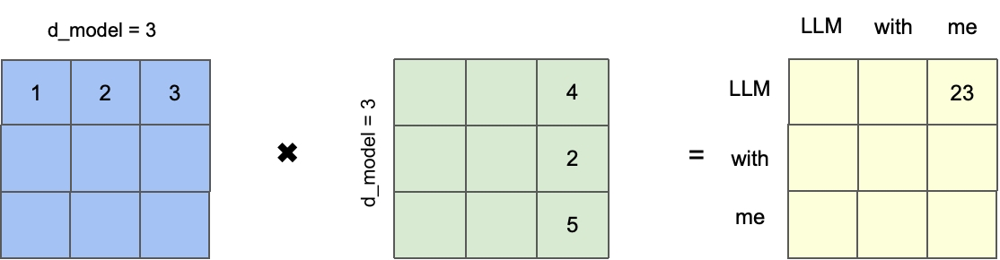

通过矩阵相乘，即`LLM`和`me`的相似度是23，最终它们都会被投射到多维平面上。

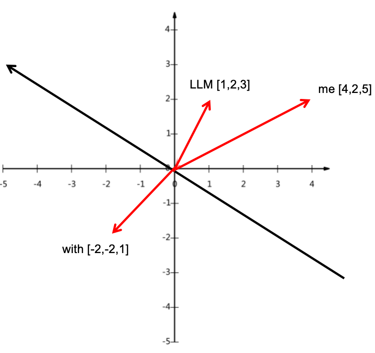

当然时间向量的值一般是[-1,+1]区间的，而不是整数型，这里是一个简单的示例。而且还会经过不断的训练循环，来不断的调整每个文本的多维表达数值分别是多少，也就是LLM初始值假设是[1,2,3]，可能训练的下一轮是[-1,3,1]下一轮又是[3,1,2]，直到最终训练结束。

### QKV权重运算

> - **Q的权重矩阵**：用于将输入转换为Query向量，这些向量代表了要查询的信息或者关注的点。
> - **K的权重矩阵**：用于将输入转换为Key向量，这些向量代表了可以被查询的信息或者关注点的索引。
> - **V的权重矩阵**：用于将输入转换为Value向量，这些向量代表了与Key相关联的实际信息内容。
>
> 想象你在一个聚会上，你（Query）想找人聊天。你环顾四周，试图找出谁（Key）可能和你兴趣相投。你找到了几个人，然后根据他们的兴趣（Value），你决定和谁聊得更投机。
>
> 在Transformer模型中，这个过程是这样的：
>
> - **Query（Q）**：就像你想找的聊天对象。
> - **Key（K）**：就像聚会上每个人的兴趣标签。
> - **Value（V）**：就像根据兴趣标签找到的人，你实际上会和他们聊天。
>
> 模型通过比较每个Query和所有Key，来决定哪些Value最相关，然后把这些信息结合起来，帮助模型更好地理解整个场景。

接下来，我们逐层拆解，来到本章节重点QKV。上一章，文本结果向量化再加上位置编码输出的矩阵是[1,4,768]，然而我们不可能只有一个句子，或者是长度只有3个字符。

比如现在我们有4句话，同时我们复用GPT-2的768维向量

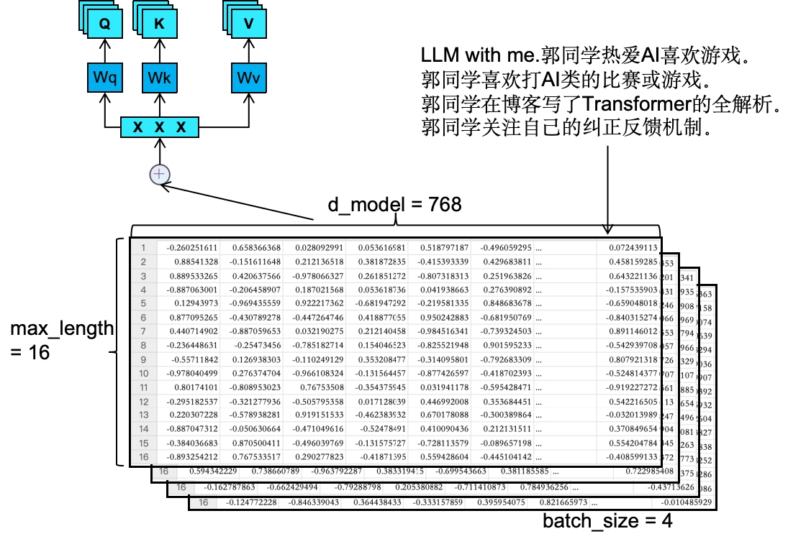

[4, 16, 768] = [batch_size, max_length, d_model]，batch_size就是我们可以做并行的设置，做算法建模的同学应该对这个比较熟悉，越大的batch_size，意味着需要越大的内存和显存。max_length则是我们设置的最大长度，超过则截断（因为资源也是有限的，我们一般取能获取到绝大多数完整句子的长度即可）。768则是GPT-2的默认向量维度。

看上面的图，[4, 16, 768]复制成3份，分别去与Wq、Wk和Wv矩阵相乘。

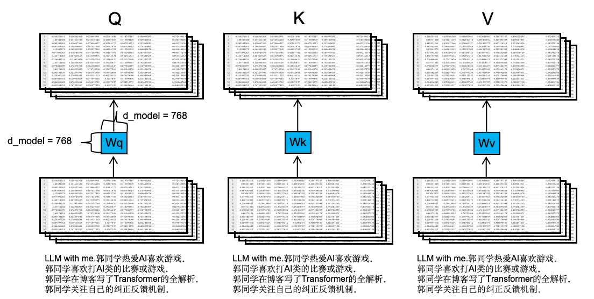

如上图所示，Wq也是一个[768, 768]维的矩阵，Wk、Wv同理，它们一开始会初始化值，训练过程会自动调整。

单独拿一个Q出来细看，[4, 16, 768]跟[768, 768]是怎么矩阵相乘的，实际上，相乘都是后两个维度跟768相乘，也就是[16,768]跟[768,768]。如下图所示：

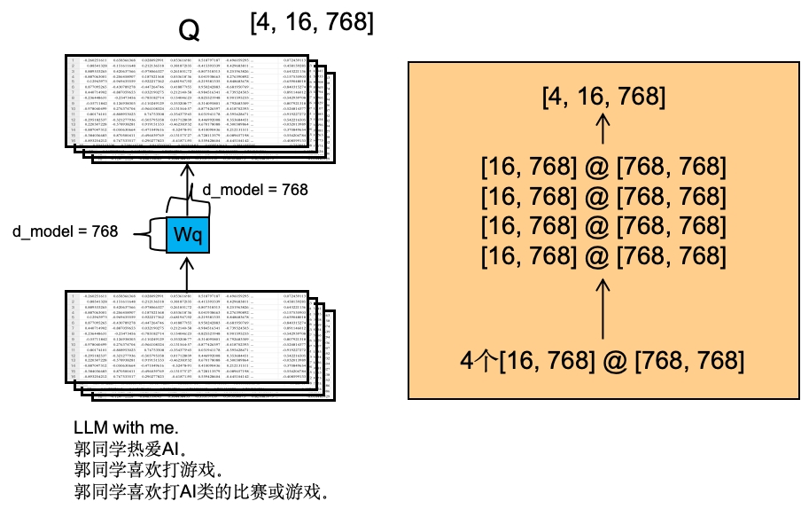

把4个[16, 768]维的矩阵分别拿出来，去与[768, 768]维的矩阵相乘。原矩阵里的数值，经过W权重后，出来的Q里的值会不一样。即最终出来的QKV三个矩阵里的值都跟原始的有所变化。

### QKV多头机制

上面我们看到单个头的是[4, 16, 768]，前面我们也一直提到QKV的多头机制，如果按照GPT里的12头（Transformer原文中并没有规定是多少头），那么会这么切分，如下图：

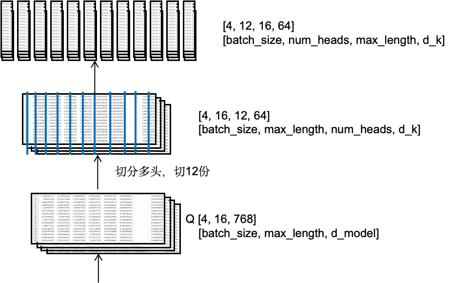

可以看到我们将768维的向量分成12个64维的向量。另外，由于大模型都是后两位数矩阵相乘，所以我们把头跟长互换，即[4, 16, 12, 64]转为[4, 12, 16, 64]。

### QK矩阵相乘

> 再次补充一下，Q是要查询的文本的信息，K则是被查询的信息或索引。即要查询文本的向量跟其它文本的向量的相似度。

QKV分别获得后，QK则是根据路线进行矩阵相乘，如下图

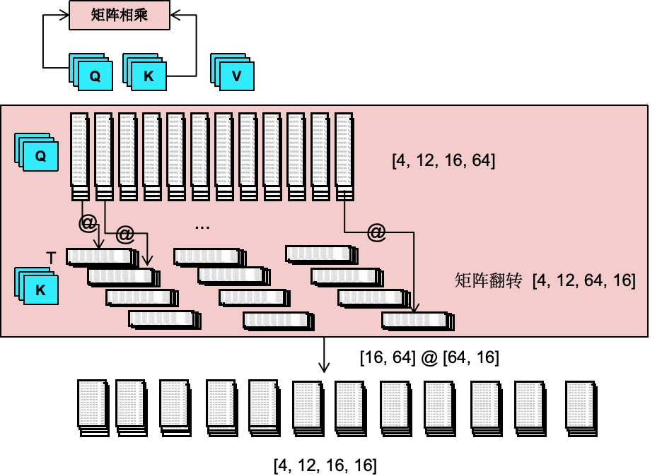

其中我们对K矩阵进行了转置（transpose），方便相乘。矩阵相乘则是每个batch_size里的每个头进行矩阵相乘，即[16, 64]和[64, 16]进行矩阵相乘，相乘后则是变成了[16, 16]的矩阵。

### 总结

本章节介绍了多头注意力机制中的QK矩阵相乘过程。在Transformer模型中，输入文本通过向量化和位置编码转换成数值矩阵，然后通过注意力机制放大语义关系。注意力机制的核心是QKV（Query, Key, Value）的计算，其中Q代表查询信息，K代表被查询的索引，V代表实际的内容信息。

多头注意力机制通过QK矩阵相乘，计算注意力分数，这些分数表示在给定查询（Query）的情况下，每个键（Key）的重要性，使得模型能够更好地捕捉文本的上下文信息，从而提高了模型对语言的理解能力。
