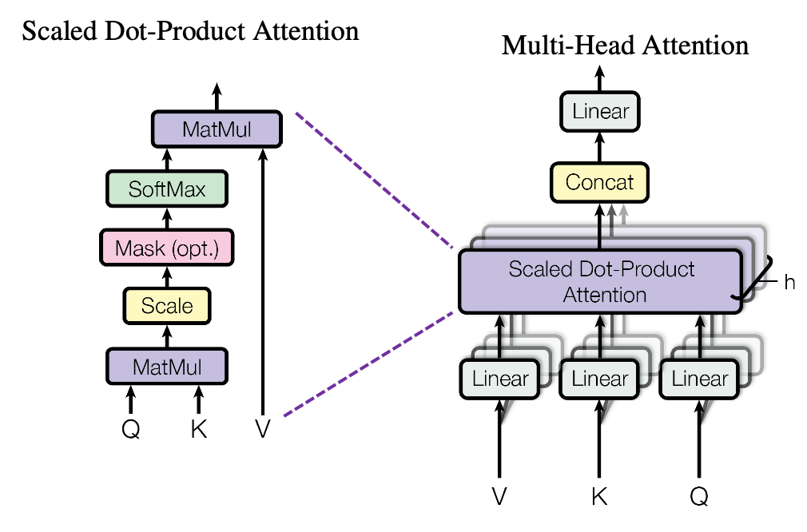

# 第四章——语义关系学习（多头注意力机制）

### 前言

前面通过向量和位置编码后，我们已经得倒了一个数值矩阵，那么这个数值矩阵，怎么把数值矩阵用起来了。接下里就到了Transformer里最吸引人的一部分，注意力机制。

放大语义关系学习（注意力机制）内部

> Linear：线性层。数学表达式是 `y = wx + b`，其中 `x` 是输入向量，`W`是权重矩阵，`b` 是偏置向量，`y` 是输出向量。
>
> MatMul: 矩阵相乘。一种线性代数运算，用于计算两个矩阵的乘积。如果有两个矩阵 A 和 B，它们的乘积 C 通过将 A 的行与 B 的列对应元素相乘然后求和来计算。
>
> Scale：缩放层。缩放操作通常用于调整矩阵乘法的结果。在计算注意力分数之前，会将查询和键的矩阵乘法结果除以一个缩放因子，通常是键向量维度的平方根。这样做是为了防止在进行softmax操作之前，注意力分数过大导致梯度消失问题。
>
> Softmax：软最大值。oftmax用于将注意力分数（经过缩放的矩阵乘法结果）转换为概率值，这些概率值表示每个头在给定输入时应该关注的程度。

QKV会结果一个线形层，也就是X会变成3份，分别去乘以不同的权重W。变成QKV，经过各种层后，最终输出上面说的缩放好的点积注意力机制，也就是除开Scale、Maks、Softmax外，是包裹了两次的矩阵相乘。这也是最重要的部分，为什么是矩阵相乘呢？矩阵相乘能代表词之间的关注度高低吗？

### 什么是矩阵相乘

一个值是标量（Scalar），一组值是向量（Vector），多组值是矩阵（Matrix）

矩阵也就是多维的向量，矩阵是可以多种维度的，如3列2行（上面图的），亦或者2行3列。

矩阵相乘（又叫点积相乘）如下：

~~~markdown
"点积" 是把 对称的元素相乘，然后把结果加起来：
(1, 2, 3) • (7, 9, 11) = 1×7 + 2×9 + 3×11 = 58
~~~

要更加深入了解计算的，可以跳转到这个网址[数学乐](https://www.shuxuele.com/algebra/matrix-multiplying.html)

这里顺便补充下， 我们平时说的线形变换，其实就是一种特殊的矩阵相乘，即，矩阵乘以一个向量

最终输出的是[3,1]的矩阵，即一个向量`[16 4 7]`。

### 为什么是矩阵相乘-几何解释

假设我们有两个矩阵：A [1 2] 和 B [3 3]两个矩阵，画到象限表，如下图

我们说A和B相似，如何判断相似，就看它们离的近不近，或者两个向量的夹角a比较小。并且我们肉眼看，A和C离的相对更远。

在线性代数中，如何判断两个顶点是否相似，可以用余弦相似度来计算（定理）。余弦相似度 = 两个矩阵相乘 除以 两条线的长度。结果越大（分子）表示相似度越高，这里我们只需要关注矩阵的值即可，因为分母（线的长度）变长，对应着矩阵的值也会增加，所以矩阵相乘的结果增幅永远大于分母的增幅。

公式变换：
$$
cos(\theta) =  \frac{A矩阵*B矩阵}{A长度*B长度}
$$
等同于
$$
A矩阵*B矩阵=B长度*A长度*cos(\theta)
$$
我们做一个浅绿色的垂线，它就变成一个直角三角形。在数学三角函数中，cos的邻边等于cos(θ)乘以斜边。也就是A的长度乘以cos(θ)，等于黑色的线（B上的黑色线）

也就是公式等同于，也就是红色乘以黑色的部分
$$
A矩阵*B矩阵=B长度*(A在B上的投影)
$$
也就是寻找两个向量的相似度，也就是看其中一个向量在另一个向量上的投影长度大小，也就是A越长 等同于 投影长度越长 等同于 两者越靠近（越相似），B是不变的。

如果是C做垂线B，可能就是负数了。如果是三维平面或者四维屏幕，则是如下增加多条线

现在我们知道矩阵相乘能代表相似度的高低，回到实际中，过程图如下

上面我放的文字，实际传给机器的时候是数值。

通过矩阵相乘，即`LLM`和`me`的相似度是23，最终它们都会被投射到多维平面上。

当然时间向量的值一般是[-1,+1]区间的，而不是整数型，这里是一个简单的示例。而且还会经过不断的训练循环，来不断的调整每个文本的多维表达数值分别是多少，也就是LLM初始值假设是[1,2,3]，可能训练的下一轮是[-1,3,1]下一轮又是[3,1,2]，直到最终训练结束。