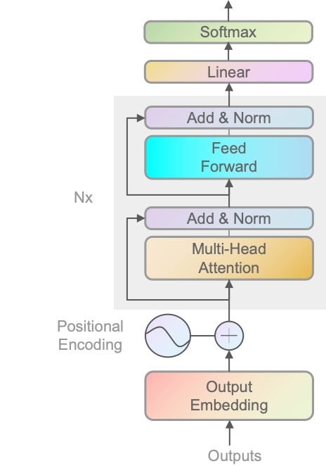

# 训练和推理的区别（选修）

### 前言

在主修章节里，我们几乎都是围绕着训练去讲的，因为懂了训练几乎等同于懂了预测。接下来我们再补充一点推理和训练不同的内容。

### 相同

#### 架构一样

​	不管是训练还是推理阶段，两者的架构都是一样的。

#### 模块一样

​	不管是训练阶段还是推理阶段，两者都是先进行向量化——>添加位置编码——>进入多头注意力模块——>Add&Norm——>前馈神经网络——>Add&Norm——>多个层块组合——>Linear——>Softmax

### 不同

#### 损失函数

- 训练阶段：会有损失函数，且每个层都会多次循环，以进行更新各种W等参数
- 推理阶段：不会运行损失函数，每个层都是固定的，且里面的W等参数不会改成，即训练完成后都不会有变化了。

### 为什么不用encoder

个人认为最主要且唯一需要不用encoder只用decoder的原因，就是 **单向性** 。

**单向性：** Transformer模型中的encoder-decoder结构是为了处理翻译等任务，其中输入和输出之间存在双向交互。然而，GPT模型的任务通常是单向的，即根据已给的上下文生成下一个词，因此只需单向的decoder结构。