# 必备数学基础

### 高等数学基础

#### 函数

> **WHAT**:后面基本都是用函数，这里先理解一下函数的概念

**函数的定义**：

- y = f(x) 其中x是自变量，y是因变量。y随着x变化

**几种特性**：

奇偶性、周期性、单调性（如下图）

**极限**：

- 按照一定次数排列的数：x1，x2，...，xn，其中xn叫做通项
- 对于数列｛xn｝,当n无限增大时，其通项无限接近于一个常数A，则称该数列以A为极限或称数列收敛于A。

**导数**：

- 都有对应的结果，不用死记硬背，查就行了，如(C)' = 0 或者(sin x)' = cos x

#### 方向导数（引出梯度）

> 在函数定义域的内点，对某一*方向*求导得到的*导数*。
>
> 常规数学中，所有问题都有一个解。而机器学习当中，求解很难或者没有解，我们只能不断逼近这个最优解。

**问题一**：蚂蚁沿着什么方向跑路不被火烧，能活下来（二维平面）

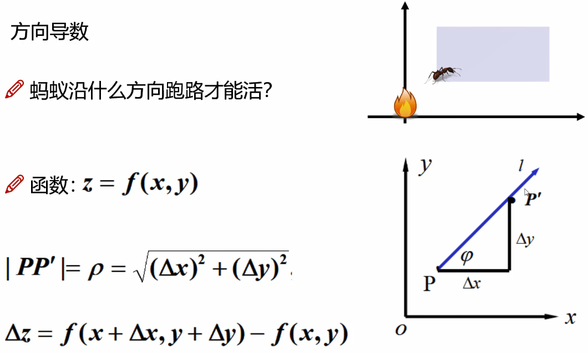

> 蚂蚁沿着任意方向都可以活，最优的是沿着对角方向L，z是函数变化，也就是图中的φ。

**三维平面的方向导数公式**：

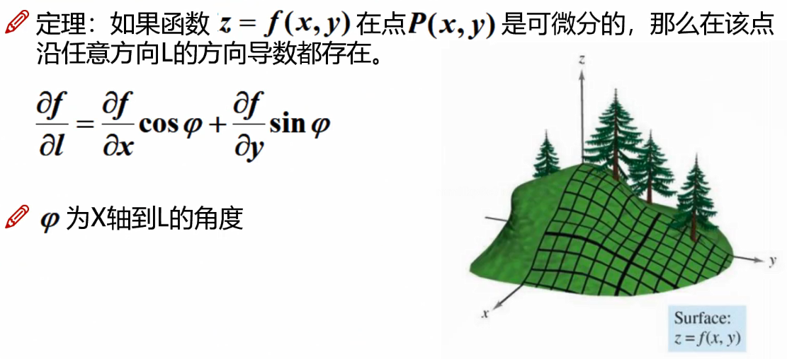

**求一个方向导数具体的值**：

求函数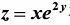在点P(1,0)处，沿着从点P(1,0)到点Q(2,-1)的方向的方向导数。

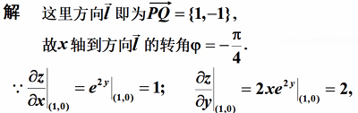

所求方向导数

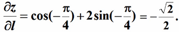

#### 梯度

> **WHAT**:简而言之，就是找到函数在某点沿着哪个梯度方向变化最大（小），也就是怎样的方向对数据逼近所需要的值最好。
>
> 是一个向量（矢量），表示某一函数在该点处的方向导数沿着该方向取得最大值，即函数在该点处沿着该方向（此*梯度*的方向）变化最快，变化率最大（为该*梯度*的模）。

函数：z = f(x,y)在平面域内具有连续的一阶偏导数，对于其中每个点P(x,y)都有向量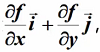则其称为函数点P的梯度。

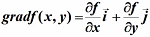

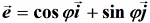是方向L上的单位向量

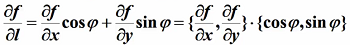

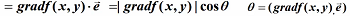

> 根据上面的梯度导数，和方向导数的区别就在多了个*cosθ*，*θ*充当梯度和方向导数之间的关系

只有当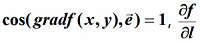才有最大值

函数在某点的梯度是一个向量，它的方向与方向导数最大值取得的方向一致。

其大小正好是最大的方向导数

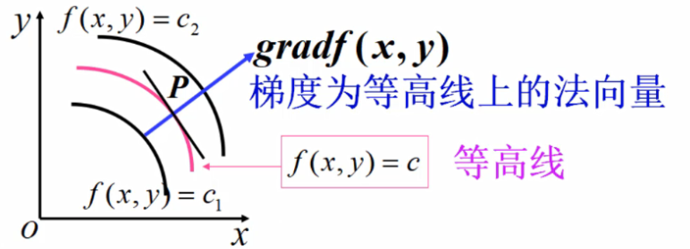

> 注意，只有*θ*=0，*cos*导数才能=1，梯度才能取得最大值，也就是那个方向。而沿着反方向就是最小值也就是梯度下降。

**求一个具体值，最大梯度方向和最小梯度方向**：

设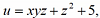求grad u，并求在点M(0,1,-1)处方向导数的最大（小）值

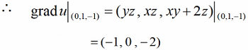

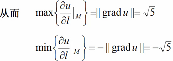

> 注：得出的结果(-1,0,2)，求解：((-1^2) + (0^2) + (-2^2)) = √5，前面都是x的平方，所以结果也需要开根号。

### 微积分

#### 微积分基本理论

> **WHAT**:前面说到，机器学习当中，求解很难或者没有解，而微积分也是一个用简单的方式，求一个与实际情况最接近的答案。
>
> 很多的微分积起来

如何求A面积的值

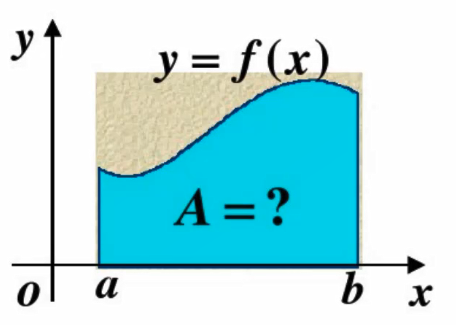

**以直代曲**：

- 对于矩形，我们可以轻松求得其面积，能否用矩形代替曲线形状呢？

- 应该用多少个矩形来代替？

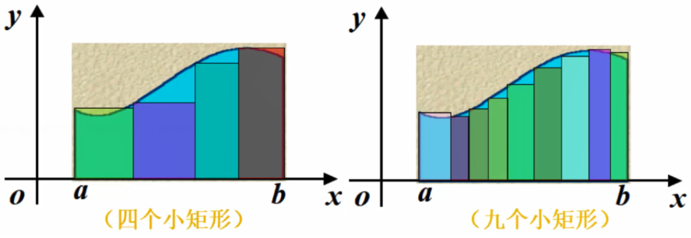

> 越小的矩形，越覆盖，然后求每个矩形的面积。

**面积的由来**：

- 在ab之间插入若干个点，这样就得到n个小区间。
- 每个小矩形面积为：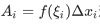近似得到曲线面积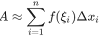
- 当分割无限加细，每个小区间的最大长度为λ，此时λ → 0
- 曲边面积：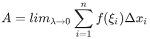

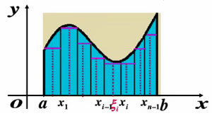

> 注意每个小区间的最大长度为λ，而λ无限接近于0时，那么曲边的面积我们就可以得出，当然这里的近似表达是极限，无限接近的极限。

**求和**：

我们需要尽可能的将每一个矩形的底边无穷小

莱布尼茨为了体现求和的感觉，把S拉长了，简写成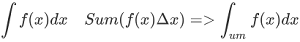

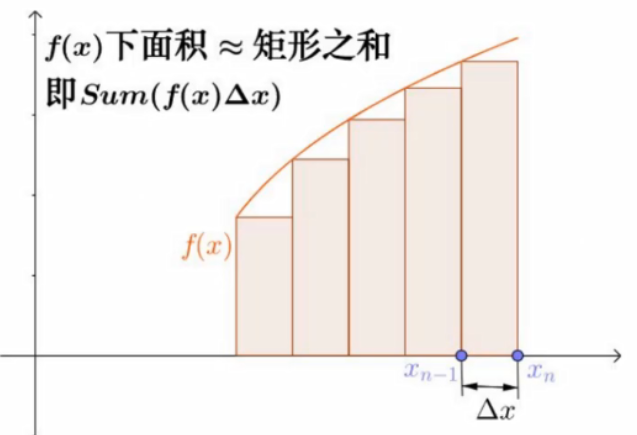

> 将上面的所有矩阵求和，∫ = sum，求和的意思

**定积分**:

当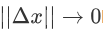时，总和S总数趋于确定的极限l，则称极限l为函数f(x)在曲线[a,b]上的定积分

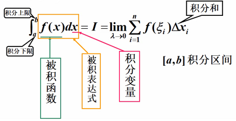

### 泰勒公式

> **what**：用简单、熟悉的多项式来近似替代复杂的函数。
>
> 一个概念可以自己去找找，需要就找我，我再把内容加上

### 线性代数基础

#### 矩阵和特征

> **WHAT**：人工智能领域，数据基本是矩阵形式，而矩阵的每列（一般是除开首列），称为特征

**矩阵**：

> 拿到数据后，数据就长如下样子，有行有列

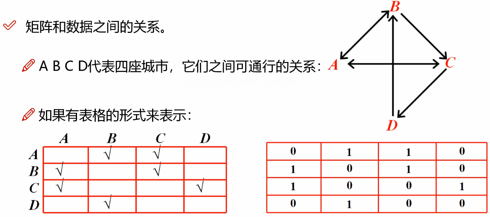

> 左图√表示A可以到B和C，如右上图，再把√号改成0/1以存储在数据里面，就如右下图

**几种特别的矩阵**：

> 上三角部分有值，和下三角部分有值

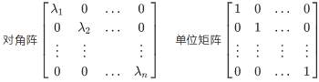

> 对角阵：对角有值且可以是任意值，单位矩阵：对角有值且相同

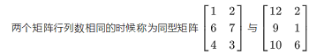

> 同型矩阵：行列相同。矩阵相等：行列相同且里面的值一样

#### 向量内积

- 设有n维向量：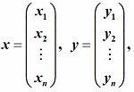

- [x, y] = x1 y1 + x2 y2 + ... + xn yn，此时我们就把[x,y]叫做向量的内积。
- 
  - 对称性：[x, y] = [y, x]
  - 线性性质：[λx, y] = λ[x, y], [x + y, z] = [x, z] + [y, z]

#### SVD矩阵分解

> **WHAT**：为了让数据的呈现更好，且不破坏数据的原始表达

数据行列可能很大，如电商行业100万客户（行），有1万的商品（特征），用一组数据表达就是

| 客户ID   | 商品1             | 商品2 | ...  | 商品1万 |
| -------- | ----------------- | ----- | ---- | ------- |
| xxx1     | 1（表示买过一次） | 0     | ...  | 5       |
| xxx2     | 0                 | 1     | ...  | 0       |
| ...      | 5                 | 10    | ...  | 0       |
| xxx100万 | ...               | ...   | ...  | ...     |

那么来一个客户，就是直接多1万列表示，这样的数据是非常稀疏的，我们可以分解成A表100万客户，100个特征，而这100个特征对应这那B表的1万个商品，也就是一个表变成A表和B表，且两者关联。

这就需要用到SVD矩阵。

### 随机变量

#### 离散和连续型数据

> 离散型是有限多个的，比如10个台阶，只可能是其中的一个台阶，一个确定的结果。
>
> 连续型则可能是任意的值，没办法确定是哪个台阶。

**离散型随机变量概率分布**

- 找到离散型随机变量X的所有可能取值

- 得到离散型随机变量取这些值的概率

  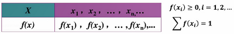

  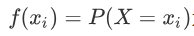为离散型随机变量的概率函数

**连续型随机变量概率分布**

- 密度：一个物体，如果问其中一个点的质量是多少？这该怎么求？

  由于这个点实在太小了，那么质量就为0了，但是其中的一大块是由

  很多个点组成的，这时我们就可以根据密度来求其质量了

- X为连续随机变量，X在任意区间(a,b]上的概率可以表示为：

  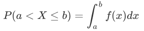其中f(x)就叫做X的概率密度函数，也可以简单叫做密度

> 还有一种方法是把每个值划分在不同区间，变成离散型，但如果有新数据进来就要再划分区间导致区间越来越多。

#### 简单随机抽样

抽取的样本满足两点

1. 样本X1，X2...Xn是相互独立的随机变量。

2. 样本X1，X2...Xn与总体X同分布。

   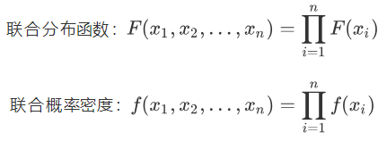

#### 极大似然估计

> **WHAT**：找到最有可能的结果

1. 构造似然函数：L(θ)

2. 对似然函数取对数：lnL(θ)

   > 做log后，logAB = logA + logB，加法更好求

3. 求偏导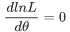

4. 求解得到 θ 值

   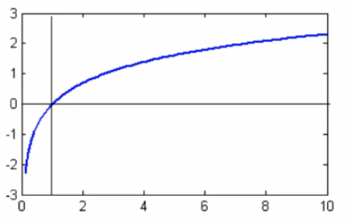

> 第一步构造函数；第二步取对数，对数后的值容易取且极值点还是那个位置；第三步求偏导；得到θ

**求一个具体的值**：

设 X 服从参数 λ(λ>0) 的泊松分布，x1,x2,...,xn 是来自 X 的一个样本值，求λ的极大似然估计值

- 因为X的分布律为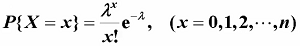
- 所以 λ 的似然函数为
- 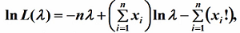
- 令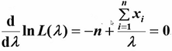
- 解得 λ 的极大似然估计值为 

### 概率论基础

#### 概率与频率

- 抛硬币和王者游戏击杀数，这些都是随机的
- 其特点：可以在相同条件下重复执行、事先知道可能出现的结果、开始前并不知道这一次的结果
- 随机试验E的所有结果构成的集合称为E的样本空间 S = {e}
  - 抛硬币：S = {正面，反面}
  - 击杀数：S = {0,1,2,...,n}

**频率与概率**

- A在这N次试验中发生的频率：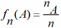，其中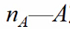发生的次数(频数)；n—总试验次数。
- 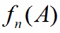的稳定值P定义为A的概率P(A) = p

- 次数越多则结果越稳定

#### 古典概型

- 定义：试验E中样本点是有限的，出现每一样本点的概率是相同。

  P(A) = A所包含的样本点数 / S中的样本点数

- 一袋中有8个球，编号为1 - 8，其中1 - 3号为红球，4 - 8 为黄球，设摸到每一球的可能性相等，从中随机摸一球，记A={摸到红球}，求P(A)。

  - S={1,2,...,8}
  - A={1,2,3} => P(A) = 3/8

#### 条件概率

> **WHAT**：在一定条件下的某个事件发生的概率

- 有个不放回的抽奖，一共三种可能性，两个不中奖一个中奖，也就是3个人抽奖，必有一个中奖，所有可能为{YNN, NYN, NNY}，N表示不中间，Y表示中间
- 第一名没中则：A = {NYN, NNY}，第三中的概率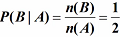
- 样本空间变了，概率也变了

#### 独立性

> **WHAT**：两个或多个随机事件的发生概率不相互影响。

例题：

甲、乙两人同时向一个目标射击，甲击中率为0.8，乙击中率为0.7，求目标被击中的概率。

设A={甲击中}，B={乙击中}，C={目标被击中}

则：C = A ∪ B，P(C) = P(A) + P(B) - P(AB)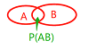

∵ 甲、乙同时射击，其结果互不影响，

∴ A, B相互独立

P(C) = 0.7+0.8-0.56 = 0.94

#### 二维随机变量

> **WHAT**:关心两个指标并了解其相互关系

如：为了了解学生的身体状况，观察学生的身高（X）和体重（Y）及两者的相互关系

- 有二维离散型随机变量
- 有二维连续型随机变量

#### 期望

> **WHAT**：期望达到什么，反映了随机变量的取值水平

- 离散型随机变量X的分布律为：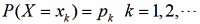

  若级数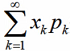绝对收敛，则称其为随机变量X的数学期望，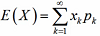

  > Xk是每种情况，Pk是每种情况对应的概率

  - 投骰子的期望则是1 / (1/6) + 2 / (1/6) + ... + 6 / (1/6) = 21 / 6 = 3.5

- 连续型随机变量X的概率密度为f(x)，若积分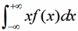绝对收敛，则称积分的值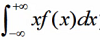为随机变量X的数学期望。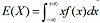

  - 随机变量X满足于均匀分布，求其期望。

    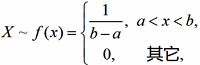=>

    

**方差**

> 衡量随机变量相对于数学期望的分散程度

#### 贝叶斯拼写纠错

问题：我们看到用户输入了一个不在字典中的单词，我们需要去猜测用户到底想输入的是什么

- P(猜测想输入的单词|用户实际输入的单词)
- 用户实际输入的单词记为D（D代表Data，即观测数据）
- 猜测1：P(h1|D)，猜测2：P(h2|D)，猜测3：P(h3|D) ...
- P(h|D) = P(h) * P(D|h) / P(D)

> p(h) 在字典里某个词出现的次数占总体的比（先验概率）
>
> P(D|h)指输入一个词，输错的概率多大；
>
> P(D)客户输入的值D，可以约掉

贝叶斯方法计算：P(h|D) = P(h) * P(D|h) ，P(h)是特定猜测的先验概率。

比如用户输入tlp，到底是top还是tip？当最大似然不能作出决定性判断时（可能两边都是一半可能性），这是先验概率就可以插手给出指示，告诉我们，一般来说top出现的程度要高许多，所以他更可能想打的是top。

#### 垃圾邮件过滤

模型比较理论

- 最大似然：最符合观测数据的（即P(D|h)最大的）最有优势
- 奥卡姆剃刀：P(h)较大的模型有较大的优势
- 抛一枚硬币，观察到的是“字”，根据最大似然估计的理念，我们应该猜测这枚硬币抛出“字”的概率是1，因为这个才能最大化P(D|h)的猜测

实例：

- 问题：给定一封邮件，判定它是否属于垃圾邮件

  D来表示这封邮件，注意D是由N个单词组成。

  我们用h+表示垃圾邮件，h-表示正常邮件

- P(h+|D) = P(h+) * P(D|h+) / P(D)

  P(h-|D) = P(h-) * P(D|h-) / P(D)

  > P(h+)是先验概率，只需要计算一个邮件库垃圾邮件和正常邮件的比例；
  >
  > P(D|h+) 垃圾邮件中，目前这封邮件里面的词有多少个相似。D里面含有N个单词d1，d2，d3，P(D|h+) =P(d1,d2,...,dn|h+)，扩展：P(d1|h+)  × P(d2|d1,h+)  × P(d3|d2,d1, h+)× ...，垃圾邮件第一个词是d1的概率 × 垃圾邮件第一个词是d1且第二个词是d2的概率 × 垃圾邮件第一个词是d1且第二个词是d2且第三个词是d3的概率...

- 上面的公式太麻烦了，例用朴素贝叶斯简化，朴素贝叶斯假设特征之间是独立，互不影响的。这么假设完d1，d2，d3完全没关系了，

  简化为P(d1|h+)  × P(d2|h+) × P(d3|h+)  × ...

- 对于P(d1|h+)  × P(d2|h+) × P(d3|h+)  × ... 只要统计di这个词在垃圾邮件中出现的概率。如：全部100封邮件中，di个词出现的概率

- 再回到最上面 P(h+|D) = P(h+) × P(D|h+) / P(D)，P(D)正常异常相同，一起省略，P(h+)是先验概率，P(D|h+) 是该封信的每个词在垃圾邮件中出现的概率，这样就可以得到结果了

### 数据科学的几种分布

#### 正态分布

> 代表宇宙中大多数的运转状态，大量的随机变量被证明是正态分布的。

若随机变量X服从一个数学期望为μ、方差为σ^2的正态分布，记为N(μ, σ^2)。其概率密度函数为正态分布的期望值μ决定了其位置，其标准差σ决定了分别的幅度。当μ = 0，σ = 1时的正态分布是标准正态分布。

- 公式

  μ是均值

  σ是标准差

#### 二项式分布

> 结果只有两个

投篮只有进球或者不进球，进球概率可能是0.5也可能不是，而不进球概率 = 1 - 进球概率。

二项式得属性包括：

- 每个试验都是独立的。
- 试验中的结果只有两种可能：进球和不进球。
- 总共进行了n次相同得试验。
- 所有试验进球和不进球的概率是相同的。

公式

N * p表示分布的均值

#### 泊松分布

适用于在随机时间和空间上发生事件的情况，其中，我们只关注事件发生的次数，如：

- 医院在一天内录制的紧急电话的数量
- 某个地区在一天内报告的失窃的数量
- 在特定城市上报自杀的人数

当以下假设有效时，则称为泊松分布

- 任何一个成功的事件都不应该影响另一个成功的事件
- 在短时间内成功的概率必须等于在更长时间内成功的概率
- 时间间隔很小时，在给间隔时间内成功的概率趋向于零

泊松分布中使用的符号

- λ是事件发生的速率
- t是时间间隔的长
- X是该时间间隔内的事件数
- 其中，X称为泊松随机变量，X的概率分布称为泊松分布
- 令μ表示长度为t的间隔中的平均事件数。μ = λ * t

公式

**求一个具体的值**

- 已知平均每小时出生3个婴儿，请问接下来的两小时，一个婴儿都不出生的概率？

  描述某段时间内，事件具体的发生概率

  

- P表示概率，N表示某种函数关系，t表示时间，n表示数量，1小时内出生3个婴儿的概率，就表示为P(N(1)=3)，λ是事件的频率。

  

#### 均匀分布

对于骰子来说，结果是1到6，得到任何一个结果的概率是相等的，这就是均匀分布的基础。与伯努利分布不同，均匀分布的所有看你结果的n个数都是相等的。

如果变量X是均匀分布的，则密度曲线可以表示为：                             

均匀分布的曲线：

均与分布曲线是一个矩形，又称为矩形分布。

**求一个具体的值**：

花店每天销售的花束数量是均匀分布的，最多40，最少为10，求日销量在15到30之间的概率。

日销量在15到30之间的概率为(30-15)*(1/(40-10)) = 0.5

也可求日销量大于20的概率为 0.667

#### 卡方分布

> 通过小数量的样本容量取预估总体容量的分布情况

卡方验证统计样本的实际观测值与理论推断值之间的偏离程度

公式

where 

#### Beta分布

> 一个概率的概率分布，当不知道一个东西的具体概率时，可以给出所有概率的可能性大小

举一个简单的例子，熟悉棒球运动的都知道有一个指标就是棒球击球率(batting average)，就是用一个运动员击中的球数除以击球的总数，我们一般认为0.266是正常水平的击球率，而如果击球率高达0.3就被认为是非常优秀的。

现在有一个棒球运动员，我们希望能够预测他在这一赛季中的棒球击球率是多少。你可能就会直接计算棒球击球率，用击中的数除以击球数，但是如果这个棒球运动员只打了一次，而且还命中了，那么他就击球率就是100%了，这显然是不合理的，因为根据棒球的历史信息，我们知道这个击球率应该是0.215到0.36之间才对。

最好的方法来表示这些经验（在统计中称为先验信息）就是用beta分布，这表示在我们没有看到这个运动员打球之前，我们就有了一个大概的范围。beta分布的定义域是(0,1)这就跟概率的范围是一样的。

接下来我们将这些先验信息转换为beta分布的参数，我们知道一个击球率应该是平均0.27左右，而他的范围是0.21到0.35，那么根据这个信息，我们可以取α=81,β=219。

之所以取这两个参数是因为：

- beta分布的均值是从图中可以看到分布主要落在(0.2,0.35)间，这是经验中得出的合理范围
- 在这个例子中，x轴就表示各个击球率的取值，x对应的y值就是这个击球率对应的概率。也就是beta分布可以看作一个概率的概率分布

- α和β是一开始的参数，在这里是81和219。当α增加了1（击中一次）。β没有增加（没有漏球）。这就是我们新的beta分布Beta(81+1,219)。
- 当得到了更多的数据，假设一共打了300次，其中击中100，200次没击中，那么新的分布就是Beta(81+100,219+200)

根据公式 α / (α+β) = (82+100) / (82+100+219+200) = 0.303，命中率提升了，蓝色曲线右移。

### 核函数

#### 核函数的目的

> 最基本的出发点是升维，使得数据更好一些，更多一些

核函数是SVM支持向量机当中最重要的函数

出发点

- 如果数据有足够多的可利用的信息，那么可以直接做想要的事情。但是现在没有那么多的信息，我们可不可以在数学上进行一些投机呢？

- 低维（比如我只知道一个人的年龄，性别，那我们能对他有更多了解吗）

  高维（比如我知道从他出生开始，做过哪些事，赚过哪些钱等）

- 如果我们对数据更好的了解，得到的结果也会更好（机器也是一样）

> 上图中，我们很难说画一个圈来区分红点和绿点，一般画直线或者曲线，如果我们把二维转换成三维，我们只需要一个面就可以切分开了，低维很难解决的问题，高维能很容易解决。核函数就是解决这么一个问题

低维的数据变成高维后，数据量和计算量也会有所增加，引出下面的解决方法。

#### 线性核函数

- Linear核函数对数据不做任何变换。

- 何时用，特征已经比较丰富，样本数据量巨大，需要进行实时得出结果的问题
  - 越复杂的模型，针对的数据集越窄，泛化能力越差，且处理速度很慢，当然越复杂也代表着越强大。
- 不需要设置任何参数，直接就可以用

#### 多项式核函数

- 需要给定3个参数

  > Q越大，越复杂

- 一般情况下2次的更常见

- γ(gama)对内积进行缩放，ζ(zeta)控制常数项，Q控制高次项。

  其特例就是线性核函数

#### 核函数实例

还是先从一个小例子来阐述问题。假设我们有俩个数据,x=(x1,x2,x3);y=(y1,y2,y3)，此时在3D空间已经不能对其进行线性划分，那么我们通过一个函数将数据映射到更高维的空间，比如9维的话，那么(x)=(x1x2,x1x2,x1x3,x2x1,X2x2,x2x3,x3x1,x3x2,x3x3)，由于需要计算内积,所以在新的数据在9维空间，需要计算<fx),f(y)>的内积,需要花费O(n^2)。

再具体点，令x = (1,2,3); y = (4,5,6), 那么f(x) = (1,2,3,2,4,6,3,6,9)，计算方式如上的x1x2内积相乘，f(y) = (16,20,24,20,25,36,24,30,36)，(此时<f(x),fy)>=16+40+72+40+100+180+72+180+324=1024。

似乎还能计算,但是如果将维数扩大到一个非常大数时候,计算起来可就不是一丁点问题了。

但是发现,K(x,y)=(<x,y>)^2

K(x, y) = (4+10+18)^2 = 32^2 = 1024

俩者相等，`K(x,y)=(<x,y>)^2=<f(x),f(y)>`，但是K(x,y)计算起来却比<f(x),f(y)>简单的多

也就是说只要用K(x,y)来计算,,效果和<f(x),f(y)>是一样的,但是计算效率却大幅度提高了，如:K(x,y)是O(n),而<f(x),f(y)>是0(n^2)。

所以使用核函数的好处就是，可以在一个低维空间去完成高维度(或者无限维度)样本内积的计算，比如K(xy)=(4+10+18)^2的3D空间对比<f(x),f(y)> = 16+40+72+40+100+180+72+180+324的9D空间。

#### 高斯核函数

> 最常用的，最好用的核函数

一维的高斯

二维的高斯

公式：

- 看起来像两个样本点之间的距离的度量，如果X和Y很相似，那么结果也就是1，如果不相似那就是0。

- 这样做的好处，特征多了无穷个，得到无穷维。

  

#### 参数的影响

高斯核函数看起来不错，但是它对参数是极其敏感的，效果差异也很大

σ^2 = 0.5

> σ越小，顶部越尖，我们计算的是样本到样本点的距离，也就是尖尖到底部的距离，底部到顶部变化越快，层次更分明，那么特征也就越明显，识别的越容易，风险也会比较高

σ^2 = 3

> σ越大，层次越平衡，也就是大家的特征都差不多，那么识别也越不容易，但是风险也相对低

决策边界如下图，σ越小，切分越厉害，越容易过拟合

> 原σ在下面，注意上面的公式||x - x'||^2 / 2σ^2，这里移上去了，所以前面加上负号，第一个是负1，第二个是负10，第三个是负100

### 熵和激活函数

#### 熵的概念

- 物体内部的混乱程度。（一件事发生的不确定性）
- 

- 所有的概率值都在0-1之间，那么最终H(X)必然也是一个正数

#### 熵的大小意味着

- 假如有100个商品，那么选到某个商品的概率非常低，而如果商品只有几个，那么选到某个商品的概率非常高
- 如公式，商品越多，所有log后的值就越高，且公式是求和，那么值就更大

想象一个分类任务，我们希望得到如下的那种结果

- A[1,1,1,1,1,1,1,1,1,1,1]
- B[1,2,3,4,5,3,4,2,2,1,1]

显然A集合才是我们希望得到的结果，它的熵值表现是非常小的。

比如我们手上有一份数据，有两个指标性别和资产，判断是否给该用户贷款，性别和资产分组完后，如果资产熵值小，那么我们可以认为资产对是否可以贷款的影响更重要。

#### 激活函数（Sigmoid函数）

- Sigmoid是常用的非线性激活函数
- 能够把连续值压缩到0-1区间，不断的下降
- 缺点：杀死梯度，非原点中心对称

解决当正负样本不好分类的时候，无法用线性分割，那么用一个概率值去定义一个样本是否是正负，比如大于0.5定义为正，否则是负。

又如5分类任务时，我们可以输出成以下形式

| 样本 | 类别1 | 类别2 | 类别3 | 类别4 | 类别5 |
| ---- | ----- | ----- | ----- | ----- | ----- |
| A    | 0.1   | 0.9   | 0.3   | 0.6   | 0.1   |
| B    | 0.9   | 0.1   | 0.1   | 0.1   | 0.1   |
| C    | 0.1   | 0.1   | 0.1   | 0.1   | 0.6   |

如上所示，我们可以认为A是类别2和类别4的，B是类别1的，C是类别5的。

#### 激活函数的问题

**杀死梯度**：

之前我们计算梯度下降时，当值无限接近于边缘，如X轴，那么梯度就为0，也就没办法应用，特别是神经网络是串行的，结果是累乘的求梯度，这样其中一个为0时，那么乘以0就全部结果为0

**非原点中心对称**：

> 原点对称是0的位置

Sigmoid没有负数，都是大于0的，当梯度更新的时候，要么全为负要么全为正，不会有正有负，也就是一根筋的往一个方向跑，优化更新会产生阶梯式

那么更新就会慢，收敛效果一般

**Tanh函数**

- 原点中心对称
- 输出在-1到1直接
- 梯度消失现象依然存在，会贴近边缘

**ReLU函数**

- 公司简单使用
- 解决梯度消失现象，计算速度更快

> 没有了梯度为0的地方

> 会直接把小于0的杀死

> 虚线是其它函数，实现是relu，可以看到relu函数收敛的非常快

但是上面还存在一个问题，就是杀死小于0的神经元，那么这些神经元就不会再更新，它可能会存在作用，所以改进后

**Leaky ReLU**

- 解决了Rulu会杀死一部分神经元的情况

> 可以看到max里面最小值是0.01x，也就是不会直接杀死

### 回归分析

#### 概述

> 相关分析是研究两个或多个以上的变量之间相关程度及大小的一种统计方法。
>
> 回归分析是寻找存在相关关系的变量间的数学表达式，并进行统计推断的一种统计方法。

在对回归分析进行分类时，主要有两种分析方式：

- 根据变量的数目，可以分类一元回归、多元回归
- 根据自变量与因变量的表现形式，分为线性和非线性

所以回归分析包括四个方向：一元线性回归分析、多元线性回归分析、一元非线性回归分析、多元非线性回归分析

> 曲线上的点，叫估计值（预测值），观测值也是真实值，观测值和估计值之间的差异叫残差。我们希望这个残差越小越好

回归分析的一般步骤：

- 确认回归方程中解释变量和被解释变量
- 确定回归模型建立回归方程
- 对回归方程进行各种校验
- 利用回归方程进行预测

#### 回归方程的定义

- 因变量：被预测或被解释的变量，用y表示
- 自变量：预测或解释因变量的一个或多个变量，用x表示
- 对于具有线性关系的两个变量，可以用一个方程来表示它们之间的线性关系
- 描述因变量y如何以来自变量x和误差项ε的方程称为回归模型。

对于只涉及一个变量的一元线性回归模型可表示为：

- y因变量
- x自变量
- β0表示截距
- β1表示斜率
- ε表示误差项，反映除x和y之间的线性关系外的随机因素对y的影响

如何求出β0和β1

一元例子：

- 人均收入是否会影响人均食品消费支出
- 贷款余额是否影响到不良贷款
- 航班正点率是否对顾客投诉次数有显著影响

**回归方程**

描述因变量y的期望值入喝依赖于自变量x的方程称为回归方程。根据一元线性回归模型的假设，可以得到它的回归方程为：

- 如果回归方程中的参数已知，对于一个给定的x值，利用回归方程就能计算出y的期望值
- 用样本统计量代替回归方程中的未知参数，就得到估计的回归方程，简称回归直线

#### 误差项的定义

- 误差ε是独立且具有相同的分布，并服从均值为0方差为θ^2的高斯分布
- 独立：张三和李四一起来贷款，他俩没关系
- 同分布：他俩都是来同一银行，即我们假定的银行
- 高斯分布：银行可能会多给，也可能会少给，但是绝大多数情况下浮动不会太大，极小情况下浮动大，符合正常情况

#### 最小二乘法推导与求解

- 预测值与误差

- 由于误差服从高斯分布

- 将（1）式代入（2）式：

  > 什么样的θ和x相乘后，得到最相近或者相同的y

- 似然函数：

  解释：什么样的参数和我们的数据组合后恰好是真实值

- 对数似然：

  解释：乘法难解，加法就容易了，对数里乘法可以转换成加法

- 展开化简：

  

- 目标：让似然函数越大越好

  

  最小二乘法

**参数的最小二乘法估计**

对于回归直线，关键在于求解参数，常用高斯提出的最小二乘法，它使因变量的观察值y与估计值之间的离差平方和达到最小来求解。

展开得：

求偏导可得：

求解：

#### 回归方程求解小例子

实例：70年代世界制造业总产量与世界制成品总出口量的变化关系如表：

| 年度 | 总产量年增长率(%) x | 总出口量年增长率(%) y |
| ---- | ------------------- | --------------------- |
| 1970 | 4.0                 | 8.5                   |
| 1971 | 4.0                 | 8.0                   |
| 1972 | 8.5                 | 10.5                  |
| 1973 | 9.5                 | 15.5                  |
| 1974 | 3.0                 | 8.5                   |
| 1975 | -1.0                | -4.5                  |
| 1976 | 8.0                 | 13.5                  |
| 1977 | 5.0                 | 5.0                   |
| 1978 | 5.0                 | 6.0                   |
| 1979 | 4.0                 | 7.0                   |

利用回归直线进行估计和预测：

- 点估计：利用估计的回归方程，对于x的某一特定的值，求出y的一个估计值，就是点估计
- 区间估计：利用估计的回归方程，对于x的一个特定值，求出y的一个估计值的区间就是区间估计

**估计标准误差的计算**

为了度量回归方程的可靠性，通常计算估计标准误差。它度量观察值回绕着回归直线的变化程度或分散程度。

估计平均误差：

- 公式中根号内的分母是n-2，而不是n，这是由于自由度为n-2。
- 估计标准误差越大，则数据点围绕回归直线的分散程度就越大，回归方程的代表性越小。
- 估计标准误差越小，则数据点围绕回归直线的分散程度越小，回归方程的代表愈大，其可靠性越高。

**置信区间估计**

**在1—a置信水平下预测区间为**：

**求一个具体的值**

某企业从有关资料中发现广告投入和产品销售有密切的关系。近年该企业广告费和销售额资料如下表，若2003年广告费为120万，请用医院线性回归求2003年产品销售额的置信区间和预测区间（α=0.05）

| 年份 | 广告费x（万元） | 销售额y（百万元） |
| ---- | --------------- | ----------------- |
| 1994 | 35              | 18                |
| 1995 | 52              | 25                |
| 1996 | 60              | 30                |
| 1997 | 72              | 38                |
| 1998 | 85              | 41                |
| 1999 | 80              | 44                |
| 2000 | 95              | 49                |
| 2001 | 100             | 52                |
| 2002 | 105             | 60                |

求解如下

- 
- =-3.65 + 0.57 ×120 = 64.75
- 
- =64.75±2.365 × 2.43 × 0.743=64.75 ± 4.2699
- =64.72 ± 2.365 × 2.43 ×1.2459 = 64.75 ± 4.3516

结果图

影响区间宽度的因素：

- 置信水平(1-a)，区间宽度随置信水平的增大而增大
- 数据的离散程度Se，区间宽度随离程度的增大而增大样本容量
- 区间宽度随样本容量的增大而减小
- X0与X均值之间的差异，随着差异程度的增大而增大

#### 回归直线拟合优度

回归直线与各观测点的接近程度称为回归直线对数据的拟合优度

- 总平方和（SST）:

  

- 回归平方和（SSR）：

  

- 残差平方和（SSE）：

  

总平方和可以分解为回归平方和、残差平方和两部分：SST = SSR + SSE

- 总平方和（SST），反映因变量的 n 个观察值与其均值的总离差
- 回归平方和（SSR），反映了y的总变差中，由于x与y之间的线性关系引起的y的变化部分
- 残差平方和（SSE），反映了除了x对y的线性影响之外的其他因素对y变差的作用，是不能由回归直线来解释的y的变差部分

**判定系数**

回归平方和占总平方和的比例，用R^2表示，其值在0到1之间

- R^2 == 0：说明y的变好与x无关，x完全无助于解释y的变差
- R^2 == 1：说明残差平方和为0，拟合是完全的，y的变化只与x有关

**显著性校验**

著性检验的主要目的是根据所建立的估计方程用自变量x来估计或预测因变量y的取值。当建立了估计方程后,还不能马上进行估计或预测,因为该估计方程是根据样本数据得到的，它是否真实的反映了变量x和y之间的关系，则需要通过检验后才能证实根。

据样本数据拟合回归方程时，实际上就已经假定变量x与y之间存在着线性关系，并假定误差项是一个服从正态分布的随机变量，且具有相同的方差。但这些假设是否成立需要检验

显著性检验包括两方面：

- 线性关系检验
- 回归系数检验

**线性关系检验**

线性关系检验是检验自变量x和因变量y之间的线性关系是否显著，或者说，它们之间能否用一个线性模型来表示。

将均方回归(MsR)同均方残差(MsE)加以比较，应用F检验来分析二者之间的差别是否显著。

- 均方回归：回归平方和（SSR）除以相应的自由度(自变量的个数K)
- 均方残差：残差平方和（SSE）除以相应的自由度(n-k-1)

H0：β1 = 0所有回归系数与零无显著差异，y与全体x的线性关系不显著

计算检验统计量F:

**回归系数的显著性检验**

回归系数显著性检验的目的是通过检验回归系数β的值与0是否有显著性差异，来判断Y与X之间是否有显著的线性关系若β=0，则总体回归方程中不含X项(即Y不随X变动而变动)，因此，变量Y与X之间并不存在线性关系；若β≠0，说明变量Y与X之间存在显著的线性关系

是根据最小二乘法求出的样本统计量，服从正态分布；

的分布具有如下性质数学期望E()=

标准差：

由于δ未知，需用其估计量Se来代替得到的估计标准差

计算检验的统计量：

**线性关系检验与回归系数检验的区别**：

线性关系的检验是检验自变量与因变量是否可以用线性来表达，而回归系数的检验是对样本数据计算的回归系数检验总体中回归系数是否为0

- 在一元线性回归中，自变量只有一个，线性关系检验与回归系数检验是等价的
- 多元回归分析中，这两种检验的意义是不同的。线性关系检验只能用来检验总体回归关系的显著性，而回归系数检验可以对各个回归系数分别进行检验

#### 多元与曲线回归问题

经常会遇到某一现象的发展和变化取决于几个影响因素的情况，也就是一个因变量和几个自变量有依存关系的情况，这时需用多元线性回归分析。

- 多远线性回归分析预测法，是指通过对两上或两个以上的自变量与变量的相关分析，建立预测模型进行预测和控制的方法

- 多元线性回归预测模型一般式为

**调整的多重判定系数**：

用样本容量n和自变量的个数k去修正R^2得到：

- 避免增加自变量而高估R^2

**曲线回归分析**：

直线关系是两变量间最简单的一种关系，曲线回归分析的基本任务是通过两个相关变量x与y的实际观测数据建立曲线回归方程，以揭示x与y间的曲线联系的形式。

曲线回归分析最困难和首要的工作是确定自变量与因变量间的曲线关系的类型，曲线回归分析的基本过程：

- 先将x或y进行变量转换
- 对新变量进行直线回归分析、建立直线回归方程并进行显著性检验和区间估计
- 将新变量还原为原变量，由新变量的直线回归方程和置信区间得出原变量的曲线回归方程和置信区

由于曲线回归模型种类繁多，所以没有通用的回归方程可直接使用。但是对于某些特殊的回归模型,可以通过变量代换、取对数等方法将其线性化，然后使用标准方程求解参数，再将参数带回原方程就是所求。

**实例**：**某商店各个时期的商品流通费率和商品零售额资料**

| 商品零售额x（万元） | 9.5  | 11.5 | 13.5 | 15.5 | 17.5 | 19.5 | 21.5 | 23.5 | 25.5 | 27.5 |
| ------------------- | ---- | ---- | ---- | ---- | ---- | ---- | ---- | ---- | ---- | ---- |
| 商品流通费率y（%）  | 6    | 4.6  | 4    | 3.2  | 2.8  | 2.5  | 2.4  | 2.3  | 2.2  | 2.1  |

散点图如下：

散点图显示出x与y的变动关系为一条递减的双曲线。

> 这样转换后，公式和线性公式是一样的

标准方程为

将计算数据代入

解得

= -0.4377 + 60.4x'

x' = 1/x 代入

=-0.4377+

**多重共线性**

回归模型中两个或两个以上的自变量彼此相关的现象

举例 x1={10,8,6,4}，x2={5,4,3,2}，那么x1是两倍的x2

多重共线性带来的问题有：

- 回归系数估计值的不稳定性增强
- 回归系数假设检验的结果不显著等

**多重共线性检验的主要方法**

- 容忍度
- 方差膨胀因子（VIF）

容忍度：

- Ri是解释变量xi与方程中其它解释变量间的复相关系数；
- 容忍度在0~1之间，越接近于0，表示多重共线性越强，越接近于1，表示多重共线性越弱；

**方差膨胀因子**

方差膨胀因子是容忍度的倒数

- VIFi越大,特别是大于等于10，说明解释变呈xi与方程中其他解释变量之间有严重的多重共线性；
- VIFi越接近1，表明解释变量xi和其他解释变量之间的多重共线性越弱；

#### Python工具包

统计分析库https://www.statsmodels.org/stable/index

> anaconda自带

专门机器学习的包https://scikit-learn.org/stable/

> anaconda自带，含大量模型和分析工具等

https://scikit-learn.org/stable/auto_examples/

> 在这里，你可以随意选择你想要的图，复制代码换成自己的即可，无需再自己写代码

还有pandas和numpy是必不可少的

#### statsmodels回归分析

[请跳转至notebook](https://github.com/ben1234560/AiLearning-Theory-Applying/tree/master/notebook_%E5%BF%85%E5%A4%87%E6%95%B0%E5%AD%A6%E5%9F%BA%E7%A1%80/%E5%81%87%E8%AE%BE%E6%A3%80%E9%AA%8C%E7%AB%A0%E8%8A%82)

#### 高阶与分类变量实例

[请跳转至notebook](https://github.com/ben1234560/AiLearning-Theory-Applying/tree/master/notebook_%E5%BF%85%E5%A4%87%E6%95%B0%E5%AD%A6%E5%9F%BA%E7%A1%80/%E5%81%87%E8%AE%BE%E6%A3%80%E9%AA%8C%E7%AB%A0%E8%8A%82)

#### 案例：汽车价格预测任务

[请跳转至notebook](https://github.com/ben1234560/AiLearning-Theory-Applying/tree/master/notebook_%E5%BF%85%E5%A4%87%E6%95%B0%E5%AD%A6%E5%9F%BA%E7%A1%80/%E5%9B%9E%E5%BD%92%E5%88%86%E6%9E%90%E7%AB%A0%E8%8A%82)

##### 缺失值填充

##### 特征相关性

##### 预处理

##### 回归求解

上述notebook中的功能都集成在sklearn中，怎么用sklearn，
 
去到分类模型的页面https://scikit-learn.org/stable/modules/classes

找到lasso点击进去

可以看到其公式，及参数的默认值等

使用小案例等

具体的案例

### 假设检验

[请跳转至notebook](https://github.com/ben1234560/AiLearning-Theory-Applying/tree/master/notebook_%E5%BF%85%E5%A4%87%E6%95%B0%E5%AD%A6%E5%9F%BA%E7%A1%80/%E5%81%87%E8%AE%BE%E6%A3%80%E9%AA%8C%E7%AB%A0%E8%8A%82)

#### 假设检验基本思想

#### 左右侧检验与双侧检验

#### Z检验基本原理

#### Z检验实例

#### T检验

#### T检验实例

#### 卡方检验

#### 假设检验中的两类错误

以上内容均已更新在notebook

#### Python假设校验实例

[请跳转至notebook](https://github.com/ben1234560/AiLearning-Theory-Applying/tree/master/notebook_%E5%BF%85%E5%A4%87%E6%95%B0%E5%AD%A6%E5%9F%BA%E7%A1%80/%E5%81%87%E8%AE%BE%E6%A3%80%E9%AA%8C%E7%AB%A0%E8%8A%82)

#### Python卡方检验实例

[请跳转至notebook](https://github.com/ben1234560/AiLearning-Theory-Applying/tree/master/notebook_%E5%BF%85%E5%A4%87%E6%95%B0%E5%AD%A6%E5%9F%BA%E7%A1%80/%E5%81%87%E8%AE%BE%E6%A3%80%E9%AA%8C%E7%AB%A0%E8%8A%82)

### 相关分析

[请跳转至notebook](https://github.com/ben1234560/AiLearning-Theory-Applying/tree/master/notebook_%E5%BF%85%E5%A4%87%E6%95%B0%E5%AD%A6%E5%9F%BA%E7%A1%80/%E7%9B%B8%E5%85%B3%E5%88%86%E6%9E%90%E7%AB%A0%E8%8A%82)

#### 皮尔逊相关系数

#### 计算与检验

#### 肯德尔和谐系数

#### 质量相关分析

#### 品质相关分析

#### 偏相关分析

#### 复相关分析

以上内容均已更新在notebook

### 方差分析

[请跳转至notebook](https://github.com/ben1234560/AiLearning-Theory-Applying/tree/master/notebook_%E5%BF%85%E5%A4%87%E6%95%B0%E5%AD%A6%E5%9F%BA%E7%A1%80/%E6%96%B9%E5%B7%AE%E5%88%86%E6%9E%90%E7%AB%A0%E8%8A%82)

#### 方差分析概述

#### 方差分析计算方法

#### 单因素方差分析

#### 方差分析中的多重比较

#### 多因素方差分析

以上内容均已更新在notebook

#### Python方差分析实例

[请跳转至notebook](https://github.com/ben1234560/AiLearning-Theory-Applying/tree/master/notebook_%E5%BF%85%E5%A4%87%E6%95%B0%E5%AD%A6%E5%9F%BA%E7%A1%80/%E6%96%B9%E5%B7%AE%E5%88%86%E6%9E%90%E7%AB%A0%E8%8A%82)

### KMEANS算法

#### KMEANS算法概述

聚类概念：

- 无监督问题：手上没有标签
- 聚类：相似的东西分到一组
- 难点：如何评估，如何调参

基本概念：

- 想要得到簇的个数，需要指定K值，即聚成几个堆
- 质心：均值，即向量各维取平均，最中间的位置
- 距离度量：常用欧几里得距离和余弦相似度（先标准化）
- 优化目标：，让每一个样本到中心点（质心）的距离越小越好，即每个点到中心点的和最小，越小越相似

#### KMEANS工作流程

- a：我们拿到这一堆数据
- b：k=2，初始化两个点
- c：计算各个点到初始化的两个点的距离，近的聚类
- d：更新初始化点
- e：接着更新所有点到该两点的距离
- f：不断更新，直到无法更新，聚类完成

**优势：**简单、快速、适合常规数据集

**劣势：**

- K值难确定
- 复杂度与样本呈线性关系
- 很难发现任意形状的簇

如下图这种

<https://www.naftaliharris.com/blog/visualizing-k-means-clustering/>可视化网站

#### DBSCAN聚类算法

基本概念: (DensityBased Spatial Clustering of Applications with Noise)

- 核心对象: 若某个点的密度达到算法设定的阈值则其为核心点。(即r邻域内点的数量不小于 minPts)，以点为圆心，多于我们设定的阈值，即是一个核心对象
- ∈-邻域的距离阈值: 设定的半径r
- 直接密度可达: 若某点p在点q的r邻域内，且q是核心点则p-q直接密度可达。
- 密度可达:若有一个点的序列q0、q1、….qk,对任意qi-qi-1是直接密度可达的，则称从q0到qk密度可达，这实际上是直接密度可达的“传播”。

只需要设置阈值和半径，不再需要设置k值

- 密度相连：若从某核心点p出发，点q和点k都是密度可达的，则称点q和点k是密度相连的。
- 边界点：属于某一个类的非核心点，不能发展下线了。
- 直接密度可达：若某点p在点q的r邻域内，且q是核心点则p-q直接密度可达。
- 噪声点：不属于任何一个类簇的点，从任何一个核心点出发都是密度不可达的

如图：

- A: 核心对象
- B,C: 边界点
- N: 离群点

#### DBSCAN工作流程

- 参数D：输入数据集
- 参数∈：指定半径
- MinPts：密度阈值

1. 标记所有对象为 unvisited；
2. Do；
3. 随机选择一个 unvisited 对象 p；
4. 标记 p 为visited；
5. If p 的∈-领域至少有 MinPts 个对象；
6. ​    创建一个新簇C，并把 p 添加到C；
7. ​    令 N 为 p 的∈-领域中的对象集合；
8. ​    For N中每个点p
9. ​        If p 是 unvisited；
10. ​            标记 p 为 visited；
11. ​            If p 的∈-领域至少有 MinPts 个对象，把这些对象添加到N；
12. ​            如果p还不是任何簇的成员，把p添加到C；
13. ​        End for；
14. ​        输出C；
15. Else 标记 p 为噪声；
16. Until 没有标记为 unvisited 的对象；

参数选择：

- 半径∈，可以根据K距离开设定：找突变点
- k距离：给定数据集P={p(i);i=0,1,...n}，计算点P(i)到集合D的子集S中所有点之间的距离，距离按照从小到大的顺序排序，d(k)就被称为k-距离。
- MinPts：k-距离中k的值，一般取得小一些，多次尝试

优势：

- 不需要指定簇个数
- 可以发现任意形状得簇
- 擅长找到离群点（检测任务）
- 两个参数就够了

劣势:

- 高维数据有些困难（可以降维）
- 参数难以选择（参数对结果得的影响非常大）
- Sklearn中效率慢（数据消减策略）

如下两图：

<https://www.naftaliharris.com/blog/visualizing-dbscan-clustering/>可视化网站

**多种聚类算法比较**

X轴上的特征表示归一化后，是对某个特征增强10倍，其它不变，测试多个聚类算法的结果，越大越好。

可以看到DBSCAN总体上都是偏好的，所以一般情况下，首选是DBSCAN

#### 层次聚类

#### Python层次聚类

[请跳转至notebook](https://github.com/ben1234560/AiLearning-Theory-Applying/tree/master/notebook_%E5%BF%85%E5%A4%87%E6%95%B0%E5%AD%A6%E5%9F%BA%E7%A1%80/%E8%81%9A%E7%B1%BB%E5%88%86%E6%9E%90%E7%AB%A0%E8%8A%82)

#### 聚类案例实战

[请跳转至notebook](https://github.com/ben1234560/AiLearning-Theory-Applying/tree/master/notebook_%E5%BF%85%E5%A4%87%E6%95%B0%E5%AD%A6%E5%9F%BA%E7%A1%80/%E8%81%9A%E7%B1%BB%E5%88%86%E6%9E%90%E7%AB%A0%E8%8A%82)

### 贝叶斯分析

#### 贝叶斯分析概述

**一句话解释**

经典的概率论对小样本事件并不能进行准确的评估，若想的到相对准确的结论往往需要大量的现场实验；而贝叶斯理论能较好的解决这一问题，利用己有的先验信息，可以得到分析对象准确的后验分布，贝叶斯模型是用参数来描述的，并且用概率分布描述这些参数的不确定性

贝叶斯分析的思路由证据的积累来推测一个事物发生的概率，它告诉我们当我们要预测一个事物需要的是首先根据已有的经验和知识推断一个先验概率,然后在新证据不断积累的情况下调整这个概率。整个通过积累证据来得到一个事件发生概率的过程我们称为贝叶斯分析

**故事背景**

贝叶斯全名为托马斯·贝叶斯( Thomas Bayes,1701-1761)，是一位与牛顿同时代的牧师，是一位业余数学家，平时就思考些有关上帝的事情，当然，统计学家都认为概率这个东西就是上帝在掷骰子。当时贝叶斯发现了古典统计学当中的一些缺点，从而提出了自己的“贝叶斯统计学”，但贝叶斯统计当中由于引入了一个主观因素(先验概率，下文会介绍)，一点都不被当时的人认可。直到20世纪中期，也就是快200年后了，统计学家在古典统计学中遇到了瓶颈，伴随着计算机技术的发展,当统计学家使用贝叶斯统计理论时发现能解决很多之前不能解决的问题，从而贝叶斯统计学一下子火了起来,两个统计学派从此争论不休。

##### 基本概念：

**1、分布函数( Distribution Function)**

分布函数是指随机变量小于某个值的函数,即它和累积密度函数( Cumulative Density Function).是同一个意思对于连续型分布来说,分布函数或者累积密度函数是概率密度函数( (Probability Density Functio的积分对离散型分布来说,分布函数或者累积密度函数是个阶梯状的分段函数。

**2、概率密度函数( Probability Density Function)**

仅针对连续型变量定义,可以理解成连续型随机变量的似然函数。它是连续型随机变量的分布函数的一阶导数,即变化率。如一元髙斯分布的密度函数为

**3、概率质量函数( Probability Mass Function)**

仅针对离散型随机变量定义,它是离散型随机变量在各个特定值上取值的概率。注意,连续型随机变量的概率密度函数虽然与离散型随机变量的概率质量函数对应,但是前者并不是概率,前者需要在某个区间进行积分后表示概率,而后者是特定值概率。连续型随机变量没有在某一点的概率的说法(因为毎一点的概率密度函数都是0)。假设X是抛均匀硬币的结果反面取值为0,正面取值为1。那么其概率质量函数为

**4、似然函数( Likelihood Function)**

简称似然,是指在某个参数下，关于数据的函数。它在统计推断问题中极其重要。一般表示为：

由于我们般假设所有的数据都是独立同分布的,因此,似然的计算是所有数据的密度函数的乘积,这在计算中非常麻烦。所以我们般使用Log-似然来计算。

**5、边缘分布( Marginal Distribution)**

在统计理论中，边绿分布指—组随机变量中，只包含其中部分变量的概率分布。例如随机变量Ⅹ和Y,X的边緣分布是(离散型随机变量)：

连续型随机变量的边缘分布

##### 概率：

什么是概率这个问题需要好好想一想了。咱们来抛硬币吧，大家的第一反应就是五五开。为什么会这样觉得呢? 因为我做了很多少次试验，其中基本是一半半,这就说明了古典统计学的思想，概率是基于大量实验的，也就是大数定理。对于硬币来说我们可以来试一试，那有些事没办法进行试验该怎么办呢? 今天下雨的概率50%，日本某城市下个月发生地震的概率30%，这些概率怎么解释呢? 日本在100次试验中，地震了30次? 这很难玩啊！所以古典统计学就无法解释了。这只是其一，再比如说，你去赌场了，你问了10个人赢没赢钱,他们都说赢了，按照古典统计学思想，咱们是不是稳赢啊

**世界观的区别：**

**统计学派：**

- 观察到的数据被认为是随机的，因为它们是随机过程的实现,因此每次观察系统时都会发生变化。

- 模型参数认为是固定的。参数的值是未知的，但它们是固定的，因此我们对它们进行条件设置。

  

概率推理通常涉及推导未知参数的估计，基于一些选择的最优性准则选择，如无偏性、方差最小化。

比如说，我在今天绝地求生里面吃鸡了的真假。定义参数θ：

- θ=1，吃鸡
- θ=0，没有。

那么频率派认为,θ是取值0或者1的固定数，不能说θ=1的概率是多少。

**贝叶斯学派：**

- 数据被认为是固定的。他们使用的是随机的，但是一旦他们被拿到手了，就不会改变
- 贝叶斯用概率分布来描述模型参数的不确定性，这样一来，他们就是随机的了

我们要得到的就是对应该数据所有参数的可能性(分布)的情况。

还是上面的例子，这回我们可以说θ=1概率是30%。而且随着所得样本的增多，我们可以把这个概率加以变化,得到θ|x的分布。这个概率其实是信心的含义。

#### 贝叶斯算法概述：

要解决的问题：

- 正向概率：假设袋子里面有N个白球，M个黑球，你伸手进去摸一把，摸出黑球的概率是多大
- 逆向概率：如果我们事先并不知道袋子里面黑白球的比例，而是闭着眼睛摸出一个(或好几个)球，观察这些取出来的球的颜色之后，那么我们可以就此对袋子里面的黑白球的比例作出什么样的推测

什么使用贝叶斯：

- 现实世界本身就是不确定的，人类的观察能力是有局限性的
- 我们日常所观察到的只是事物表面上的结果，因此我们需要提供一个猜测

#### 贝叶斯推导实例：

一所学校的男女比例如下

- 男生总是穿长裤，女生则一半穿长裤一半穿裙子
- 正向概率：随机选取一个学生，他(她)穿长裤的概率和穿裙子的概率是多大
- 逆向概率：迎面走来一个穿长裤的学生，你只看得见他(她)穿的是否长裤,而无法确定他(她)的性别，你能够推断出他(她)是女生的概率是多大吗?

公式：

- 假设学校里面人的总数是U个
- 穿长裤的（男生）：U * P(Boy) * P(Pants|Boy)
  - P(Boy)是男生的概率=60%
  - P(Pants|Boy)是条件概率，即在Boy这个条件下穿长裤的概率是多大，这里是100%，因为所有男生都穿长裤
- 穿长裤的（女生）：U * P(Girl) * P(Pants|Girl)

求解：穿长裤的人里面有多少女生

- 穿长裤总数：U * P(Boy) * P(Pants|Boy) + U * P(Girl) * P(Pants|Girl)

- P(Girl|Pants) = U * P(Girl) * P(Pants|Girl) / 穿长裤总数

  U * P(Girl) * P(Pants|Girl) / [U * P(Boy) * P(Pants|Boy) + U * P(Girl) * P(Pants|Girl)]

与总人数有关吗？

- U * P(Girl) * P(Pants|Girl) / [U * P(Boy) * P(Pants|Boy) + U * P(Girl) * P(Pants|Girl)]
- 容易发现这里与总人数是无关的，可以消去
- P(Girl|Pants)  = P(Girl) * P(Pants|Girl) / [P(Boy) * P(Pants|Boy) + P(Girl) * P(Pants|Girl)]

- 假设学校里面的总数是U个
- 穿长裤的（男生）：U * P(Boy) * P(Pants|Boy)
  - P(Boy)是男生的概率=60%
  - P(Pants|Boy)是条件概率，即在Boy这个条件下穿长裤的概率是多大，这里是100%，因为所有男生都穿长裤
- 穿长裤的（女生）：U * P(Girl) * P(Pants|Girl)

化简：

- P(Girl|Pants) = P(Girl) * P(Pants|Girl) / [P(Boy) * P(Pants|Boy) + P(Girl) * P(Pants|Girl)]
- 分母其实就是P(Pants)
- 分子其实就是P(Pants,Girl)

贝叶斯公式

- 

  > P(A|B)：B情况下A发生的概率
  >
  > P(B|A)：A情况下B发生的概率
  >
  > P(A)：A发生的概率
  >
  > P(B)：B发生的高女

#### 拼写纠正实例：

- 问题是我们看到用户输入了一个不在字典中的单词，我们需要去猜测：“这个家伙到底真正想输入的单词是什么呢”
- P(我们猜测他想输入的单词|他实际输入的单词)

用户实际输入的单词记为D (D代表Data，即观测数据)

- 猜测1：P(h1|D)，猜测2：P(h2|D)，猜测3：P(h3|D) ...

  统一为：P(h|D)

- P(h|D) = P(h) * P(D|h) / P(D)

- 对于不同的具体猜测h1 h2 h3 ...，P(D)都是一样的，所以在比较P(h1|D)和P(h2|D)的时候我们可以忽略这个常数

- P(h|D) = P(h) * P(D|h)

  对于给定观测数据，一个猜测是好是坏，取决于“这个猜测本身独立的可能性大小（先验概率，Prior）”和“这个猜测生成我们观测到的数据的可能性大小”

- 贝叶斯方法计算：P(h) * P(D|h)，P(h) 是特定猜测的先验概率
- 比如用户输入tlp，到底是top还是tip？这个时候，当最大似然不能做出决定性的判断时，先验概率就可以插手进来给出指示——“既然你无法决定，那么我告诉你，一般来说top出现的程度要高许多，所以更可能他想打的top”

#### 垃圾邮件过滤实例：

- 最大似然：最符合观测数据的（即P(D|h)最大的）最优优势
- 奥卡姆剃刀：P(h)较大的模型有较大的优势
- 掷一个硬币，观测到的是“正”，根据最大似然估计的精神，我们应该猜测这枚硬币掷出“正”的概率是1，因为这个才是能最大化P(D|h)的那个猜测

- 如果平面上有N个点，近似构成一条直线，但绝不精确地位于一条直线上。这时我们既可以用直线来拟合(模型1)，也可以用二阶多项式(模型2)拟合，也可以用三阶多项式(模型3)，特别地，用N1阶多项式便能够保证肯定能完美通过N个数据点。那么，这些可能的模型之中到底哪个是最靠谱的呢?
- 奥卡姆剃刀: 越是高阶的多项式越是不常见

问题:给定一封邮件,判定它是否属于垃圾邮件D来表示这封邮件,注意D由N个单词组成。我们用h+来表示垃圾邮件,h-表示正常邮件

- P(h+|D) = P(h+) * P(D|h+) / P(D)

  P(h-|D) = P(h-) * P(D|h-) / P(D)

- 先验概率: P(h+)和P(h-)这两个先验概率都是很容易求出来的，只需要计算一个邮件库里面垃圾邮件和正常邮件的比例就行了。

- D里面含有N个单词d1，d2，d3，P(D|h+)=P(d1,d2,...,dn|h+)，P(d1,d2,...,dn|h+)就是说在垃圾邮件当中出现跟我们目前这封邮件一模样的一封邮件的概率是多大!

  P(d1,d2,,dn|h+)扩展为：P(d1|h+) × P(d2|d1,h+) × P(d3|d2,d1,h+) × ...

- P(d1|h+) × P(d2|d1,h+) × P(d3|d2,d1,h+) × ...

  假设di与di-1是完全条件无关的(朴素贝叶斯假设特征之间是独立，互不影响)

  简化为P(d1h+) × P(d2|h+) × P(d3|h+)对于P(d1|h+) × P(d2|h+) × P(d3|h+) × …只要统计di这个单词在垃圾邮件中出现的频率即可

#### 贝叶斯解释

最终目标就是得到后验分布：

这个条件概率就是在给定观测数据的时候，求得的参数的概率。以前我们想知道一个参数，要通过大量的观测值才能得出，而且是只能得出一个参数值，而现在运用了贝叶斯统计思想，这个后验概率分布其实是一系列参数值θ的概率分布。

积分求的区间指的是参数θ所有可能取到的值的域,所以可以看出后验概率是在知道x的前提下在θ域内的一个关于θ的概率密度分布，每一个θ都有一个对应的可能性(也就是概率)。

**Priors**

先验分布就是你在取得实验观测值以前对一个参数概率分布的主观判断。

**Likelihood functions**

以然函数帮助我们依据数据中的信息将先验分布更新到我们想要的后验分布。

**一个小例子**

这个例子很容易就能求解出来大多数情况贝叶斯分析的计算量会很大血友病是一种罕见的遗传性疾病,该病是一种X连锁隐性遗传性状，这意味着男性只有一个基因，而女性只有两个基因，这种特征可以被显性基因等位基因所掩盖在这个例子中，我们需要计算这个母亲是携带者的概率。

> 可以先通俗的理解为，有基因大X和小x，女性有两个基因且是两个小x才是感染者，男性有一个基因且一个小x就是感染者，而遗传是一半一半，即会从父亲中拿一个，母亲中也拿一个遗传。注意，这里的感染者不代表会发病。

> 红色：感染affected
>
> 橙色：携带carrier
>
> 绿色：正常no gene
>
> 灰色：未知 unknown

W=1表示是感染的，W=0表示是未感染的。求解公式如下：

> S1和S2表示两个孩子，都是0未感染，即W=1在两个孩子都是未感染的情况下的概率

先验知识：Pr(W = 1) = 0.5，另一种表达方式：

> Pr(W = 1) = 0.5：已知女人的母亲是携带者两个x，兄弟感染且发病，那么她至少有一个x，而两个孩子是未感染的，那么她至多有一个x，如果女人是两个小x，根据遗传对半，小孩肯定是感染者

计算女人是感染和未感染者的两种可能性

对于似然函数

> (0.5)怎么来的：根据上面情况可知，女人是Xx（感染者），那么给两个小孩的概率大X还是小x的概率都是0.5。
>
> (1)怎么来的：W=0未感染的情况下，给两个孩子都是大X，即只有1种可能

我们再计算最后女人是携带者的概率，根据贝叶斯公式：

> 分母：两个孩子是未感染者的情况下，女人是感染者的概率 × 感染者概率 + 两个孩子是未感染者的情况下，女人是未感染者的概率 × 未感染的概率。
>
> 分子：两个孩子是未感染者的情况下，女人是感染者的概率 × 感染者概率

#### 贝叶斯建模

[请跳转至notebook](https://github.com/ben1234560/AiLearning-Theory-Applying/tree/master/notebook_%E5%BF%85%E5%A4%87%E6%95%B0%E5%AD%A6%E5%9F%BA%E7%A1%80/%E8%B4%9D%E5%8F%B6%E6%96%AF%E5%88%86%E6%9E%90)