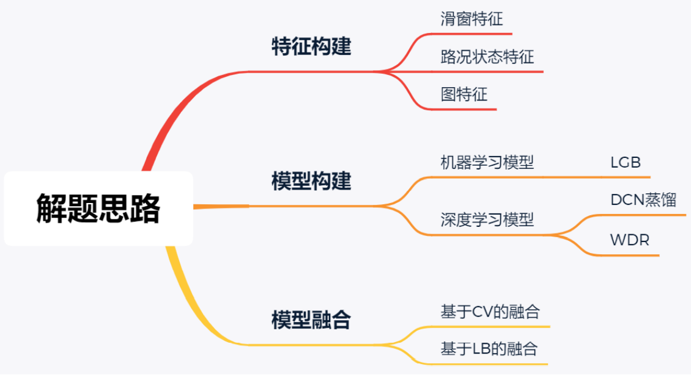

# README

7th/Top1%，提供答疑

也能做到前5，但是没必要

[竞赛地址](https://www.biendata.xyz/competition/didi-eta/)

持续更新中...

### 解题思路

[预估到达时间解题思路.pdf](https://github.com/ben1234560/AiLearning-Theory-Applying/blob/master/%E6%9C%BA%E5%99%A8%E5%AD%A6%E4%B9%A0%E7%AB%9E%E8%B5%9B%E5%AE%9E%E6%88%98_%E4%BC%98%E8%83%9C%E8%A7%A3%E5%86%B3%E6%96%B9%E6%A1%88/%E6%BB%B4%E6%BB%B4%E2%80%94%E2%80%94%E9%A2%84%E4%BC%B0%E5%88%B0%E8%BE%BE%E6%97%B6%E9%97%B4/%E9%A2%84%E4%BC%B0%E5%88%B0%E8%BE%BE%E6%97%B6%E9%97%B4%E8%A7%A3%E9%A2%98%E6%80%9D%E8%B7%AF.pdf)

### Data

由于滴滴数据保密协议，博主也无法找到可开放数据及数据地址，故无法提供。

### Model

- DCN模型
  - max_order_xt：head级别的特征，如同一sample_eta、distinct等
  - max_170_link_sqe_for_order：link序列特征，如右格式：[link_id_1, link_id_3, link_id_20...]
  - cross_data_dir：cross序列特征
  - link_data_other_dir：link统计特征，如某link_id前6小时的均值、求和等
  - head_data_dir：历史同星期的全天的统计特征
  - win_order_data_dir：订单的滑窗特征，如当前订单时间点的前段时间的统计特征
  - arrival_data_dir：历史到达路况状态的统计特征
  - zsl_arrival_data_dir：同上，不同人进行构建
  - arrival_sqe_data_dir：到达时刻的序列特征，提供给DCN的T模型进行蒸馏给S模型
  - pre_arrival_sqe_dir：利用树模型预测的到达时刻特征
  - zsl_link_data_dir：link统计特征，不同人构建
- WDR模型
  - 同上
- LGB模型
  - 待补充

### 推荐工具

- [智能钛Notebook-2.4.0-tf](https://console.cloud.tencent.com/tione/notebook/instance)
- [腾讯云服务器](https://console.cloud.tencent.com/cvm/instance/index)

### 说明

- 数据来自滴滴出行，英文（Data source: Didi Chuxing），数据出处：[https://gaia.didichuxing.com](https://gaia.didichuxing.com/)
- 代码属于公司所有，不能提供最优代码
- 感谢[@xbder](https://github.com/xbder)、[@AiIsBetter](https://github.com/AiIsBetter)

