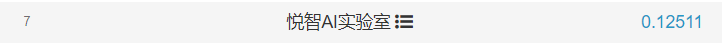

# README

7th/Top1%，提供答疑

也能做到前5，但是没必要

<https://www.biendata.xyz/competition/didi-eta/>

持续更新中...

### How to run the code

- DCN模型
- WDR模型
- LGB模型

### 推荐工具

- [智能钛Notebook-2.4.0-tf](https://console.cloud.tencent.com/tione/notebook/instance)
- [腾讯云服务器](https://console.cloud.tencent.com/cvm/instance/index)

### 说明

- 数据来自滴滴出行，英文（Data source: Didi Chuxing），数据出处：[https://gaia.didichuxing.com](https://gaia.didichuxing.com/)
- 代码属于公司所有，不能提供最优代码

