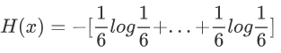
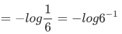
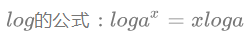
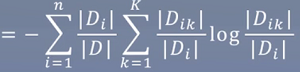
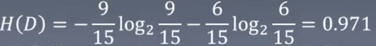
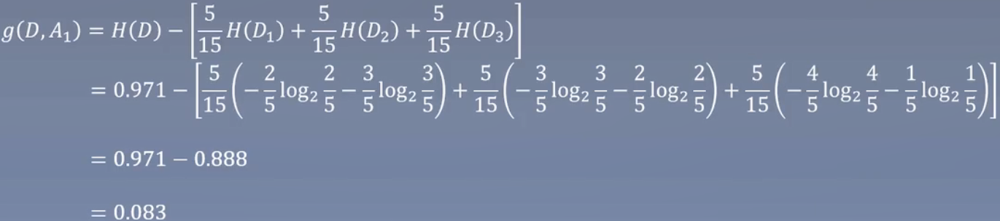
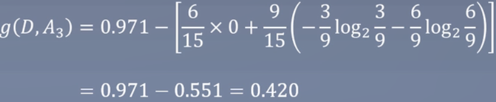
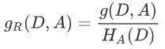
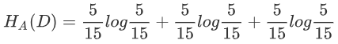

# 5.决策树——每次选一边

Decision tree

### 知识树

Knowledge tree

### 一个小故事

A story

挑苹果：

> 根据这些特征，如颜色是否是红色、硬度是否是硬、香味是否是香，如果全部满足绝对是好苹果，或者红色+硬但是无味也是好苹果，从上图可以看出来，只要做足够的循环判断即可得到结果。

如下图：

> 一步步走下来，就能挑到好苹果。这就是决策树

1. 最顶端的叫根节点，所有样本的预测都是从根节点开始。
2. 每一个圆形节点表示判断，每个节点只对样本的某个属性进行判断。
3. 圆形节点是标记节点，走到圆形节点表示判断结束，将圆形节点中的标签作为对应的预测结果。

如何构建决策树：

1. 构建的决策树按顺序对每个特征进行判断（低效）
2. 每个判断节点都尽可能让一半进入A分支，另一半进入B分支（高效）

引入新的知识，信息熵

### 信息熵

Information entropy

1. 每走一步，我们都在确定苹果的好坏。
2. 在根节点时，我们对苹果的好坏一无所知。
3. 经过对颜色的判断后，如果是红色，我们明白好坏的概率是1/2。虽然还包含了1/2的不确定性。
4. 如果苹果红色的前提下又硬，我们100%确定它是好苹果。此时不确定性坍塌为0。
5. 这是一个减少不确定性的过程。

从整体来讲，我们希望决策树每走一步，不确定性都下降的快一些，让我们的判断步数无限小。

**什么是信息的不确定性？**

就是信息熵

在信息论与概率统计中，熵（entropy）是表示随机变量不确定性的度量，设X是一个取有限个值的离散随机变量，其概率分布为

则随机变量X的熵定义为

> 面试可能会问到这个公式，还有交叉熵、相对熵

熵越大，则随机变量的不确定性越大。其中0 ≤ H(P) ≤ log n

### 举例计算

Example

假设投色子，6个的概率分别是1/6，计算如下：

> 其中6个1/6（log左边的六分之一）加起来就是1

> 

则最终=log6

这也解释了为什么上面H(P) ≤ log n

另外，均由分布的时候，熵最大，因为所有可能都是一样的，如上面的6个面都是1/6。

如果有1个坏苹果和9个好苹果时，我们可以认为大部分都是坏苹果。内部并不混乱，确定性很大，熵很小。

### 信息增益

Information gain

表示得知特征X的信息而使得类Y的信息的不确定性减少的程度。

特征A对训练集D的信息增益g(D,A)，定义为集合D的经验熵H(D)与特征A给定条件下D的经验条件熵H(D|A)之差，即：g(D, A) = H(D) - H(D|A)

当前的信息熵等于划分完（如划分成两个）的信息熵之和。

**信息增益算法**

输入：训练数据集D和特征A

输出：特征A对训练数据集D的信息

1. 计算数据集D的经验熵H(D)

   

2. 计算特征A对数据集D的经验条件熵H(D|A)

   

   

3. 计算信息增益

   

### 举个例子

Example

是否信贷

| ID   | 年龄 | 有工作 | 有自己房子 | 信贷情况 | 类别 |
| ---- | ---- | ------ | ---------- | -------- | ---- |
| 1    | 青年 | 否     | 否         | 一般     | 否   |
| 2    | 青年 | 否     | 否         | 好       | 否   |
| 3    | 青年 | 是     | 否         | 好       | 是   |
| 4    | 青年 | 是     | 是         | 一般     | 是   |
| 5    | 青年 | 否     | 否         | 一般     | 否   |
| 6    | 中年 | 否     | 否         | 一般     | 否   |
| 7    | 中年 | 否     | 否         | 好       | 否   |
| 8    | 中年 | 是     | 是         | 好       | 是   |
| 9    | 中年 | 否     | 是         | 非常好   | 是   |
| 10   | 中年 | 否     | 是         | 非常好   | 是   |
| 11   | 老年 | 否     | 是         | 非常好   | 是   |
| 12   | 老年 | 否     | 是         | 好       | 是   |
| 13   | 老年 | 是     | 否         | 好       | 是   |
| 14   | 老年 | 是     | 否         | 非常好   | 是   |
| 15   | 老年 | 否     | 否         | 一般     | 否   |

对上表所给的训练数据集D，根据信息增益准则选择最优特征。首先计算经验熵H(D)

> 计算类别：一共15个类别，9个是，6个否

然后计算各特征对数据集D的信息增益，分别以A1,A2,A3,A4表示年龄、有工作、有自己房子和信贷情况4个特征，则

1. 首先计算年龄

   > H(D)=0.971上面计算了，H(D1)青年，H(D2)中年，H(D3)老年

2. 计算有工作

   

   > H(D)=0.971，H(D1)是有工作，H(D2)是无工作

3. 计算有无房子

   

4. 计算信贷情况

   

有无房子是作为信贷的第一个划分，下降的最快

### 信息增益比

Information gain ratio

**信息增益比：**

如果以信息增益为划分依据，存在偏向选择取值较多的特征，信息增益是对这一问题进行矫正。

**举例**：

如上面的例子，后面加入了身份证这个特征，身份证又是唯一的，算法对样本画了个15叉树，一层就搞定了全部的分类。

这样会造成一个问题，划分会倾向于特征取值数目较多的，即分的更快。

但在预测集上就出现很大的问题了，即预测集的身份证肯定也是唯一的。

**定义：**

特征A对训练数据集D的信息增益比定义为其信息增益g(D,A)与训练数据集D关于特征A的经验熵H(D)之比：

**计算**：

如上面的年龄，有3个类（青年、中年、老年），

信息增益比和信息增益的区别就是除以

### 决策树的构建

Build the decision tree

ID3算法：

- 输入：训练数据集D，特征A，阈值ε ；
- 输出：决策树T
  1. 若D中所有实例属于同一类，则T为单节点数，并将类作为该节点的类标记，返回T；
  2. 若A = Ø，则T为单节点树，并将D中实例数最大的类作为该节点的类标记，返回T；
  3. 否则，按算法计算A中各特征对D的信息增益，选择信息增益最大的特征Ag；
  4. 如果Ag的信息增益小于阈值ε，则置T为单节点树，并将D中实例数最大的类作为该节点的类标记，返回T；
  5. 否则，对Ag的每一个可能值ai，依将D分割为若干非空子集Di，将Di中实例最大的类作为标记，构建子节点，由节点及其子节点构成树T，返回T；
  6. 对第i个子节点，以Di为训练集，以A - {Ag}为特征集，递归地调用1~5步，得到树Ti，返回Ti。

C4.5算法，大体相同，只不过计算的是信息增益比，而不是信息增益。我们通常也是用C4.5作为决策树的算法，其区别也就在于多了个分母。

### 总结

Summarization

1. 决策树的核心思想：以树结构为基础，每个节点对某特征进行判断，进入分支，直到到达叶节点。

2. 决策树构造的核心思想：让信息熵快速下降，从而达到最少的判断次数获得标签。

3. 判断信息熵下降速度的方法：信息增益。

4. 构建决策树算法：ID3（使用信息增益）、C4.5（使用使用信息增益比）。

5. 信息增益会导致节点偏向选取取值角度的特征的问题。

   > 关于第5点的补充，统计学习和西瓜书都是给的这个解释，但还有另一种解释，就是信息增益导致大数问题——>概率是否准确的问题。

