# 7.支持向量机——升维打击

Support vector machines

### 知识树

Knowledge tree

> 支持向量机也是李航的统计学习中效果最好的模型，面试中也是问的最多的
>
> 苹果表示重点
>
> 间隔：使用了几何间隔，保证w b的度量，感知机则是函数间隔
>
> 间隔最大化思想：则是支持向量机的独有，这使得它找到最优超平面
>
> 核函数：面试当中可能会问到是否能写出其中的一个核函数

### 红豆绿豆的前世今生

前面章节讲到划分超平面，来区分红豆和绿豆

> 从上面可以看到，能找到很多的超平面，黄色的线，那哪条黄色的线才是最好的呢？当然是对角的黄色线，因为这条可以让红豆绿豆区分的最开，也就是线和豆的距离最远，即使区分新的豆（预测集），也能最好的区分开，因为可能豆有接近的情况。

**如何找到最优的超平面**

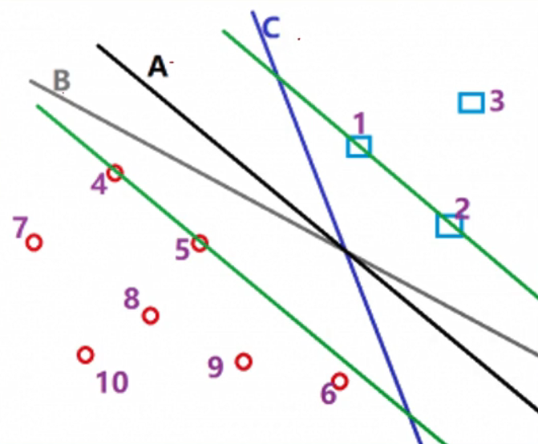

> 从上图可知，超平面A是最优的。因为它与两个类的距离都足够大。

结论：我们试图找到一个超平面，这个超平面可以使得与它最近的样本点的距离必须大于其他所有超平面划分时与最近的样本点的距离。

在SVM中，这叫间隔最大化。

> 即该超平面与最近的样本点的距离，都大于所有超平面离最近样本点的距离

此时我们可以说，我们找到了最优的超平面，但随着时代的变迁，红豆绿豆也发生了变化，比如下图的

> 它不再是左右分开，而是混在一起

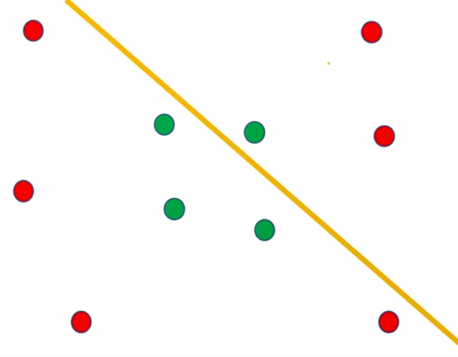

> 单纯用线性无法解决，如果是非线性呢？

> 我们需要找到这么个圈的超平面，那么圈能是超平面呢？

> 如上图，原本二维空间的样本，因为线性不可分， 即需要投射到三维空间，那么在三维空间就能用超平面切分。
>
> 再将三维空间的超平面投射到二维空间，那么超平面在二维空间上就是曲线的，即非线性。

那么接下来，我们要考虑的是，怎么进行低维和高维之间的转换。

### 升维可分问题

1. 当有人拿着棍子指着你时，你只能看到棍子的横截面，是一个点，它是一维的。我们无法将两个点区分开来。因为她们重叠了。

   

   > 右边红色线表示看的方向

2. 当有人拿着棍子指着其它地方，我们能看到整个棍子，这时候是二维的。我们可以一把刀劈开，把红豆和绿豆区分开。所以，红豆和绿豆虽然在一维的时候不能分开，但在二维时线性可分了。

   

3. 也可能二维不可分， 如下图

   

4. 这时候我们可以把棍子看作三维中的棍子，有体积的。如果把棍子立在地上，很有可能红豆靠南侧，绿豆靠北侧，我们像劈柴一样从上至下即可劈开（分开），也一样是线性可分。

5. 如果三维还不能线性可分，那就升到思维

**总会从某一个维度开始，它变成线性可分了，即只要不断的增加维度（特征）总能区分开来**

同时，我们发现高维中的超平面，映射到低维空间中时，可能会变成曲线或其它的划分形式。

这也就是为什么，在SVM中我们同样使用超平面来划分，SVM可以划分非线性的数据集。

它本质上仍然是线性超平面，不过是高维中的线性超平面。

**那么升维一定会线性可分吗？**

**会不会升到无穷维了仍然线性不可分？**

答案是不会的，首先要明白，我们的数据集一定是基于真实的某种分布，分为A类的样本和B类的一定在本质上有区别。只要有区别，就一定可以区分开来，一定在某个高维度上线性可分。

**另外，总能上升到有个维度空间中线性可分，无限上升的同时有没有可能在N+1维度又不可分了？**

不会，随着维度的上升，我们获得的信息越来越多。当第N维的数据已经足够划分时，更多的信息量并不会出现又不可分的情况。

### 总结

Summarization

1. SVM使用间隔最大化思想构造最优超平面。
2. 构造出来的超平面使得其与最近的点的距离最大。
3. SVM也可划分非线性数据集。
4. 它通过高维中的线性超平面再低维中的投影来完成非线性的划分。因此从直观上来讲，我们的模型必定有一个升维的操作。
5. 这是总体的概念。

### 支持向量机

Support vector machines

函数间隔：

几何间隔：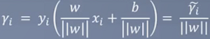

这里使用的是几何间隔，前面讲到这里就不重复了

**最大间隔分离超平面：**

目前讲的是线性超平面

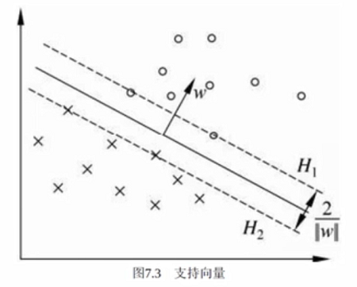

> 图中心，虚线到实线的距离我们称之为γ，我们要做的是最大化γ，使得这个超平面调整为γ的一个最大值，等价于找到了最优的超平面

**式子如下：**

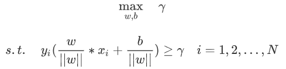

> γ：表示几何间隔
>
> s.t. 表示约束
>
> yi：正负1。保证算出来的数始终是大于0的，如上图中“圈”表示+1的样本“×”表示负一的样本，那么某个“圈”是正数，乘以上方的yi（正数），正正得正，某个点“×”是负数，乘以下方的yi（负数），负负得正。

**简化上方的式子：**

我们知道max的γ是几何间隔，那么我们变换一下
$$
\frac{\hat{γ}}{||w||} 其中，\hat{γ}表示函数间隔，除以w二范数就是几何间隔了。
$$

$$
既然我们最终是\frac{\hat{γ}}{||w||} ，那么式子我们可以简化成
$$

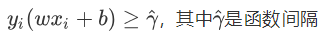

max的时候是几何间隔，也就是最终s.t. 还是会约束着它朝着几何间隔去走，但是这样的好处就是下方的||w||就没有了

**简化后如下：**

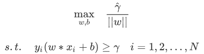

之前我们说过，对于函数间隔，我们等比例放大缩小w、b可以让最终结果变成1，也就是γ=1

**再简化后：**

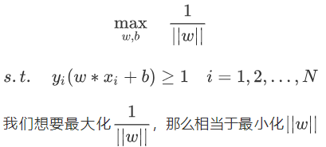
$$
后面要用到拉格朗日乘子法，我们把\frac{1}{||w||}变成\frac{1}{2}||w||^2，这两者是等价的
$$

**再简化后：**

$$
\min_{w,b} \quad \frac{1}{2}||w||^2
$$

$$
s.t.\quad y_i(w*x_i+b)-1≥0 \quad i=1,2,...,N
$$

> 利用拉格朗日乘子法，推导成如下式子

$$
L(w,b,α)=\quad \frac{1}{2}||w||^2-\sum^N_{i=1}α_iy_i(w*x_i+b)+\sum^N_{i=1}α_i
$$

$$
目标：\min_{w,b}\max_aL(w,b,α)
$$

$$
转换成：\max_a\min_{w,b}L(w,b,α)
$$

将拉格朗日函数L(w,b,α)分别对w,b求偏导并令其等于0

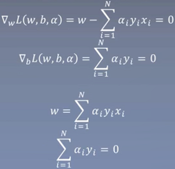

进行推导

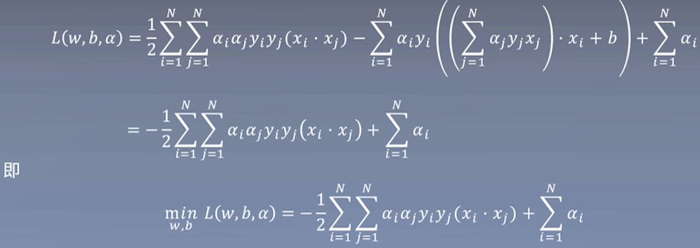

2.求minL(w,b,α)对α的极大，即是对偶问题

3.求max转换成min：

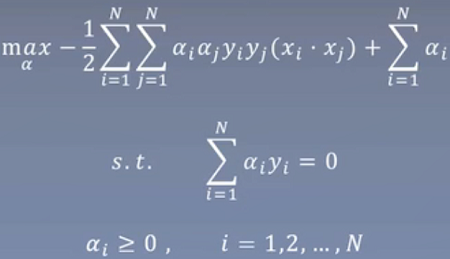

接下来就是求解α的问题了，但是我们还得解决另外的一个问题

### 软间隔最大化

Maximum soft interval

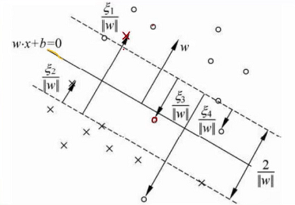

如上图所示，圈和叉表示两个不同的类别，但有的圈那边有叉，有的叉那边也有圈，怎么解决呢

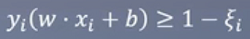

> 加入ξ松弛变量，即允许有一些交叉的类别样本

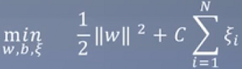

> 变成如上式子，但同时我们也对ξ约束，防止它是过大的

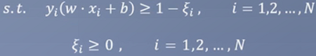

最终的结果为：

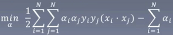

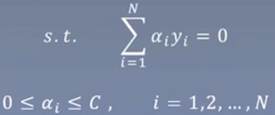

这样接下来的问题就只剩求解α了

### 核函数

Kernel function

**现在到了这里：**

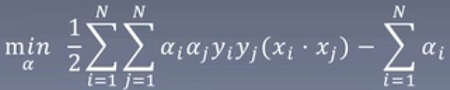

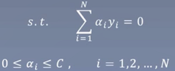

**目前的问题：**

式子中间有xi核xj的点积

例如在手写数字数据集中，训练集有6万个样本，6万乘6万勉强能接受

但如果每个样本有784维，6万样本两两做点积，是非常慢的。如果x是更高的维度呢？

**梳理一下：**

1. 由于公式的需要，我们需要计算xi和xj的点积
2. 此外，我们需要将样本映射到高维去，加入映射函数ø(x)，那么ø(xi)和ø(xj)的维度数目进一步扩大，它们的点积会让运算变得极其复杂
3. 我们希望存在一个函数K(xi,yi)=ø(xi)×ø(xj)，但函数K的计算方式更简单。也就是说，我们将样本通过函数升维得到ø(xi)和ø(xj)，接下来要计算它们的点积，能不能有个简单的计算公式，计算出来的结果和ø(xi)×ø(xj)一样？那样我们就不用再去算ø(xi)和ø(xj)的结果了，直接用简单方式计算不是更好吗？

这个简便方式，就是核函数

**在SVM中，我们通常使用高斯核:**

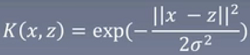

 在计算x和z的点积时，直接用这个公式替代就好了

### 序列最小最优化算法（SMO）

Sequetial minimal optimization

之前我们还剩下α求解，我们用SMO

**我们最后求解出来的α，一定是让整个结果满足KKT条件的。如果不满足，那一定不是最优解。**

**所以我们可以不断地调整α的值，直到所有α都满足KKT条件，这是我们一定能得到最优解。**

**怎么调整呢？——用SMO**

假设整个式子中有N个α(α1,α2,α3,...,αN)，先固定其它α，找α1,先让α1满足KKT条件。但如果固定除α1以外的所有α，等于也固定了α1.

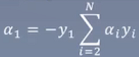

所以我们每次选择优化两个α

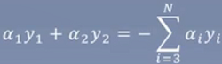

进一步，原式中目前hi有α1和α2两个变量，我们将其它作为常数去除。

整理如下：

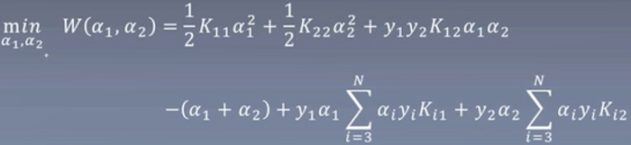

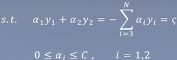

目前可知，α1一定在0和C之间

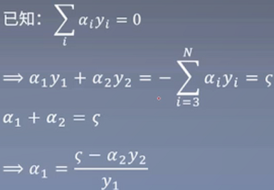

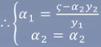

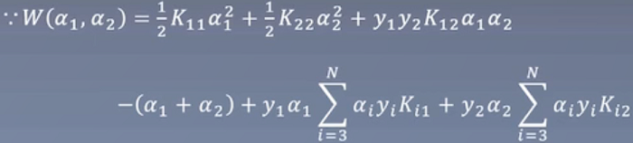

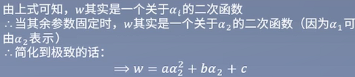

**最终得到结果：**

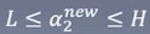

其中，L与H是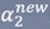所在对角线段端点的界，如果y1≠y2（如下左图所示），则

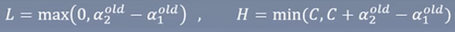

如果y1=y2（如下右图所示），则

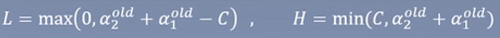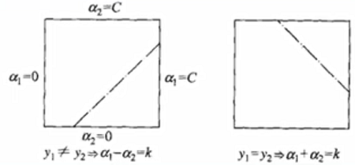

现在对于两个α，我们已经知道该怎么优化了。那么怎么从总舵的α中挑选两个合适的来进行优化呢？

——找到**违反KKT最严重**的。

**第一个变量的选择：**

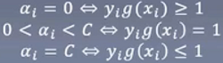

**第二个变量的选择：**

在第一个变量步子迈大的情况下，再找一个步子迈得最大的α。它的量化方式|E1-E2|

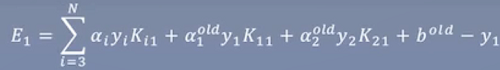

两个α都找到一个，进行优化，然后找下一对α，直到再也找不到不违反KKT的α为止。

### 总结

Summary

1. SVM首先从最大间隔出发，设计了可构造最优超平面的线性模型。
2. 考虑到存在噪音或有部分点让人很为难，添加了软间隔。变成了具有软间隔功能的线性模型。
3. 通过对数据的升维，使得模型变成了非线性。可以用于非线性数据集。
4. 升维后无穷维的点积运算难以实现，引入了核函数简化运算。