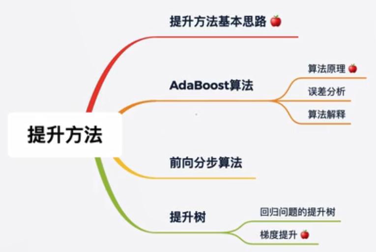

# 8.提升方法——三个臭皮匠，顶个诸葛亮

boosting

多个弱分类器组合

### 知识树

Knowledge tree

### 提升方法

Boosting

- 基本思路：
  - 将弱可学习算法提升为强可学习算法
  - 其中提升方法是集成学习的一种
  - 集成学习两个主要类别
    - 序列方法
    - 并行方法

Adaboost算法

- 解决分类问题 y ∈ [-1,+1]
- 在训练数据上训练得到模型，查看模型在整体数据和单个数据的分类效果
- 在整体数据上分类效果较好，则该模型在最后的模型中占较大比例，反之。
  - 比如：有5个小模型，预测一个数据是正1或者负1，但是不同模型的整体效果不一样，好的模型乘以更大的概率，最后再全部求和的sigmoid得出是正1还是负1
- 在单个数据上分类效果较好，那么在训练下个模型时调小单个数据的权值，反之。
- 在上面过程迭代N次之后，直到最后的分类结果达到预期目标。将所有的模型组合，得到强可学习模型。