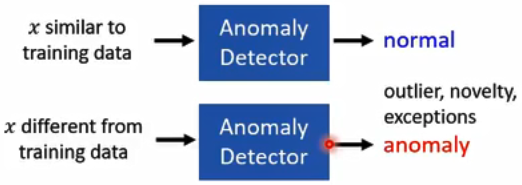
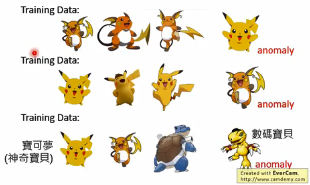

# 1. 异常检测——概述

### 问题描述

Problem Formulation

- 有一批训练数据如：{x1,x2,...,xn}
- 我们想从这批输入数据中分出类似的，或者不类似的

> 类似上图，找出数据中anomaly的数据，这个anomaly并不表示它是有问题，只是说它跟大多数数据不一样。有可能是特别好的，有可能是特别坏的。

### 什么是异常

What is Anomaly?

什么是异常取决于大部分是什么

> 你给它看很多雷丘，那么皮卡丘就是异常
>
> 你给它看很多皮卡丘，那么雷丘就是异常
>
> 你给它看很多神奇宝贝，那么数码宝贝就是异常

### 异常检测的应用

Applications

- Fraud Detection（诈欺检测）
  - Training data：正常刷卡行为，x：盗刷？
  - Ref: https://www.kaggle.com/ntnu-testimon/paysim1/home
  - Ref: https://www.kaggle.com/mlg-ulb/credicardraud/home
- Network Intrusion Detection（入侵检测）
  - Training data:正常连接，x：攻击行为？
  - Ref:http://kdd.ics.uci.edu/databases/kddcup99/kddcup99.html
- Cancer Detection（细胞检测）
  - Training data：正常细胞，x：癌细胞
  - Ref:http://kdd.ics.uci.edu/uciml/breast-cancer-wisconsin-data/home

### 如何分类

Binary Classification?

- Given normal data 
- Given anomaly 
- Then training a binary classifier ......

如上，给它正常数据和异常数据，然后自动分成Class1和Class2