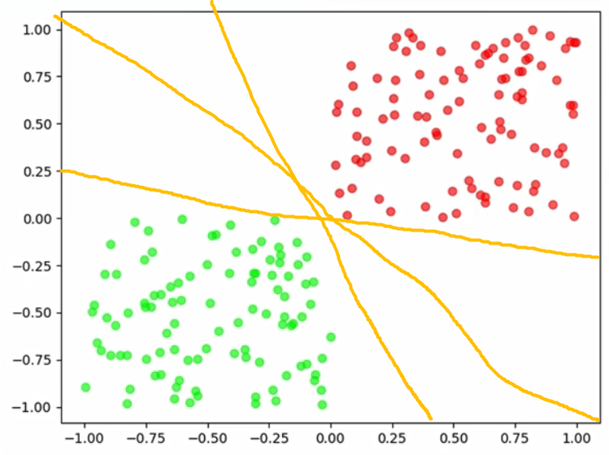
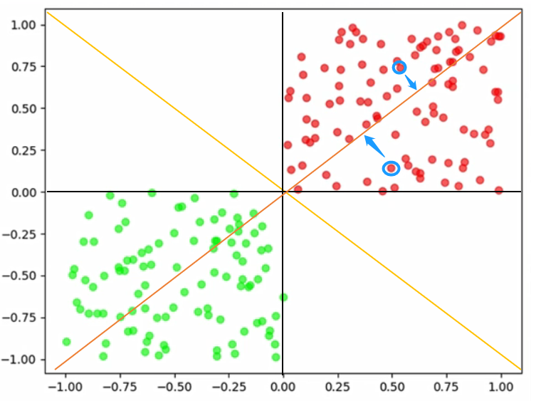
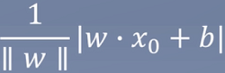
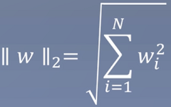
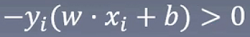
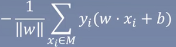
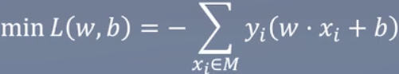
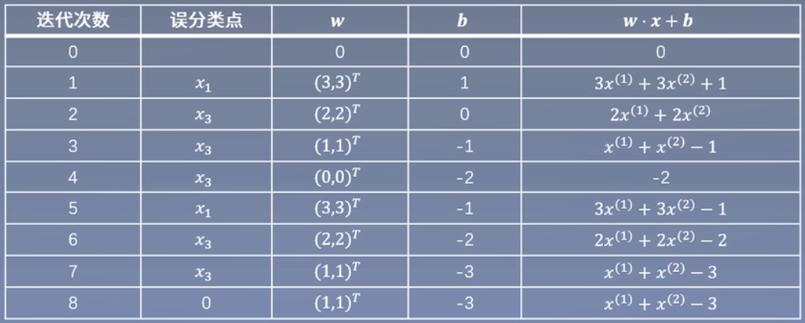

# 2.感知机——入门的垫脚石

### 概述

每个算法都是为了解决一类问题，或者说解决之前的问题所创造出来的，而感知机，在解决一类问题的时候也暴露了很多问题，变相的推动了以后的算法的改进方向。

### 知识树

> 苹果表示相对重要的

### 直观介绍

现在有一盘红豆和绿豆，怎么把红豆和绿豆分开来

> 当红豆和绿豆放在一起时，它们却能自己分开来，为什么呢？

我们怎么区分呢，假设我们随意花如下的线

> 这样是不是就完美的区分开来了，完美解决。
>
> 那么程序怎么知道x和y都大于0的豆是红豆呢？
>
> 或者说，它是怎么学会这个规则的？

那是不是只要一条直线不分错一个点，或者说尽可能的少分错点，那就是一条好的直线。

即：我们把所有分错的点和直线的距离的和（蓝色示例），求和的距离最小表示这条直线越好，因为这表示这条线分错的最少。

> 如图中红色线的和的距离肯定比黑色或者黄色的线大。

### 总结

1. 一条直线不分错一个点，这就是好的直线。
2. 模型要尽可能找到好的直线。
3. 如果没有好的直线，在差的直线中找到好的直线。
4. 判断直线多差的方式：分错的点到直线的距离求和。

### 感知机模型

Perceptron

确定终究目标

f(x)

> 我们希望一个函数，如f(x)，进来一个豆，它告诉我们是红豆还是绿豆

f(x) = sign(w * x + b)

> sign如图：

把w * x + b 比作x，相当于给了一个“豆”进来，就只得到两个结果，也就是红豆（+1）或者绿豆（-1）。那么w * x + b 是什么？

w * x + b是超平面

> 即那条黄色的分割线，且当豆在线的上面，就是红豆，在下面是绿豆。
>
> 超平面是n维欧氏空间中余维度等于一的线性子空间，也就是必须是(n-1)维度。即如果是2维，超平面就是1维，如果是3维，超平面就是2维。

w * x + b分别代表什么

> w是权重，x是特征的实际值，b是偏值
>
> 比如知道豆的直径，如x1表示某个豆的直径 = w1 * x1 + b1，大于1则是红豆，小于则是绿豆
>
> 有时候一个特征不一定能区分开来，可能还需要质量，(x1,x2)计算 = (w1, w2) * (x1, x2)
>
> 亦或者还有豆的光滑度，则有x1, x2, x3 ，这样就变成3维了。

**正式的说**

w * x + b 是一个n维空间中的超平面S，其中w是超平面的法向量，b是超平面的截距，这个超平面将特征空间划分成两部分，位于两部分的点分别被分为正负两类。所以，超平面S称为分离超平面。

特征空间也就是整个n维空间，样本的每个属性都叫一个特征，特征空间的意思是在这个空间中可以找到样本所有的属性的组合。

### 感知觉的学习策略

Learning policy

> 求空间中任意一个点X0到超平面S的距离

**函数间隔与几何间隔**

函数间距：

> 缺点：已知wx + b = 0，当不等于0时（比如1），那如果等比例放大缩小w和b是不是就更小，等同于1/2 (wx + b) = 1/2(wx) + 1/2(b) = 1/2，超平面是没有动的，但是结果却缩小了，那么模型就觉得它知道等比例缩小就能得到更小的结果。
>
> 这时候就引入几何间距

几何间距：

> 加入了二范式，相当于有了一个度量的标准，即等比例缩小w时，外面的w也会等比例变化。

通俗来讲，函数间距是将你去吃饭的那段路本来要1000m，它改成1km，1就小于1000了，而几何间距就杜绝这种情况，只能都是m或者km

对于误分类数据而已，

> yi表示真实是+1还是-1
>
> w*xi+b表示预测的结果
>
> 绿豆预测成绿豆：预测结果w*xi+b < 0（绿豆），且真实为绿豆(-1)时，则- * -1(wxi + b) < 0。
>
> 绿豆预测成红豆：w*xi+b > 0，真实为绿豆-1，则- * -1 (wxi + b) > 0。
>
> 也就是说只要分错，那么数据一定是大于0

误分类点xi到超平面S的距离为：

因此，所有误分类点到超平面S的总距离为：

> M：误分类点的集合

### 感知觉的学习策略——原始形式

Learning policy

1. 任选一个超平面w0，b0

   > 随机初始化，如w0 = 1，可能有多个维度，如x0，x1，x2，那么w也会有w0，w1，w2的随机初始化

2. 采用梯度下降法极小化目标函数

   

   > L：loss
   >
   > 这时候用的还是函数间隔，因为感知机的超平面的目标是不分错任何一个点。所以不存在说要某个点到超平面的距离无限的小。
   >
   > 也可以用几何间隔，但是会增加计算量，没有必要，但后面基本都是用几何间隔。
   >
   > 侧面反映了感知机只能在线性可分的数据集上使用，也就是线性模型。

3. 更新w，b

   

### 例子

Example

训练数据中，正例（y=+1）点位x1 = (3,3)T，x2 = (4,3)T，负例（y=-1）为x3 =  (1, 1)T，求解感知机模型f(x) = sign(w*x + b)，其中w = (w1, w2)T，x = (x1, x2)T

解：

1. 构造损失函数

   

2. 梯度下降求解w，b。设步长为1

   1. 取初值w0 = 0，b0 = 0
   2. 对于x1，y1(w0 * x1 + b0) = 0未被正确分类，更新w，b。w1 = w0 + x1y1 = (3,3)T，b1 = b0 + y1 = 1 => w1 * x + b1 = 3x + 3x + 1

3. 对x1，x2，显然yi(w1 * xi + b1) > 0，被正确分类，不做修改。对于x3，y3(w1 * x3 + b1) 应该小于0，结果是大于0被误分类，更新w，b。

   

4. 以此往复，直到没有误分类点，损失函数达到极小。

   

   

