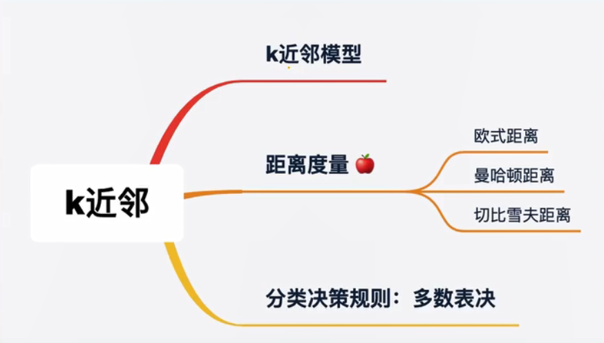
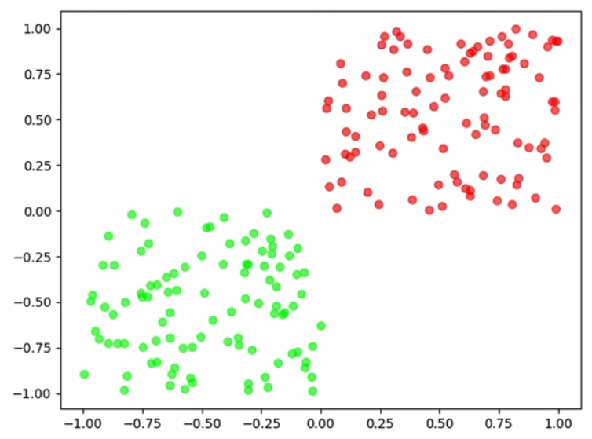
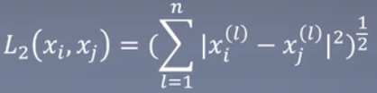
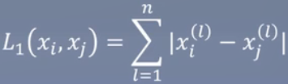
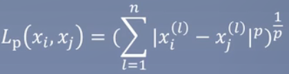

# 3.K近邻——物以类聚

K-nearest neighbor

### 知识树

### 怎么区分红豆绿豆？

How to distinguish red beans and green beans?

之前我们构造了一个超平面来解决这个问题，既然超平面可以切分，是不是红豆之间和绿豆之间有着某种关联。即：物以类聚。

如果一个豆过来自然而然的到红豆堆，我们有理由认为它大概率是红豆。

1. 同一标签的样本通常有很多相似的特征。
2. 没进来一个样本，查看它周边的样本是什么类别，那么它就很有可能属于该类别。

那么某个点与其它点距离怎么计算。

### 距离度量

Distance measure

首先令

度量的方法有：

欧式距离（也称二范数）：

> xi里的x减去对应位置的xj里的x，然后全部平方，再求和，然后开根号。
>
> 如果两个点之间的距离很远，那么值就会很大

曼哈顿距离（也称一范数/也称城市街区距离）：

> 相对上面欧式距离，不需要平方-相加-开根号，只要拿它的绝对值-相加即可

P范数：

> 引出P范数，p=1则是一范数，p=2则是二范数

还有3范数（也称切比雪夫距离/棋盘距离）

最常用的是欧式距离>曼哈顿距离>切比雪夫距离

