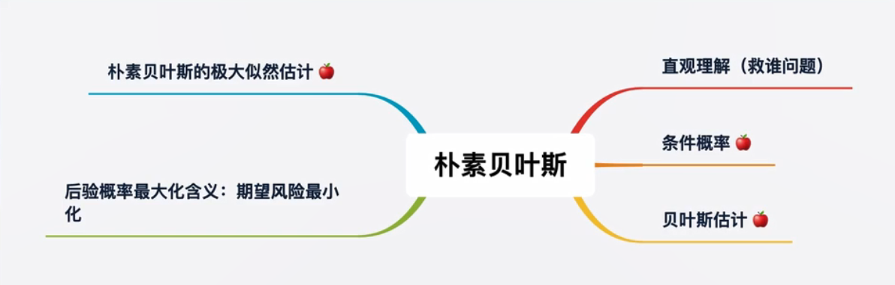

# 4.朴素贝叶斯

### 知识树

Knowledge tree

> P(y|x)，P给定x的条件下，y的概率。如：P(y=我招女孩子喜欢的概率|我是学生)

### 一个小故事

A story

1. 女朋友和妈妈掉河里，路人拿出3颗豆，两颗红豆1颗绿豆。如果我抽中红豆救女朋友，抽中绿豆救妈妈。
2. 我和路人各种抽一颗，路人发现自己抽中的是绿豆，他想用剩下的那颗跟我换，我换不换？换豆和女朋友活下去的概率一样吗？

**直觉来讲**：

换不换豆我抽中红豆的概率应该都是1/3。这时路人跟我说他的是绿豆，排除一颗，我抽中红豆的概率是1/2。换不换概率都是1/2

**条件概率**：

P(A|B)表示在B发生的条件下，发生A的概率。

计算：设A表示我抽中的是红豆，B表示路人抽中的是绿豆

结论：如果要救女朋友，最好和路人交换（2/3）。如果要救妈，最好不要换。

### 直观理解

Intuitive understanding

假设有一个手写数据集，里面有100条记录，分别是0-10。

此时小红写了个数字X，怎么判断是数字几？

朴素贝叶斯工作原理：

P(Y = 0|X) = ?, P(Y = 1|X)=? ......, P(Y = 10|X) = ?

找到概率最高的，就是对应的数字。

### 数学理解

Mathmetical

上面的数字判别公式修改为P(Y=Ck|X=x)。

