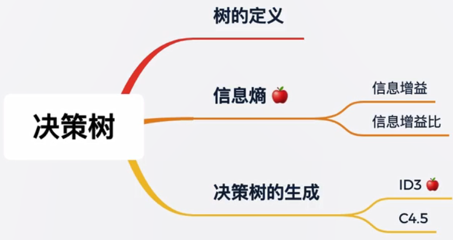
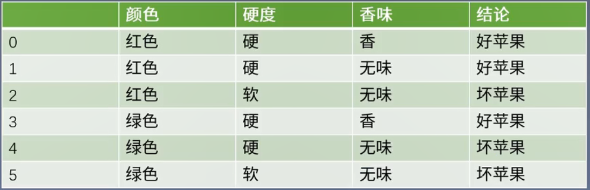
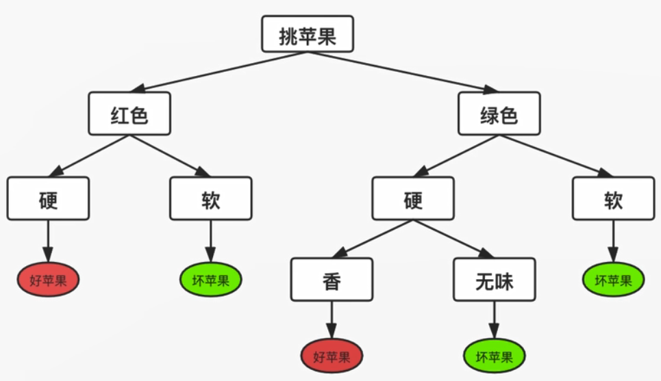
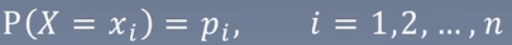
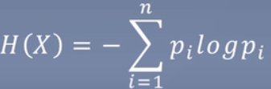

# 5.决策树——每次选一边

Decision tree

### 知识树

Knowledge tree

### 一个小故事

A story

挑苹果：

> 根据这些特征，如颜色是否是红色、硬度是否是硬、香味是否是香，如果全部满足绝对是好苹果，或者红色+硬但是无味也是好苹果，从上图可以看出来，只要做足够的循环判断即可得到结果。

如下图：

> 一步步走下来，就能挑到好苹果。这就是决策树

1. 最顶端的叫根节点，所有样本的预测都是从根节点开始。
2. 每一个圆形节点表示判断，每个节点只对样本的某个属性进行判断。
3. 圆形节点是标记节点，走到圆形节点表示判断结束，将圆形节点中的标签作为对应的预测结果。

如何构建决策树：

1. 构建的决策树按顺序对每个特征进行判断（低效）
2. 每个判断节点都尽可能让一半进入A分支，另一半进入B分支（高效）

引入新的知识，信息熵

### 信息熵

Information entropy

1. 每走一步，我们都在确定苹果的好坏。
2. 在根节点时，我们对苹果的好坏一无所知。
3. 经过对颜色的判断后，如果是红色，我们明白好坏的概率是1/2。虽然还包含了1/2的不确定性。
4. 如果苹果红色的前提下又硬，我们100%确定它是好苹果。此时不确定性坍塌为0。
5. 这是一个减少不确定性的过程。

从整体来讲，我们希望决策树每走一步，不确定性都下降的快一些，让我们的判断步数无限小。

**什么是信息的不确定性？**

就是信息熵

在信息论与概率统计中，熵（entropy）是表示随机变量不确定性的度量，设X是一个取有限个值的离散随机变量，其概率分布为

则随机变量X的熵定义为

