# 6.逻辑斯蒂回归与最大熵

### 知识树

Knowledge tree

相较前面的算法，性能更好，也更符合工业场景

### 一个逻辑斯蒂回归回归的故事

A story about the Logistic regression

1. 之前的f(x) = sign(w*x+b)只输出+1和-1，这样的判别方式真的有效吗？
2. 超平面左侧0.001距离的点和超平面右侧0.001距离的点真的有天壤之别吗？

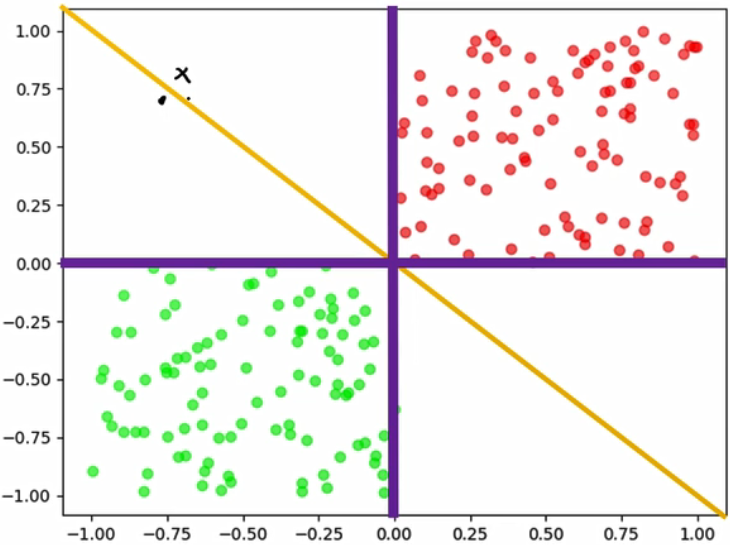

> 如上面两个黑点，明明只差分毫，却变成了+1或者-1。这也是感知机的缺陷

**我们想要解决的：**

1. 怎么解决极小距离带来的+1和-1的天壤之别
2. 怎么让最终的预测式子连续可微

### 逻辑斯蒂回归

Logistic regression

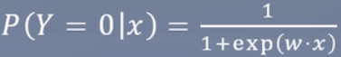

> 连续可微
>
> 可输出概率

**参数估计：**

由上面的式子可知，里面参数只有w和x，x为已知的特征，也就是更新w即可

逻辑斯蒂回归模型学习时，对于给定的训练数据集T={(x1,y1), (x2,y2), ...,(xn,yn)}，可以应用极大似然估计法估计模型参数，从而得到逻辑斯蒂回归模型。

设：

> Y=1和Y=0相加时为1，所以当Y=1=π(x)，那么Y=0就等于1-π(x)

似然函数为

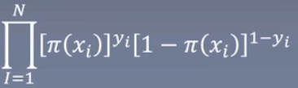

> 当前的条件做连乘，变换成log则是相加

对数似然函数为

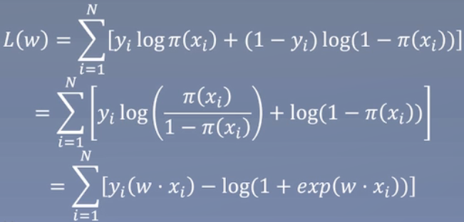

对L(w)求极大值，得到w的估计值

**似然函数对w求导：**

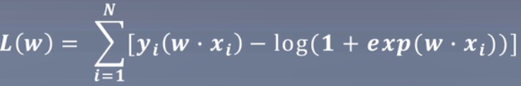

### 总结

Summarization

1. 逻辑斯蒂以输出概率的形式解决了极小距离带来的+1和-1的天壤之别，同时概率也可作为模型输出的置信程度。
2. 逻辑斯蒂使得了最终的模型函数连续可微，训练目标与预测目标达成一致。
3. 逻辑斯蒂采用了较大似然估计来估计参数。

### 一个最大熵的小故事

A story about the Maximum entropy model

我们去到拉斯维加斯赌场

问1：我手里有个骰子，问你扔下去后某个面朝上的概率是多少？

答1：都是1/6，因为概率相同

问2：我竟然认为有道理，可如果是老千手里的骰子呢？你还觉得是1/6吗？

答2：可是你没说是老千手里的

问3：可是为什么你不去假设可能是老千手里的骰子这种情况？

答3：因为你没说是老千手里的

问4：好像是这么个道理，如果要考虑老千，那可能还要考虑骰子是否破损，桌面是否有问题

答4：所以1/6最保险

问5：如果我告诉你，1朝上的概率是1/2呢？

答5：那剩下的就是1/10

**什么是最大熵？**

在我们猜测概率时，不确定的部分我们认为是等可能的，就像骰子一样，我们知道有6个面，因此认为每个面的概率是1/6，也就是等可能。

换句话说，就是趋向于均匀分布，最大熵使用的就是这么朴素的道理：

​	凡是我们知道的，就把它考虑进去，凡是不知道的，通通均匀分布。

### 最大熵模型

Maximum entropy model

终极目标：P(Y|X)

熵：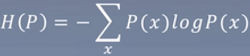

将终极目标代入熵：

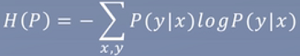

做些改变，调整熵：

我们手里有训练集，包含所有样本及对应的标签。

> v表示数目，满足X=x，Y=y的数目
>
> 统计出来概率，通过频数

**特征函数**

其作用是为了将某个特征x，进行一些转换后，让它和标签y起到重大的相关作用

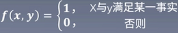

特征函数f(x,y)关于经验分布，的期望值：

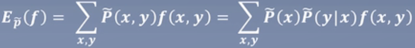

特征函数f(x,y)关于模型P(Y|X)与经验分布的期望值：

> 下面的P表示真实世界中全部数据的分布，即训练集不可能用上全部的数据，一般都是某段时间的，比如N年，所以用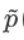表示它是真实的全部时间P中的某段的经验分布

约束：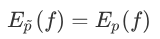

> 希望训练集的和真实的全部数据是一致的分布

max

> fi表示让所有的特征都满足约束条件

min

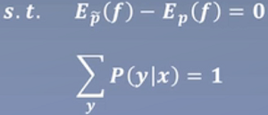

**拉格朗日乘子法：**

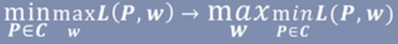

> 求最小的值

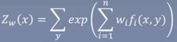

