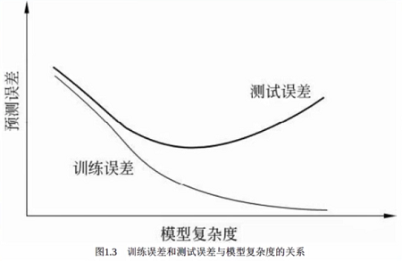
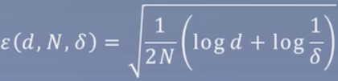
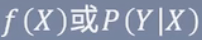
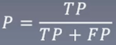
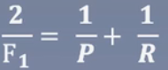
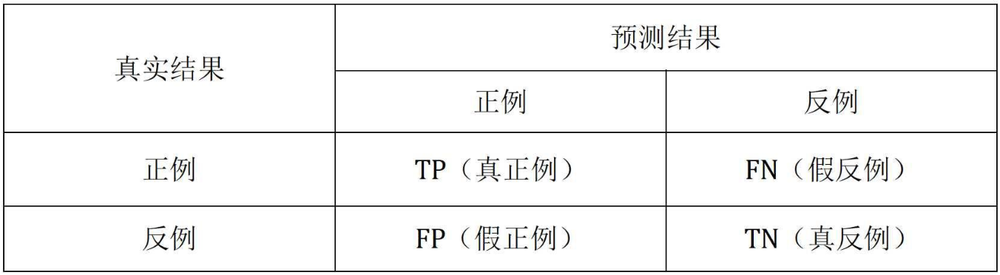

# README

## 李航——统计学习方法

### 知识树

> 苹果表示比较重要的

### 监督学习

Supervised learning

#### 监督学习的实现步骤：

1. 得到一个有限的训练数据集合
2. 确定模型的假设空间，也就是所有的备选模型
3. 确定模型选择的准则，即学习策略
4. 实现求解最优模型的算法
5. 通过学习方法选择最优模型
6. 利用学习的最优模型对新数据进行预测或分析

> 告诉它哪些东西是好的，哪些东西是坏的，它依据这些来学习

比如下面的例子：

> 根据是否招女孩子喜欢的一些特征，来推导其它未知的数据是否招女孩子喜欢，而无监督学习是没有是否招女孩子喜欢这个标签，可能会采取一些聚类的方法，比如把身高聚的时候，高的一堆，矮的一堆，成绩高的一堆低的一堆，以得到类似的结果。

按照常理来讲有监督学习肯定比无监督学习好，但现实生活中，有监督学习需要标注，也就是要大量的人力成本，而无监督数据的获取往往是最低成本的。

### 统计学习三要素

Element of statistical learning

#### 模型（假设空间）

> 假设所有的点都在空间中，每个点是一个模型或者函数

决策函数：

> f(x)：把所有的函数假设为f(x)
>
> θ：f(x)里头的参数，用来确定模型

条件概率分布：

策略：

> 怎么确定θ的参数，让模型知道是否预测错了，错的偏差有多大

0-1损失函数

> 预测相同为0，否则为1，得继续努力，但这样有个很明显的缺陷，就是它只知道错了，但是不知道错在哪里

平方损失函数

> 弥补上面的缺陷，告诉它差距有多大，相等则不需要

绝对损失函数

> 防止小于0的情况，即Y-f(x)小于0，相当于非常非常好，这显然是不对的，所以加入绝对值，要么大于0，要么小于0

对数损失函数

> 让为0的概率越来越大，让为1的概率越来越小

经验风险最小化：

> 对每个样本跑一遍，将所有的loss平均计算，loss越大表示离真实的越大，loss越小说明里真实越接近，模型也越好

结构风险最小化：

> 加入正则项，防止过拟合，也就是模型过于复杂，过于只适合当前数据，导致预测其它数据的时候很差（泛化能力）。

算法：挑选一个合适的算法，使得可以求解最优模型

### 模型评估与选择

Model evaluation and model selection

训练误差：

> 对所有训练数据的结果做一个平均，误差越大模型可能越大。但如果以训练集来评估，就想考试一样，如果考试题目平时已经见过，当然能做出来，要解决的是平均没见过的类似题目。

测试误差：

> 利用测试集去测试模型的训练情况。

验证集：我们通常来讲，会挑选测试集表现最好的，但是也有总可能就是测试集刚好和训练集的“题目”类似，那它当然能表现的好，这时候就需要引入验证集。我们一般选择验证集表现最好的模型。

多项式拟合问题：

> 左上欠拟合严重，右上欠拟合，左下拟合正常，右下过拟合。实际中怎么判断过拟合，即训练集上误差非常低，但是在其它数据集上的误差非常高，一般就是过拟合。

### 正则化与交叉验证

Regularization and cross validation

防止过拟合

最小化结构风险：

交叉验证：

数据集随机划分为以下3部分：

- 训练集：模型的训练
- 测试集：模型的选择
- 验证集：模型的评估

### 泛化能力

Generalization ability

定理1.1泛化误差上界

对于二分类问题，当假设空间是有限个函数的集合F = {f1,f2,...,fd}时，对任意一个函数f ∈ F，至少以概率1 - δ，以下不等式成立：

其中，

> 即以某种依据来确定模型是否具备泛化能力。但现实生活中这个是非常难实现的，问题在于有限个，而这个有限，在我们实际操作中是不可能知道是有限个的。

### 生成模型与判别模型

Generative model and discriminant model

生成方法：

> P(Y|X)：表示PX条件下，Y的概率

判别方法：

例子：如何知道女孩子的姓名呢？

生成方法：我要是把她爸妈建模出来，直接问她爸妈不就行了吗？

判别方法：她叫小红的概率是多少？她叫小刘的概率是多少？

### 分类问题

Classification

TP——将正类预测为正类数；

FN——将正类预测为负类数；

FP——将负类预测为正类数；

TN——将负类预测为负类数；

精确率：预测为正类的样本中有多少分对了；

召回率：在实际正类中，有多少正类被模型发现了

F1值：

一般会配合一个混淆矩阵：

