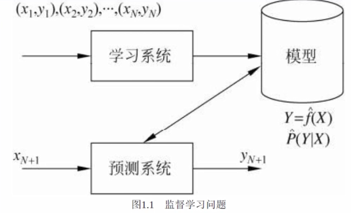
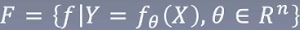
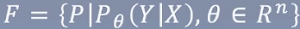
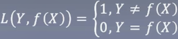
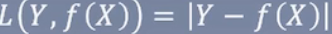
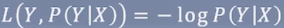

# README

## 李航——统计学习方法

### 知识树

> 苹果表示比较重要的

### 监督学习

Supervised learning

#### 监督学习的实现步骤：

1. 得到一个有限的训练数据集合
2. 确定模型的假设空间，也就是所有的备选模型
3. 确定模型选择的准则，即学习策略
4. 实现求解最优模型的算法
5. 通过学习方法选择最优模型
6. 利用学习的最优模型对新数据进行预测或分析

> 告诉它哪些东西是好的，哪些东西是坏的，它依据这些来学习

比如下面的例子：

> 根据是否招女孩子喜欢的一些特征，来推导其它未知的数据是否招女孩子喜欢，而无监督学习是没有是否招女孩子喜欢这个标签，可能会采取一些聚类的方法，比如把身高聚的时候，高的一堆，矮的一堆，成绩高的一堆低的一堆，以得到类似的结果。

按照常理来讲有监督学习肯定比无监督学习好，但现实生活中，有监督学习需要标注，也就是要大量的人力成本，而无监督数据的获取往往是最低成本的。

### 统计学习三要素

Element of statistical learning

模型（假设空间）：

> 假设所有的点都在空间中，每个点是一个模型或者函数

决策函数：

> f(x)：把所有的函数假设为f(x)
>
> θ：f(x)里头的参数，用来确定模型

条件概率分布：

策略：

> 怎么确定θ的参数，让模型知道是否预测错了，错的偏差有多大

0-1损失函数

> 预测相同为0，否则为1，得继续努力，但这样有个很明显的缺陷，就是它只知道错了，但是不知道错在哪里

平方损失函数

> 弥补上面的缺陷，告诉它差距有多大，相等则不需要

绝对损失函数

> 防止小于0的情况，即Y-f(x)小于0，相当于非常非常好，这显然是不对的，所以加入绝对值，要么大于0，要么小于0

对数损失函数

> 让为0的概率越来越大，让为1的概率越来越小

