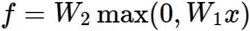

### 第二章——走进深度学习的世界 神经网络模型

#### 反向传播计算方法

简单的例子：

如何让 f 值更小，就是改变x、y、z，而损失函数也是这样，那么我们分别求偏导，则能得出每个值对结果的影响

**链式法则**

- 梯度是一步一步传的

  

复杂的例子：

#### 神经网络整体架构

类生物神经元

> 左半边是生物学上的神经元，右半边是数学上的“神经元”，可以说是非常像。

整体架构

- input layer输入层：比如输入X，有多少个x即有多少个input，比如前面的猫有3千多像素点，那么就有3千多个“圈”进行input。

- hidden layer 1：指将X做了某些变换，且每个圈与前者的全部圈都连接，即是全连接，为什么多了1个圈，是表示可能会在原始特征的基础上做变换，变成4个特征。具体如：假设X输入的是年龄，第一圈表示对年龄做平方，第二个圈表示将年龄与其它值相加相乘等等。
- W1：input是3个，hidden layer 1是4个，那么夹在中间的W1就是[3,4]的权重矩阵。

- hidden layer 2：指在1的基础上再进行变换，防止如果hidden layer 1的效果不好，那么加多一层，进行再加工。
- W2：hidden layer 1是4个，hidden layer 2是4个，那么夹在中间的W2就是[4,4]的权重矩阵。

- output layer：输出结果。
- W3：hidden layer 2是4个，output layer 2是1个，那么夹在中间的W3就是[4,1]的权重矩阵。

整体大致公式：

- 基本架构：
- 继续堆叠一层：

- 神经网络的强大之处在于，用更多的参数来拟合复杂的数据

#### 神经元个数对结果的影响

<https://cs.stanford.edu/people/karpathy/convnetjs/demo/classify2d.html>

