### 第二章——走进深度学习的世界 神经网络模型

#### 反向传播计算方法

简单的例子：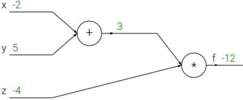

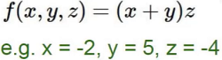

如何让 f 值更小，就是改变x、y、z，而损失函数也是这样，那么我们分别求偏导，则能得出每个值对结果的影响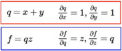

**链式法则**

- 梯度是一步一步传的

  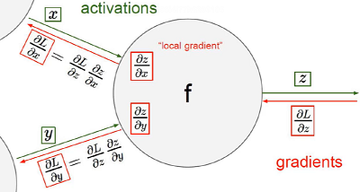

复杂的例子：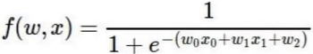

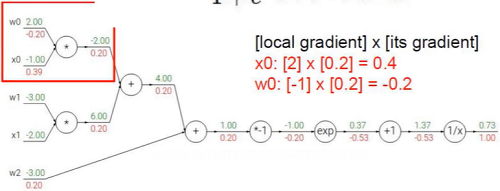

#### 神经网络整体架构

类生物神经元

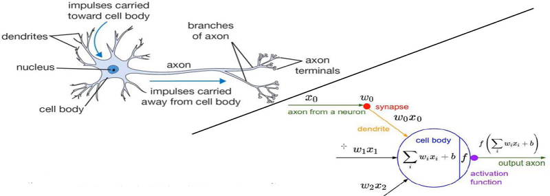

> 左半边是生物学上的神经元，右半边是数学上的“神经元”，可以说是非常像。

整体架构

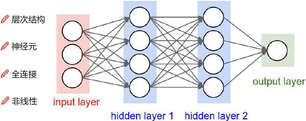

- input layer输入层：比如输入X，有多少个x即有多少个input，比如前面的猫有3千多像素点，那么就有3千多个“圈”进行input。

- hidden layer 1：指将X做了某些变换，且每个圈与前者的全部圈都连接，即是全连接，为什么多了1个圈，是表示可能会在原始特征的基础上做变换，变成4个特征。具体如：假设X输入的是年龄，第一圈表示对年龄做平方，第二个圈表示将年龄与其它值相加相乘等等。
- W1：input是3个，hidden layer 1是4个，那么夹在中间的W1就是[3,4]的权重矩阵。

- hidden layer 2：指在1的基础上再进行变换，防止如果hidden layer 1的效果不好，那么加多一层，进行再加工。
- W2：hidden layer 1是4个，hidden layer 2是4个，那么夹在中间的W2就是[4,4]的权重矩阵。

- output layer：输出结果。
- W3：hidden layer 2是4个，output layer 2是1个，那么夹在中间的W3就是[4,1]的权重矩阵。

整体大致公式：

- 基本架构：
- 继续堆叠一层：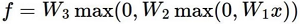

- 神经网络的强大之处在于，用更多的参数来拟合复杂的数据

#### 神经元个数对结果的影响

<https://cs.stanford.edu/people/karpathy/convnetjs/demo/classify2d.html>

越多的神经元个数，切分的越明显

如1个神经元：

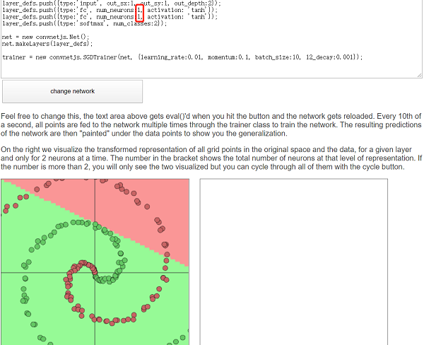

> 目的是区分绿色和红色的点，当只有1个神经元时，可以明显看到类似一刀切。

如10个神经元：

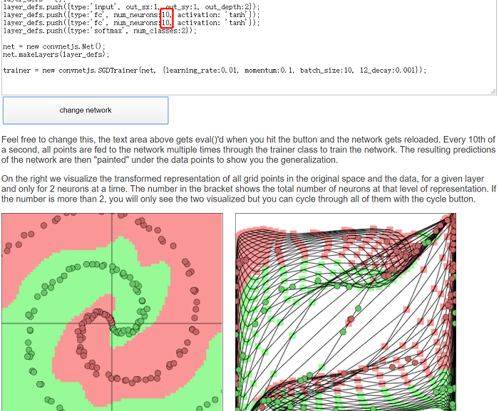

> 可以看到已经切分的非常明显了

另外：在机器学习中，如果数据是完全随机的情况，模型是无法分辨的，但神经网络可以。如下图

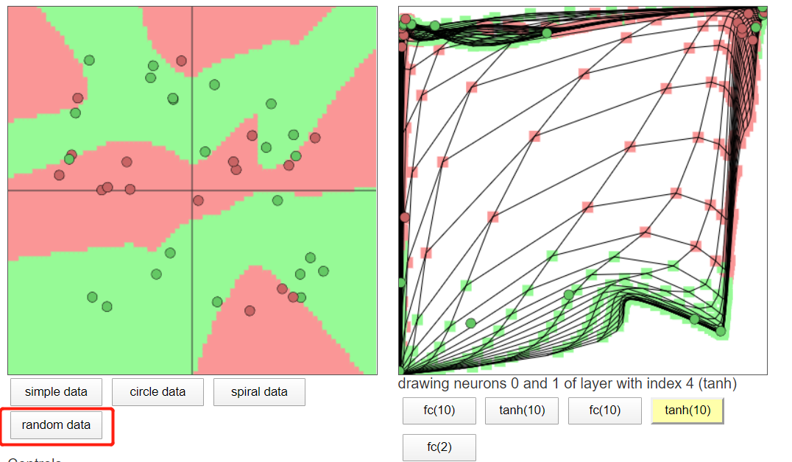

这就是神经网络的强大之处，越多神经元区分的越明显，不过也可能存在过拟合，因为太强大了。

#### 正则化与激活函数

- 惩罚力度对结果的影响：

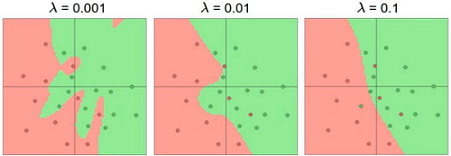

> 惩罚力度过小（左图），导致的结果是过拟合，有几个红色点明明应该更靠近绿色也被评定为红色。这些一般是训练集的情况，有标签能学到，但是在测试集可能就是灾难了。随着lambda的增大，切分的会相对平滑。

- 参数个数对结果的影响：

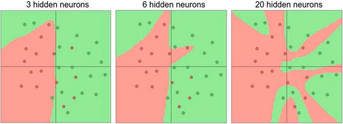

> 同样，神经元个数越多，也越容易过拟合

- 激活函数

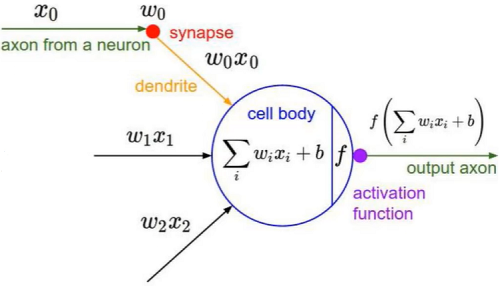

> 做非线性变换，如Sigmoid、Relu、Tanh等

激活函数对比

- Sigmoid：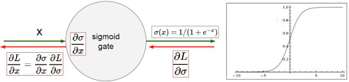

  > 其缺点是，靠两边的线过于平缓，无法计算梯度或者约等于0，那么值就不会进行更新或者前向传播，而我们恰恰需要传播来更新我们的W值（前面讲到）

- Relu：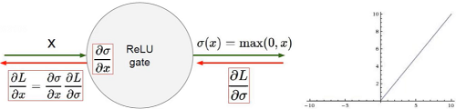

  > 市面上绝大多数神经网络用的激活函数，这个是绝对会有梯度，不会出现梯度消失。