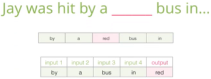
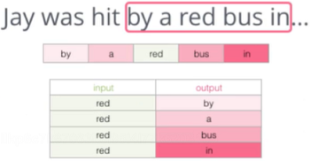
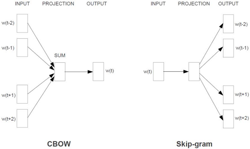
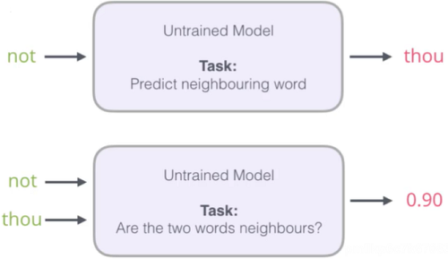
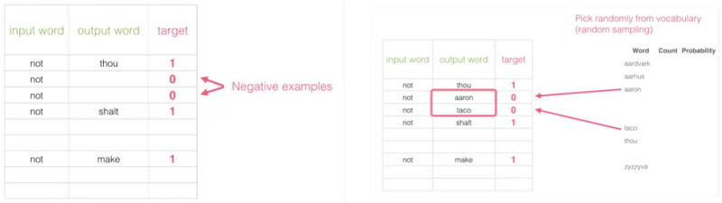
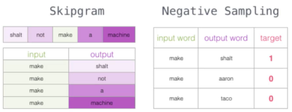
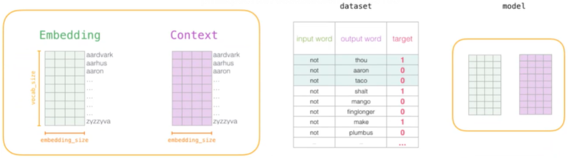
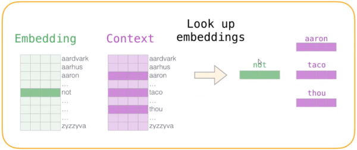
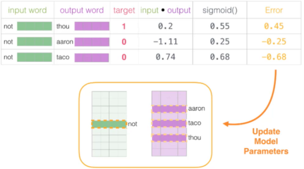

### 第四章——递归神经网络与词向量原理解读

#### RNN网络架构解读

常规神经网络并不能考虑时间序列的特征（比如前天+昨天+今天或者带有前后关联的特征），现在每个特征都是独立考虑的，那么如果有这样的特征，网络应该怎么学呢

> 而递归递归网络hidden这里的转回箭头，表示训练完第一个X后，再拿回来去训练第二个X，即前一次训练的结果对后一次的训练结果产生影响。

> 类似现在有X0、X1、X2 ... Xt，假设X0就是本月的1号，X1就是2号以此类推，Xt就是昨天，这样是不是就是一个时间序列。
>
> X输入后有了h，h是中间的结果，每个h保证能联合前一个的h。

#### LSTM网络

RNN的问题在于，每一次的h只考虑前一个，当h到最后的时候，它只考虑n-1的h，这样对吗？或者说越后面的时间的数据一定越重要吗？我们是不是应该考虑每个时间的数据

- C：控制参数，决定什么样的信息会被保留什么样的会被遗忘。

- 门：一种让信息选择式通过的方法

- 每次计算的结果和前一轮的结果进行比较，选择要更新的信息

  

#### 词向量Word2Vec模型通俗解释

先考虑第一个问题：如何将文本向量化

比如描述一个人，只用身高或体重，还是综合各项指标？如下

只要有了向量，就可以用不同的方法来计算相似度。如下

通常，数据的维度越高，能提供的信息也就越多，从而计算结果的可靠性就更值得信赖了。如下

如何描述语言的特征呢？通常都在词的层面上构建特征。Word2Vec就是把词转成向量：

假设现在已经拿到一份训练好的词向量，其中每个词都表示50维的向量：

如果在热度图中显示，结果如下：

从结果中可以发现，相似的词在特征表达中比较相似，也就是说明词的特征是有实际意义的！

> 如上图的男人和男孩有相当部分的区域颜色是相似的，只是有的浅了点，有的深了点。同样的地方，对比水，它们之间相差的就非常远，颜色基本没有关联。

#### 训练数据构建

输入数据从哪来？首先我们得理解的是，文字单词转换成数值，它并不是仅仅针对该次任务或者该数据的，Thou或者shalt在这里是有这些意思，转成对应的数值，在其它文本其它数据中也是同样的意思，所以只要是符合逻辑的文本，我们都可以拿来训练。目前有Google的预训练bert模型也是这个原理。一般我们会维护一下语料库大表。

如何训练

> 我们选中三个单词，以thou shalt 来预测not，也可以不断的往后滑动，如以shalt not来预测make

> 也就是可以是无监督学习，但文字的前后一定是有先后顺序的，不能没有说话逻辑。

#### CBOW与Skipgram模型

CBOW：根据上下文预测中间内容

Skipgram：根据中间内容预测上下文

两模型输入输出如下：

> 这两个模型都存在gensim里，后续调用该工具包即可。

最终预测的词也会带有概率，而前面我们讲到如SoftMax用到会将最大的值提取出来，如果我们的语料库非常大，比如5万字，那么要给出5万字的概率，而SoftMax也得计算这5万，可以说是非常耗时的，怎么解决这个问题呢？

#### 负采样方案

**初始方案：**

输入两个单词，看它们是不是前后对应的输入和输出，也就相当于一个二分类任务

出发点是好的，但是此时训练集构建出来的标签全为1，无法进行较好的训练

> 如上图，这样相当于告诉模型，只要往1预测，那么一定能效果好，类似风控场景中，正负样本非常悬殊甚至达到1：1万的情况。我们是不能直接训练的，我们会“构造”一些正样本，而这里是1太多，需要构建一些负样本。

**改进方案：**

加入一些负样本

> 1个1添加多少个0呢？gensim工具包给出的默认参数是1个1和5个0，即正负样本比1:5

正常情况下的Skipgram训练集

**大致流程如下：**

**1.初始化词向量矩阵**

> 最左边Embedding是语料库大表，所有的词都在里面。
>
> Context是本次的预测的文本
>
> dataset是负采样完成后的结果

**2.通过神经网络返回传播来计算更新，此时不光更新权重参数矩阵W，也会更新输入数据**

> 给出损失函数Error的结果，并更新到输入和输出数据中。更新输出数据是为了输出本次的预测结果，而更新输入数据，是为了维护我们将一直使用的语料库大表，使得我们的语料库的词向量等越来越准确。

