### 第四章——递归神经网络与词向量原理解读

#### RNN网络架构解读

常规神经网络并不能考虑时间序列的特征（比如前天+昨天+今天或者带有前后关联的特征），现在每个特征都是独立考虑的，那么如果有这样的特征，网络应该怎么学呢

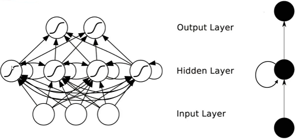

> 而递归递归网络hidden这里的转回箭头，表示训练完第一个X后，再拿回来去训练第二个X，即前一次训练的结果对后一次的训练结果产生影响。

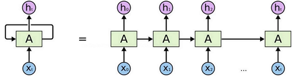

> 类似现在有X0、X1、X2 ... Xt，假设X0就是本月的1号，X1就是2号以此类推，Xt就是昨天，这样是不是就是一个时间序列。
>
> X输入后有了h，h是中间的结果，每个h保证能联合前一个的h。

#### LSTM网络

RNN的问题在于，每一次的h只考虑前一个，当h到最后的时候，它只考虑n-1的h，这样对吗？或者说越后面的时间的数据一定越重要吗？我们是不是应该考虑每个时间的数据

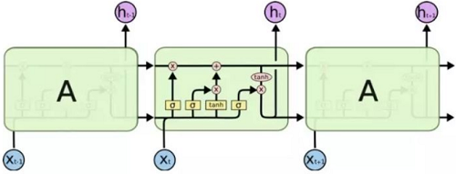

- C：控制参数，决定什么样的信息会被保留什么样的会被遗忘。

- 门：一种让信息选择式通过的方法

- 每次计算的结果和前一轮的结果进行比较，选择要更新的信息

  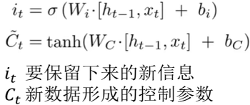

#### 词向量Word2Vec模型通俗解释

先考虑第一个问题：如何将文本向量化

比如描述一个人，只用身高或体重，还是综合各项指标？如下

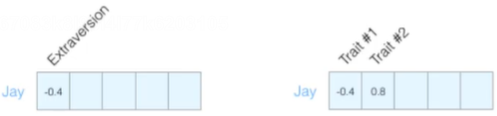

只要有了向量，就可以用不同的方法来计算相似度。如下

通常，数据的维度越高，能提供的信息也就越多，从而计算结果的可靠性就更值得信赖了。如下

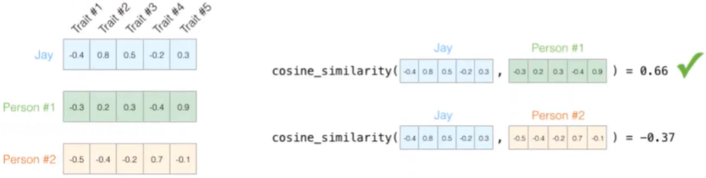

如何描述语言的特征呢？通常都在词的层面上构建特征。Word2Vec就是把词转成向量：

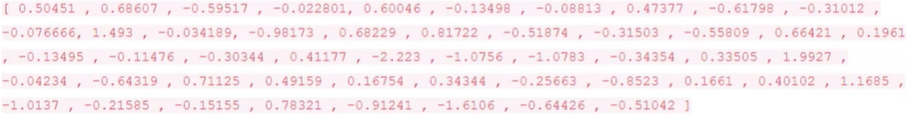

假设现在已经拿到一份训练好的词向量，其中每个词都表示50维的向量：

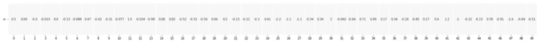

如果在热度图中显示，结果如下：

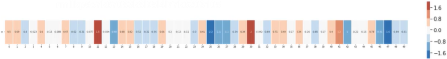

从结果中可以发现，相似的词在特征表达中比较相似，也就是说明词的特征是有实际意义的！

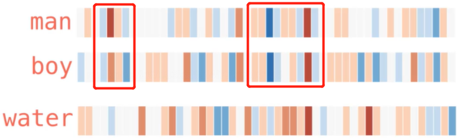

> 如上图的男人和男孩有相当部分的区域颜色是相似的，只是有的浅了点，有的深了点。同样的地方，对比水，它们之间相差的就非常远，颜色基本没有关联。

#### 训练数据构建

输入数据从哪来？首先我们得理解的是，文字单词转换成数值，它并不是仅仅针对该次任务或者该数据的，Thou或者shalt在这里是有这些意思，转成对应的数值，在其它文本其它数据中也是同样的意思，所以只要是符合逻辑的文本，我们都可以拿来训练。目前有Google的预训练bert模型也是这个原理。

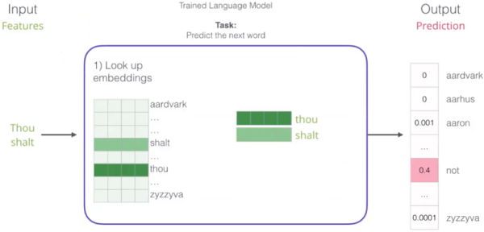

如何训练

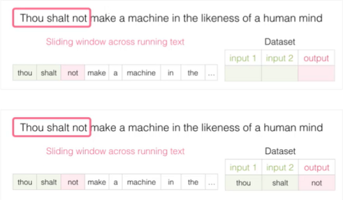

> 我们选中三个单词，以thou shalt 来预测not，也可以不断的往后滑动，如以shalt not来预测make

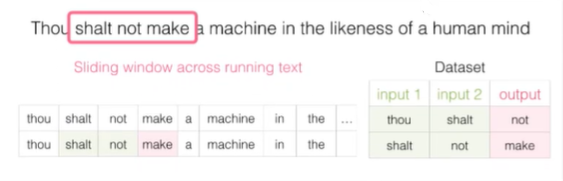

